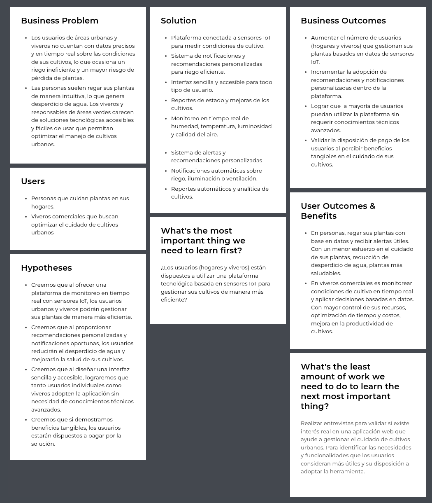
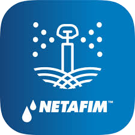
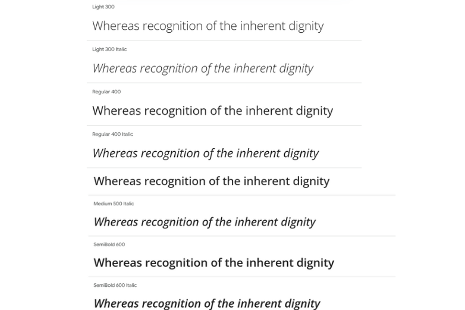
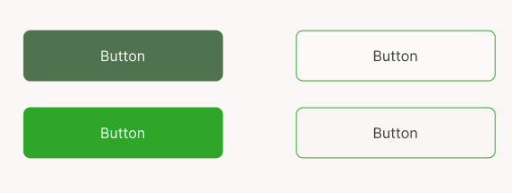
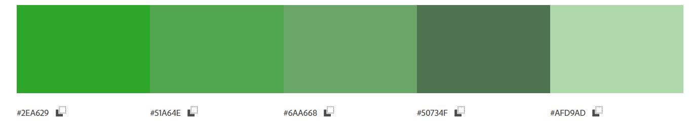
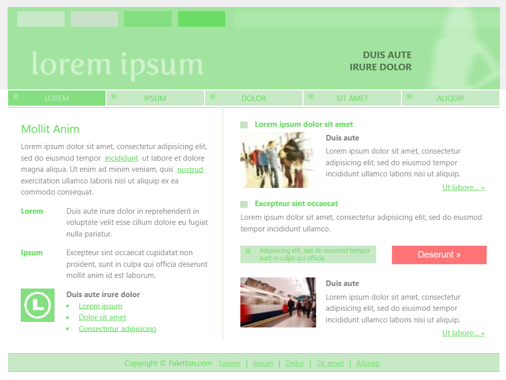
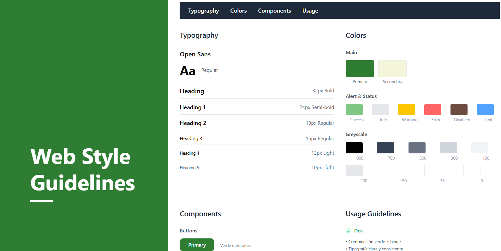
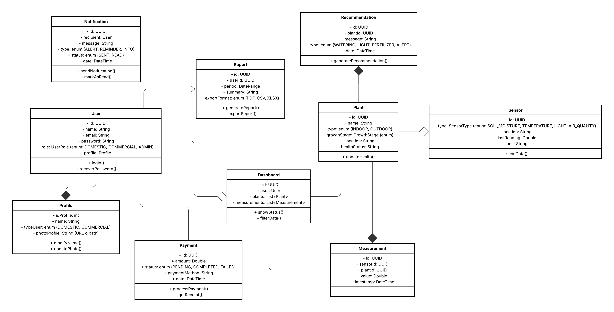

<h2 align="center">
  
</h2>

<h1 align="center">Universidad Peruana de Ciencias Aplicadas</h1>

<h3 align="center">
  Ingeniería de Software
    
  Curso: Desarrollo de Aplicaciones Open Source
    
  Sección: 7380
    
  Profesor: Hugo Allan Mori Paiva
    
  Semestre: 2025-20
    
  Informe del Trabajo Final
    
  Startup: EcoTech
    
  Producto: PlantaE
</h3>

| 
Alumno
       | 
Código
       |
|:-------------------------------------------:|:-------------------------------------------:|
|       Apaza Bocanegra, Elizabeth Noelia     |            u20231c197                       |
|       Contreras Leon, Flor De María         |            u202323243                       |
|       Guillen Galindo, Julio Adolfo         |            u20241a352                       |
|       Miraval Pomalaya, Rodrigo Jesus       |            u202311082                       |
|       Navarro Chinga, Antonio Jhair         |            u202314101                       |

 Setiembre 2025 

# Registro de Versiones del Informe  

| Versión | Fecha       | Autor(es)                            | Descripción de modificación                             |
|---------|-------------|--------------------------------------|---------------------------------------------------------|
|   0.1   | 12/09/2025  | Apaza Bocanegra, Elizabeth Noelia    |  Elaboración de la estructura inicial del reporte.      |

# Project Report Collaboration Insights  

---

# Contenido
- [Registro de Versiones del Informe](#registro-de-versiones-del-informe)
- [Project Report Collaboration Insights](#project-report-collaboration-insights)
- [Contenido](#contenido)
- [Student Outcome](#student-outcome)
- [Capítulo I: Introducción](#capítulo-i-introducción)
  - [1.1. Startup Profile](#11-startup-profile)
    - [1.1.1. Descripción de la Startup](#111-descripción-de-la-startup)
    - [1.1.2. Perfiles de integrantes del equipo](#112-perfiles-de-integrantes-del-equipo)
  - [1.2. Solution Profile](#12-solution-profile)
    - [1.2.1. Antecedentes y problemática](#121-antecedentes-y-problemática)
    - [1.2.2. Lean UX Process](#122-lean-ux-process)
      - [1.2.2.1. Lean UX Problem Statements](#1221-lean-ux-problem-statements)
      - [1.2.2.2. Lean UX Assumptions](#1222-lean-ux-assumptions)
      - [1.2.2.3. Lean UX Hypothesis Statements](#1223-lean-ux-hypothesis-statements)
      - [1.2.2.4. Lean UX Canvas](#1224-lean-ux-canvas)
  - [1.3. Segmentos objetivo](#13-segmentos-objetivo)
- [Capítulo II: Requirements Elicitation \& Analysis](#capítulo-ii-requirements-elicitation--analysis)
  - [2.1. Competidores](#21-competidores)
    - [2.1.1. Análisis competitivo](#211-análisis-competitivo)
    - [2.1.2. Estrategias y tácticas frente a competidores](#212-estrategias-y-tácticas-frente-a-competidores)
  - [2.2. Entrevistas](#22-entrevistas)
    - [2.2.1. Diseño de entrevistas](#221-diseño-de-entrevistas)
    - [2.2.2. Registro de entrevistas](#222-registro-de-entrevistas)
    - [2.2.3. Análisis de entrevistas](#223-análisis-de-entrevistas)
  - [2.3. Needfinding](#23-needfinding)
    - [2.3.1. User Personas](#231-user-personas)
    - [2.3.2. User Task Matrix](#232-user-task-matrix)
    - [2.3.3. User Journey Mapping](#233-user-journey-mapping)
    - [2.3.4. Empathy Mapping](#234-empathy-mapping)
  - [2.4. Big Picture Event Storming](#24-big-picture-event-storming)
  - [2.5. Ubiquitous Language](#25-ubiquitous-language)
- [Capítulo III: Requirements Specification](#capítulo-iii-requirements-specification)
  - [3.1. User Stories](#31-user-stories)
  - [3.2. Impact Mapping](#32-impact-mapping)
  - [3.3. Product Backlog](#33-product-backlog)
- [Capítulo IV: Product Design](#capítulo-iv-product-design)
  - [4.1. Style Guidelines](#41-style-guidelines)
    - [4.1.1. General Style Guidelines](#411-general-style-guidelines)
    - [4.1.2. Web Style Guidelines](#412-web-style-guidelines)
  - [4.2. Information Architecture](#42-information-architecture)
    - [4.2.1. Organization Systems](#421-organization-systems)
    - [4.2.2. Labeling Systems](#422-labeling-systems)
    - [4.2.3. SEO Tags and Meta Tags](#423-seo-tags-and-meta-tags)
    - [4.2.4. Searching Systems](#424-searching-systems)
    - [4.2.5. Navigation Systems](#425-navigation-systems)
  - [4.3. Landing Page UI Design](#43-landing-page-ui-design)
    - [4.3.1. Landing Page Wireframe](#431-landing-page-wireframe)
    - [4.3.2. Landing Page Mock-up](#432-landing-page-mock-up)
  - [4.4. Web Applications UX/UI Design](#44-web-applications-uxui-design)
    - [4.4.1. Web Applications Wireframes](#441-web-applications-wireframes)
    - [4.4.2. Web Applications Wireflow Diagrams](#442-web-applications-wireflow-diagrams)
    - [4.4.2. Web Applications Mock-ups](#442-web-applications-mock-ups)
    - [4.4.3. Web Applications User Flow Diagrams](#443-web-applications-user-flow-diagrams)
  - [4.5. Web Applications Prototyping](#45-web-applications-prototyping)
  - [4.6. Domain-Driven Software Architecture](#46-domain-driven-software-architecture)
    - [4.6.1. Design-Level Event Storming](#461-design-level-event-storming)
    - [4.6.2. Software Architecture Context Diagram](#462-software-architecture-context-diagram)
    - [4.6.3. Software Architecture Container Diagrams](#463-software-architecture-container-diagrams)
    - [4.6.4. Software Architecture Components Diagrams](#464-software-architecture-components-diagrams)
  - [4.7. Software Object-Oriented Design](#47-software-object-oriented-design)
    - [4.7.1. Class Diagrams](#471-class-diagrams)
  - [4.8. Database Design](#48-database-design)
    - [4.8.1. Database Diagrams](#481-database-diagrams)
- [Capítulo V: Product Implementation, Validation \& Deployment](#capítulo-v-product-implementation-validation--deployment)
  - [5.1. Software Configuration Management](#51-software-configuration-management)
    - [5.1.1. Software Development Environment Configuration](#511-software-development-environment-configuration)
    - [5.1.2. Source Code Management](#512-source-code-management)
    - [5.1.3. Source Code Style Guide \& Conventions](#513-source-code-style-guide--conventions)
    - [5.1.4. Software Deployment Configuration](#514-software-deployment-configuration)
  - [5.2. Landing Page, Services \& Applications Implementation](#52-landing-page-services--applications-implementation)
    - [5.2.1. Sprint 1](#521-sprint-1)
      - [5.2.1.1. Sprint Planning 1](#5211-sprint-planning-1)
      - [5.2.1.2. Aspect Leaders and Collaborators](#5212-aspect-leaders-and-collaborators)
      - [5.2.1.3. Sprint Backlog 1](#5213-sprint-backlog-1)
      - [5.2.1.4. Development Evidence for Sprint Review](#5214-development-evidence-for-sprint-review)
      - [5.2.1.5. Execution Evidence for Sprint Review](#5215-execution-evidence-for-sprint-review)
      - [5.2.1.6. Services Documentation Evidence for Sprint Review](#5216-services-documentation-evidence-for-sprint-review)
      - [5.2.1.7. Software Deployment Evidence for Sprint Review](#5217-software-deployment-evidence-for-sprint-review)
      - [5.2.1.8. Team Collaboration Insights during Sprint](#5218-team-collaboration-insights-during-sprint)

- [Conclusiones](#conclusiones)
- [Conclusiones y recomendaciones](#conclusiones-y-recomendaciones)
- [Video About-the-Team](#video-about-the-team)
- [Bibliografía](#bibliografía)
- [Anexos](#anexos)

# Student Outcome  
El curso contribuye al cumplimiento del Student Outcome ABET:
**ABET – EAC - Student Outcome 3**
Capacidad de comunicarse efectivamente con un rango de audiencias.
En el siguiente cuadro se describe las acciones realizadas y enunciados de conclusiones por parte del grupo, que permiten sustentar el haber alcanzado el logro del ABET – EAC - Student Outcome 3.

|             
Criterio específico
             |          
Acciones Realizadas
            |          
Conclusiones
            |
|:---------------------------------------------------------------------:|-------------------------------------------------------------------|------------------------------------------------------------|
| Comunica oralmente con efectividad a diferentes rangos de audiencia.  | <ul><li>**Apaza Bocanegra, Elizabeth Noelia**   **TB1:**   </li><li>**Contreras Leon, Flor De María**   **TB1:**   </li><li>**Guillen Galindo, Julio Adolfo**   **TB1:**   </li><li>**Miraval Pomalaya, Rodrigo Jesus**   **TB1:**   </li><li>**Navarro Chinga, Antonio Jhair**   **TB1:**</ul> | <ul><li>**TB1:** </li></ul> |
| Comunica por escrito con efectividad a diferentes rangos de audiencia | <ul><li>**Apaza Bocanegra, Elizabeth Noelia**   **TB1:**   </li><li>**Contreras Leon, Flor De María**   **TB1:**   </li><li>**Guillen Galindo, Julio Adolfo**   **TB1:**   </li><li>**Miraval Pomalaya, Rodrigo Jesus**   **TB1:**   </li><li>**Navarro Chinga, Antonio Jhair**   **TB1:**</ul> | <ul><li>**TB1:** </li></ul> |

# Capítulo I: Introducción
## 1.1. Startup Profile
### 1.1.1. Descripción de la Startup
Somos EcoTech, una startup universitaria conformada por estudiantes de la Universidad Peruana de Ciencias Aplicadas (UPC), dedicada a desarrollar soluciones tecnológicas que promuevan la sostenibilidad y el cuidado responsable de los recursos naturales. En un contexto donde la agricultura urbana y el mantenimiento de áreas verdes enfrentan retos de eficiencia y gestiones, presentamos PlantaE, una plataforma inteligente basada en IoT que permite a los usuarios monitorear y optimizar el cuidado de sus plantas y cultivos urbanos.

PlantaE surge ante la creciente necesidad de contar con herramientas accesibles y confiables que faciliten el riego eficiente y el cuidado de áreas verdes en hogares y viveros. La aplicación recopila datos en tiempo real sobre humedad, temperatura, luminosidad y calidad del aire mediante sensores instalados en macetas o terrenos de cultivo, brindando a los usuarios notificaciones oportunas y recomendaciones personalizadas para garantizar la salud de sus plantas. Ademas de, contribuir al uso responsable del agua, ofreciendo una plataforma que combina tecnología, sostenibilidad y facilidad de uso. Con PlantaE, buscamos acercar la innovación al bienestar ambiental y a la vida diaria de las personas, fomentando comunidades más conscientes y responsables con su entorno.

   
  

### Misión:
Digitalizar y optimizar el cuidado de cultivos urbanos mediante el uso de tecnologías IoT, ofreciendo a personas y viveros herramientas accesibles para gestionar sus plantas de forma sostenible, eficiente y consciente con el medio ambiente.

### Visión:
Ser una referencia en soluciones tecnológicas para el cuidado de plantas y áreas verdes, promoviendo un estilo de vida más sostenible y acercando la tecnología al servicio del bienestar ambiental y de las comunidades.

### 1.1.2. Perfiles de integrantes del equipo

| **Integrante**            | **Apaza Bocanegra, Elizabeth Noelia**                                               |
|---------------------------|-------------------------------------------------------------------------------------|
| **Código del Estudiante** |                                                                                     |
| **Carrera**               |                                                                                     |
| **Descripción**           |                                                                                     |
| **Foto**                  |  
  
  |

---

| **Integrante**            | **Contreras Leon, Flor De María**                                                   |
|---------------------------|-------------------------------------------------------------------------------------|
| **Código del Estudiante** |  u202323243                                                                         |
| **Carrera**               |  Ingenieria de Software                                                             |
| **Descripción**           |  Mi nombre es Flor de María Contreras León y actualmente estudio la carrera de Ingeniería de Software en la Universidad Peruana de Ciencias Aplicadas (UPC), sede San Miguel. Tengo 20 años y me considero una persona responsable, comprometida y dedicada a mi formación profesional.Me apasiona la programación y la investigación, áreas en las que busco seguir aprendiendo y desarrollando nuevas habilidades. Aunque me considero una persona callada, siempre estoy atenta a los detalles, lo que me permite trabajar de manera cuidadosa y eficiente en mis proyectos. Asimismo, valoro el trabajo en equipo y creo que un entorno colaborativo y respetuoso es clave para alcanzar los mejores resultados. |
| **Foto**                  | 
  
 |

---

| **Integrante**            | **Guillen Galindo, Julio Adolfo**                                                   |
|---------------------------|-------------------------------------------------------------------------------------|
| **Código del Estudiante** | u20241a352                                                                          |
| **Carrera**               | Ingeniería de Software                                                              |
| **Descripción**           | Actualmente curso la carrera de Ingeniería de Software en la UPC. Me considero una persona discreta, pero responsable y enfocada en cumplir los proyectos dentro de los plazos establecidos. Poseo conocimientos en C++ y Python; disfruto trabajar en equipo cuando existe colaboración y apoyo mutuo. Además, me motiva aplicar lo aprendido para afrontar los desafíos que puedan surgir en los próximos ciclos. |
| **Foto**                  | 
  
 |

---

| **Integrante**            | **Miraval Pomalaya, Rodrigo Jesus**                                                 |
|---------------------------|-------------------------------------------------------------------------------------|
| **Código del Estudiante** | u202311082                                                                          |
| **Carrera**               | Ingeniería de Software                                                              |
| **Descripción**           | Mi nombre es Rodrigo Jesús Miraval Pomalaya y estudio Ingeniería de Software en la Universidad Peruana de Ciencias Aplicadas. Me considero una persona adaptable y detallista, siempre en busca de aprender y mejorar en lo que hago. Tengo conocimientos en Python, JavaScript, HTML y CSS, además de un nivel intermedio en SQL Server y MySQL. Me gusta aplicar lo aprendido en proyectos académicos y trabajar en equipo, ya que compartir ideas no solo ayuda a obtener mejores resultados, sino también a ampliar mi visión en la carrera. |
| **Foto**                  |  
  
    |

---

| **Integrante**            | **Navarro Chinga, Antonio Jhair**                                                   |
|---------------------------|-------------------------------------------------------------------------------------|
| **Código del Estudiante** |                                                                                     |
| **Carrera**               |                                                                                     |
| **Descripción**           |                                                                                     |
| **Foto**                  |  
  
    |

## 1.2. Solution Profile
### 1.2.1. Antecedentes y problemática
En el Perú, el cuidado de áreas verdes y la agricultura enfrentan serias dificultades relacionadas con el uso eficiente de recursos, especialmente del agua. Según la Autoridad Nacional del Agua (ANA, 2023), más del 70% del recurso hídrico del país es destinado a la agricultura, pero gran parte se desperdicia debido a sistemas de riego poco eficientes y falta de tecnología de monitoreo.

En las ciudades, la situación no es distinta. Informes de la Municipalidad de Lima (2022) señalan que gran parte de los parques y jardines públicos presentan un riego deficiente, lo que repercute en el deterioro de áreas verdes urbanas. A nivel de hogares, el cuidado de plantas suele hacerse de manera intuitiva, sin datos precisos sobre humedad, temperatura o condiciones ambientales, lo que incrementa el riesgo de pérdida de cultivos o desperdicio de agua.

A esto se suma que la FAO (2021) ha destacado la importancia de impulsar la agricultura urbana y periurbana en países en desarrollo, no solo como fuente de alimentos, sino también como estrategia de sostenibilidad ambiental y de bienestar social. Sin embargo, en el Perú, aún existe un vacío en el acceso a soluciones tecnológicas accesibles que faciliten la gestión eficiente de cultivos urbanos y viveros.

**Análisis 5W2H**

| **Pregunta**                                                         | **Respuesta**                                                                                                                                                                                      |
|:--------------------------------------------------------------------:|:--------------------------------------------------------------------------------------------------------------------------------------------------------------------------------------------------:|
|**What**   ¿Cuál es el problema?                                   |  En el Perú, el cuidado de cultivos urbanos y áreas verdes enfrenta retos significativos por la falta de tecnologías que permitan un monitoreo preciso. Gran parte de los usuarios riegan de manera intuitiva, sin información confiable sobre humedad del suelo, temperatura, luminosidad o calidad del aire. Esto genera pérdidas de plantas, uso ineficiente del agua y deterioro de jardines urbanos y viveros.                                                             |
|**When**   ¿Cuándo sucede el problema?                             |  La problemática ocurre todo el año, pero se intensifica en temporadas de sequía, verano o en situaciones donde el usuario está fuera de casa por mucho tiempo. La falta de monitoreo en tiempo real y de datos confiables hace que la pérdida de cultivos o el mal uso del agua se convierta en un problema recurrente y continuo.                                                                                                                                              |
|**Where**   ¿Dónde se presenta el problema de negocio?             |  Este problema se presenta principalmente en ciudades con creciente interés en agricultura urbana. En las zonas costeras, la necesidad es mayor debido a la escasez de agua y a la poca adopción de tecnologías digitales en el mantenimiento de áreas verdes.                                                                                                                                                                                                                  |
|**Who**   ¿Quiénes están involucrados?                             |  Los principales afectados son las personas en hogares que buscan mantener sus plantas en zonas urbanas, así como viveros y negocios de jardinería que requieren eficiencia para reducir costos y mejorar la calidad de sus productos.                                                                                                                                                                                                                                        |
|**Why**   ¿Por qué se origina el problema?                         |  El uso eficiente del agua y la sostenibilidad ambiental son prioritarios. Según la Autoridad Nacional del Agua (ANA, 2023), más del 70% del recurso hídrico del país se destina a la agricultura, con altos niveles de desperdicio. Una solución tecnológica que permita recopilar datos en tiempo real, enviar alertas y recomendaciones personalizadas no solo optimiza el cuidado de las plantas, sino que también fomenta la conciencia ambiental y contribuye a la gestión responsable de los recursos naturales en un contexto urbano y doméstico.                                                                                                                                                                                                    |
|**How**   ¿Cómo afecta este problema a las personas involucradas?  |  La falta de monitoreo confiable provoca que los usuarios rieguen de manera insuficiente, lo que genera pérdida de plantas, frustración y mayores costos en el mantenimiento de áreas verdes. Y por consiguiente, repercute directamente en la calidad de los productos que ofrecen.                                                                                                                                                                                            |
|**How much**   ¿Cuánto impacto genera el problema en la sociedad?  |  Aunque el impacto económico es considerable, el uso ineficiente del agua contribuye al agotamiento de un recurso escaso en zonas urbanas, mientras que la pérdida de áreas verdes reduce la calidad de vida y el bienestar en las ciudades. En conjunto, esto repercute en la sostenibilidad urbana y en la gestión responsable de los recursos naturales.                                                                                                                      |

### 1.2.2. Lean UX Process
#### 1.2.2.1. Lean UX Problem Statements
- Los usuarios de áreas urbanas y viveros no cuentan con datos precisos y en tiempo real sobre las condiciones de sus cultivos (humedad, temperatura, luminosidad, calidad del aire), lo que ocasiona un riego ineficiente y un mayor riesgo de pérdida de plantas.  
- Las personas suelen regar sus plantas de manera intuitiva, sin información confiable, lo que genera desperdicio de agua y afecta la sostenibilidad del cuidado de áreas verdes.  
- Viveros y responsables de áreas verdes carecen de soluciones tecnológicas accesibles y fáciles de usar que permitan optimizar el manejo de cultivos urbanos.  

#### 1.2.2.2. Lean UX Assumptions
- Los usuarios están dispuestos a utilizar herramientas digitales siempre que estas sean fáciles de usar y les brinden información clara para mejorar el cuidado de sus cultivos.  
- La incorporación de sensores IoT permitirá obtener datos relevantes que ayudarán a optimizar el riego y mejorar la salud de las plantas.  
- Al recibir notificaciones y recomendaciones personalizadas, los usuarios podrán tomar mejores decisiones que contribuirán a la reducción del consumo de agua y al cuidado responsable de áreas verdes.  
- Existe un segmento de mercado (hogares y viveros urbanos) que busca soluciones sostenibles e innovadoras para optimizar sus recursos y mejorar sus resultados.  

#### 1.2.2.3. Lean UX Hypothesis Statements
- Creemos que al ofrecer una plataforma de monitoreo en tiempo real con sensores IoT, los usuarios urbanos y viveros podrán gestionar sus plantas de manera más eficiente.  
- Creemos que al proporcionar recomendaciones personalizadas y notificaciones oportunas, los usuarios reducirán el desperdicio de agua y mejorarán la salud de sus cultivos.  
- Creemos que al diseñar una interfaz sencilla y accesible, lograremos que tanto usuarios individuales como viveros adopten la aplicación sin necesidad de conocimientos técnicos avanzados.  
- Creemos que si demostramos beneficios tangibles (ahorro de agua, reducción de pérdidas de plantas), los usuarios estarán dispuestos a pagar por la solución.  

#### 1.2.2.4. Lean UX Canvas

 
   

## 1.3. Segmentos objetivo
| Segmento Objetivo | Aspectos demográficos | Aspectos geográficos | Aspectos psicográficos |
|-------------------|------------------------|-----------------------|-------------------------|
| **Personas (hogares urbanos que cuidan plantas)** | <ul><li>Sexo: Masculino y femenino.  </li><li>Edades: 25 – 55 años (adultos jóvenes y adultos interesados en la sostenibilidad y el cuidado del hogar).</ul> | <ul><li>Nacionalidad: Peruana.  </li><li>Zona geográfica: Principalmente zonas urbanas y periurbanas con acceso a áreas verdes o pequeños jardines.</ul> | <ul><li>Valoran la sostenibilidad y el cuidado responsable del medio ambiente.  </li><li>Interesados en tecnología accesible que facilite la vida cotidiana.  </li><li>Buscan practicidad y resultados visibles en el cuidado de sus plantas.  </li><li>Dispuestos a probar soluciones innovadoras si estas son fáciles de usar.</ul> |
| **Viveros comerciales** | <ul><li>Sexo: Masculino y femenino (administradores, encargados y trabajadores de viveros).  </li><li>Edades: 20 – 60 años (jóvenes adultos y adultos con experiencia en manejo de cultivos o gestión de negocios de plantas).</ul> | <ul><li>Nacionalidad: Peruana.  </li><li>Zona geográfica: Áreas urbanas, periurbanas y rurales donde se concentran viveros, centros de producción y espacios agrícolas.</ul> | <ul><li>Buscan optimizar recursos (agua, energía, tiempo) para aumentar la rentabilidad.  </li><li>Interesados en soluciones tecnológicas que mejoren la eficiencia operativa.  </li><li>Valoran herramientas que brinden datos confiables y prácticos para la toma de decisiones.  </li><li>Dispuestos a pagar por soluciones que generen beneficios tangibles en productividad y sostenibilidad.</ul> |

# Capítulo II: Requirements Elicitation & Analysis
## 2.1. Competidores

En esta sección, se presenta un análisis de los principales competidores de PlantaE, centrado en aquellos que operan con modelos de negocio digitales similares o que, aunque no sean idénticos, ofrecen productos o servicios que se superponen parcialmente con nuestra propuesta.Evaluamos tanto competidores directos, que ofrecen plataformas basadas en IoT para monitoreo de cultivos y áreas verdes, como competidores indirectos, que brindan soluciones de riego automatizado o aplicaciones de agricultura urbana más generales.

Este análisis nos permitirá comprender mejor el entorno competitivo y cómo podemos diferenciarnos en el ecosistema de soluciones de agricultura urbana sostenible.

1. ### AgroSmart : 
Es una de las startups líderes en soluciones de agricultura digital. Su plataforma combina sensores IoT, imágenes satelitales e inteligencia artificial para optimizar el manejo de grandes cultivos.

- **Fortalezas:** monitoreo IoT en tiempo real, predicciones climáticas y optimización avanzada del riego.

- **Debilidades:** está orientada a la agricultura a gran escala y requiere alta inversión, lo que limita su accesibilidad para viveros urbanos y hogares.

2. ### Netafim:
Es una empresa pionera en riego por goteo inteligente, con sistemas que reducen significativamente el consumo de agua en cultivos.

- **Fortalezas:** experiencia consolidada, sistemas de riego automatizado de alta eficiencia y sostenibilidad hídrica comprobada.

- **Debilidades:** alto costo de implementación y foco en agricultores medianos y grandes, con baja personalización para usuarios urbanos.

3. ### Plantix

Es una aplicación móvil que utiliza inteligencia artificial para diagnosticar plagas y enfermedades en cultivos mediante fotos.

- **Fortalezas:** accesibilidad desde dispositivos móviles, comunidad activa de usuarios y recomendaciones prácticas para el cuidado de plantas.

- **Debilidades:** su alcance está limitado al diagnóstico de problemas y no ofrece un sistema de monitoreo IoT ni gestión hídrica.

### 2.1.1. Análisis competitivo
<table> 
  <tr>
    <th colspan="7"> Competitive Analysis Landscape </th>
  </tr>
  <tr>
    <td colspan="2" rowspan="2">¿Por qué llevar acabo este análisis? </td>
    <td colspan="5"> ¿Que busca comprender el analisis de PlantaE frente a competidores que ofrecen soluciones de agricultura digital e IoT, considerando factores de accesibilidad, mercado objetivo y sostenibilidad? </td>
  </tr>
  <tr>
    <td colspan="5"> Este análisis busca comprender el posicionamiento de PlantaE en comparación con otras soluciones digitales e IoT para la gestión de cultivos y áreas verdes, identificando oportunidades de mejora y diferenciación frente a las necesidades de nuestros segmentos objetivos: hogares urbanos interesados en el cuidado sostenible de plantas y viveros comerciales que buscan optimizar el uso de recursos y mejorar la salud de sus cultivos. </td>
  </tr>
  <tr>
    <td colspan="2"> Productos </td>
    <td> 
 PlantaE    </td>
    <td> 
 AgroSmart   
 </td>
    <td> 
 Netafim   
 </td>
    <td> 
 Plantix   
 </td>
  </tr>
  <tr>
    <td rowspan="2">Perfil</td>
    <td>Overview</td>
    <td> Plataforma accesible de monitoreo IoT en tiempo real para hogares y viveros comerciales. </td>
    <td> Startup de agricultura digital con sensores IoT, IA y datos satelitales. </td>
    <td> Empresa líder en riego inteligente a nivel global. </td>
    <td> App móvil que diagnostica plagas y enfermedades con IA. </td>
  </tr>
  <tr>
    <td>Ventaja competitiva ¿Qué valor ofrece a los clientes?</td>
    <td> Accesible, simple y adaptable a hogares y viveros comerciales. </td>
    <td> Alta tecnología para agricultura a gran escala. </td>
    <td> Experiencia consolidada y eficiencia hídrica. </td>
    <td> Uso de IA accesible desde móvil y comunidad activa. </td>
  </tr>
  <tr>
    <td rowspan="2">Perfil de Marketing</td>
    <td> Mercado Objetivo </td>
    <td> Hogares urbanos y viveros comerciales pequeños/medianos. </td>
    <td> Agricultores industriales y medianos. </td>
    <td> Agricultores medianos y grandes. </td>
    <td> Agricultores y aficionados urbanos </td>
  </tr>
  <tr>
    <td> Estrategias de Marketing </td>
    <td> Educación digital sobre sostenibilidad, alianzas con viveros locales. </td>
    <td> Marketing B2B, posicionamiento tecnológico. </td>
    <td> Branding global, casos de éxito y sostenibilidad hídrica. </td>
    <td> Estrategia digital masiva vía Google Play/App Store. </td>
  </tr> 
  <tr>
    <td rowspan="3">Perfil de Producto</td>
    <td> Productos & Servicios </td>
    <td> Sensores IoT, web, recomendaciones personalizadas. </td>
    <td> Sensores IoT, pronósticos climáticos, gestión avanzada. </td>
    <td> Sistemas de riego por goteo inteligentes, software de gestión. </td>
    <td> Diagnóstico de plagas y comunidad de soporte. </td>
  </tr>
  <tr>
    <td> Precios & Costos </td>
    <td> Accesible, modelo freemium o suscripción baja. </td>
    <td> Alto costo, licencias SaaS premium. </td>
    <td> Alta inversión inicial y mantenimiento. </td>
    <td> Gratis con servicios premium. </td>
  </tr>
  <tr> 
    <td>Canales de distribución (Web y/o Móvil)</td>
    <td> Aplicación Web. </td>
    <td> Aplicación Web y App móvil. </td>
    <td> Equipos físicos más plataforma digital. </td>
    <td> App móvil. </td>
  </tr>  
  <tr>
    <td rowspan="4"> Análisis SWOT </td>
    <td> Fortalezas </td>
    <td> Accesibilidad, simplicidad de uso, enfoque en sostenibilidad urbana. </td>
    <td> Tecnología avanzada, IA y datos satelitales. </td>
    <td> Experiencia consolidada, reducción comprobada de consumo de agua. </td>
    <td> Uso de IA en diagnóstico, comunidad digital activa. </td>
  </tr>
  <tr>
    <td> Debilidades </td>
    <td> Escala inicial limitada, baja madurez tecnológica frente a competidores. </td>
    <td> Costos elevados, poco enfoque en usuarios pequeños. </td>
    <td> Alto costo, poca personalización para usuarios urbanos. </td>
    <td> No ofrece gestión hídrica ni monitoreo IoT. </td>
  </tr>
  <tr>
    <td> Oportunidades </td>
    <td> Creciente demanda de soluciones sostenibles, apoyo a viveros urbanos. </td>
    <td> Expansión en mercados emergentes. </td>
    <td> Creciente necesidad de eficiencia hídrica. </td>
    <td> Integración con soluciones de riego y monitoreo urbano. </td>
  </tr>
  <tr>
    <td> Amenazas </td>
    <td> Entrada de grandes competidores al segmento urbano, barreras de adopción tecnológica. </td>
    <td> Saturación de mercado y alta inversión necesaria para usuarios pequeños. </td>
    <td> Nuevas startups más ágiles y accesibles. </td>
    <td> Dependencia de la precisión de IA y limitación del modelo freemium. </td>
  </tr>
</table>

### 2.1.2. Estrategias y tácticas frente a competidores
Para enfrentar a la competencia y posicionarse de manera sólida en el ecosistema de soluciones sostenibles, **PlantaE implementará estrategias enfocadas en sus principales ventajas competitivas** y en la explotación de oportunidades poco atendidas por otras iniciativas. Entre las principales tácticas preliminares destacan:

**Estrategia de diferenciación sostenible :**
- La plataforma digital de PlantaE facilitará la conexión entre ciudadanos, municipalidades, ONGs y empresas, mediante herramientas enfocadas en la regeneración de áreas verdes y el monitoreo comunitario. Se contempla, por ejemplo, el desarrollo progresivo de funcionalidades como reportes de impacto ambiental en tiempo real y mapas interactivos de proyectos verdes, diferenciándonos de competidores que se centran únicamente en el sector agrícola o de riego.

**Alianzas estratégicas multiactor:**
- PlantaE priorizará la construcción de convenios con municipalidades, viveros urbanos y organizaciones comunitarias. Estas alianzas permitirán fortalecer la confianza en la plataforma, garantizar acceso a insumos sostenibles y generar proyectos colaborativos que refuercen el sentido de pertenencia ciudadana.

**Campañas digitales con enfoque social y ambiental:**
- Las campañas en redes sociales serán clave para sensibilizar sobre la importancia del cuidado de áreas verdes urbanas. Se priorizarán contenidos educativos, testimonios de voluntarios y casos de éxito en la transformación de espacios públicos, reforzando así la conexión emocional entre los usuarios y su entorno.

**Captación y fidelización de comunidades:**
- La plataforma incluirá herramientas que permitan a los ciudadanos participar en proyectos de reforestación, limpieza y mantenimiento, mientras que ONGs y empresas podrán gestionar sus iniciativas desde un panel especializado. Se prevé también la implementación de incentivos no monetarios, como reconocimientos digitales o certificaciones de impacto ambiental.

**Gestión de riesgos y validación de proyectos:**
- Frente a la posible desconfianza en nuevas plataformas digitales o la falta de continuidad en proyectos comunitarios, PlantaE aplicará un modelo de validación y seguimiento transparente. Cada proyecto contará con métricas claras de impacto y espacios de retroalimentación, lo que fortalecerá la confianza y garantizará la sostenibilidad a largo plazo.

## 2.2. Entrevistas
### 2.2.1. Diseño de entrevistas
Hola, mi nombre es [Nombre del entrevistador] y formo parte del equipo que está desarrollando PlantaE, una iniciativa que busca mejorar el cuidado de plantas y áreas verdes con ayuda de la tecnología. Nuestra idea es apoyarnos en el Internet de las Cosas (IoT), es decir, en sensores y dispositivos que recopilan datos en tiempo real sobre tus plantas —por ejemplo, la humedad del suelo o la cantidad de agua utilizada— para que el riego y el mantenimiento sean más fáciles y eficientes.

Con esto queremos crear una aplicación que te brinde alertas, consejos y herramientas prácticas para ahorrar agua, cuidar mejor de las plantas y simplificar el proceso, ya sea en casa o en un vivero.
**Diseño de entrevistas - Segmento 1 :**

**Presentacion del proyecto y inicio de la entrevista:**
1. Para empezar, ¿puedes contarnos tu nombre y qué relación tienes con el cuidado de plantas en tu hogar?

2. ¿Cómo describirías tu experiencia con las plantas: las consideras un pasatiempo, una responsabilidad o parte de tu estilo de vida?

3. ¿Qué lugar ocupan las plantas en tu día a día (ejemplo: decoración, conexión con la naturaleza, bienestar personal)?

4. ¿Desde cuándo empezaste a cuidar plantas en casa y qué te motivó a hacerlo?

------------

1. ¿Dedicas un tiempo específico en la semana para cuidar tus plantas o lo haces de manera espontánea?

2. ¿Qué dificultades enfrentas al cuidar tus plantas o áreas verdes?

3. ¿Cómo organizas el riego y mantenimiento de tus plantas?

4. ¿Has tenido problemas relacionados con el riego (por exceso, falta o uso de agua)?

5. ¿Qué tanto influye el consumo de agua en tu decisión de cuidar más o menos plantas?

6. ¿Alguna vez has perdido plantas por no darles el cuidado adecuado? ¿Cómo te sentiste?

7. ¿Ha tenido problemas relacionados con el mantenimiento general de tus plantas (plagas, falta de tiempo, espacio)?

8. ¿Usas actualmente alguna aplicación, sistema o herramienta para ayudarte en el cuidado de tus plantas?

9. ¿Qué tan cómodo te sentirías usando sensores o aplicaciones para recibir alertas y recomendaciones sobre tus plantas?

10. ¿Qué tan útil te resultaría una aplicación que te ayude a optimizar el riego y cuidado de tus plantas?

11. ¿Qué funcionalidades te motivarían más a usar una aplicación como esta? (ejemplo: alertas de riego, consejos personalizados, ahorro de agua).

12. Si tuvieras esta aplicación, ¿cómo crees que cambiaría tu experiencia actual con el cuidado de plantas en casa?

13. ¿Hay algo más que te gustaría agregar sobre tu experiencia con las plantas y áreas verdes?

**Diseño de entrevistas - Segmento 2 :**

**Presentacion del proyecto y inicio de la entrevista:**

1. Para comenzar, ¿puedes presentarte y contarnos tu rol dentro del vivero o negocio de plantas?

2. ¿Cuál es la historia detrás del vivero? (¿Cómo empezó y qué los motivó a dedicarse a este rubro?)

3. ¿Qué tanto valoras la tecnología o la innovación en el manejo de riego y mantenimiento en tu negocio?

------------

1. ¿Qué retos enfrenta en la gestión del riego y mantenimiento a gran escala?

2. ¿Cómo manejan actualmente el control del consumo de agua?

3. ¿Qué estrategias utilizan para garantizar que las plantas se mantengan en buen estado?

4. ¿Han tenido pérdidas significativas de plantas por problemas de riego o mantenimiento?

5. ¿Qué métodos utilizan para planificar y organizar las tareas de su equipo en el vivero?

6. ¿Cómo gestionan el almacenamiento y uso de insumos (fertilizantes, sustratos, pesticidas)?

7. ¿Qué tan importante es para su negocio poder reducir costos relacionados al consumo de agua y mantenimiento?

8. ¿Utilizan actualmente algún software o sistema digital para gestionar el vivero? ¿Cuál?

9. ¿Qué tipo de información o métricas consideran más útiles para tomar decisiones sobre la producción y venta?

10. ¿De qué forma creen que una aplicación como PlantaE podría apoyar la eficiencia y sostenibilidad en su vivero?

11. ¿Qué funcionalidades valoraría más en una herramienta digital pensada para viveros (ejemplo: gestión de riego por sectores, alertas de plagas, informes de consumo)?

### 2.2.2. Registro de entrevistas
### 2.2.3. Análisis de entrevistas

## 2.3. Needfinding
### 2.3.1. User Personas
- User Persona – Usuario Doméstico

| **Attributes**   | **Values** |
|------------------|------------|
| **Name**         | Ana Torres |
| **Age**          | 29 años |
| **Occupation**   | Diseñadora gráfica (trabajo remoto) |
| **Status**       | Soltera |
| **Location**     | Lima, Perú (San Borja) |
| **Tier**         | Cuidadora de plantas domésticas |
| **Archetype**    | Amante de las plantas |
| **Image**        | 
  
 |
| **Quote**        | "Quiero una solución simple y confiable para que mis plantas estén siempre bien." |
| **Motivations**  | Incentive: 80/100 · Fear: 60/100 · Achievement: 70/100 · Growth: 65/100 · Power: 30/100 · Social: 85/100 |
| **Goals**        | Mantener sanas sus plantas de interior y jardín · Recibir alertas simples y claras sobre riego, luz y humedad · Compartir logros en redes sociales |
| **Frustrations** | Falta de tiempo para investigar cuidados · No identificar enfermedades a tiempo · Información técnica confusa en otras apps |
| **Biography**    | Ana vive sola en un departamento y disfruta decorarlo con plantas. Ha perdido varias porque no sabía cómo cuidarlas correctamente. Quiere recordatorios sencillos que eviten descuidos. Comparte sus hobbies en redes sociales y valora soluciones visuales y fáciles de usar. |
| **Personality**  | Extrovert: 65/100 · Thinking: 70/100 · Judging: 60/100 |
| **Technology**   | IT & Internet: 80/100 · Software: 65/100 · Mobile Apps: 90/100 · Social Networks: 95/100 |
| **Brands**       | Instagram · TikTok · Pinterest |

- User Persona – Usuario Institucional

| **Attributes**   | **Values** |
|------------------|------------|
| **Name**         | Carlos Ramírez |
| **Age**          | 45 años |
| **Occupation**   | Administrador de vivero |
| **Status**       | Casado |
| **Location**     | Lima, Perú (Ate) |
| **Tier**         | Gestor de vivero/invernadero |
| **Archetype**    | Administrador pragmático |
| **Image**        | 
  
 |
| **Quote**        | "Necesito datos claros para tomar decisiones rápidas y efectivas." |
| **Motivations**  | Incentive: 85/100 · Fear: 55/100 · Achievement: 90/100 · Growth: 80/100 · Power: 70/100 · Social: 60/100 |
| **Goals**        | Optimizar consumo de agua y fertilizantes · Recibir reportes claros y priorizados para casos críticos · Tomar decisiones estratégicas con base en tendencias históricas |
| **Frustrations** | Instalación de sensores compleja · Resistencia del personal al cambio · Exceso de alertas sin priorización |
| **Biography**    | Carlos administra un vivero de tamaño medio. Usa planillas y reportes en papel, pero sabe que la digitalización es clave. Busca ahorrar costos y tiempo con herramientas que generen reportes claros, exportables y fáciles de compartir con la gerencia. |
| **Personality**  | Extrovert: 55/100 · Thinking: 85/100 · Judging: 75/100 |
| **Technology**   | IT & Internet: 70/100 · Software: 80/100 · Mobile Apps: 60/100 · Social Networks: 50/100 |
| **Brands**       | LinkedIn · Excel · Google Workspace |

### 2.3.2. User Task Matrix

| **Tareas**                              | **Ana (Frecuencia)** | **Ana (Importancia)** | **Carlos (Frecuencia)** | **Carlos (Importancia)** |
|-----------------------------------------|----------------------|-----------------------|-------------------------|--------------------------|
| Buscar solución para cuidado de plantas | Alta                 | Alta                  | Media                   | Media                    |
| Instalar sensores                       | Media                | Alta                  | Alta                    | Alta                     |
| Configurar la app/dashboard             | Alta                 | Alta                  | Alta                    | Alta                     |
| Monitorear condiciones de las plantas   | Alta                 | Alta                  | Alta                    | Alta                     |
| Recibir alertas de cuidado              | Alta                 | Alta                  | Alta                    | Alta                     |
| Analizar reportes históricos            | Baja                 | Media                 | Alta                    | Alta                     |
  | Compartir logros o resultados         | Alta                 | Media                 | Media                   | Media                    |
| Exportar reportes                       | Baja                 | Baja                  | Alta                    | Alta                     |

---

### Conclusiones
- **Ana** (usuaria doméstica) se enfoca en tareas simples y motivacionales como recibir recordatorios, cuidar sus plantas y compartir avances en redes sociales.  
- **Carlos** (usuario institucional) prioriza el análisis de datos, la exportación de reportes y la optimización de recursos en su vivero.  
- Ambos coinciden en la **alta importancia de un dashboard confiable y alertas claras**, lo que convierte estas funciones en elementos centrales del diseño de **PlantaE**.

### 2.3.3. User Journey Mapping
- Segmento objetivo 1:

  

- Segmento objetivo 2:

 

### 2.3.4. Empathy Mapping
- Segmento objetivo 1:

 

- Segmento objetivo 2:

 

## 2.4. Big Picture Event Storming

## 2.5. Ubiquitous Language
| **Término (Inglés)**         | **Término (Español)**       | **Descripción**                                                                                              |
|------------------------------|-----------------------------|--------------------------------------------------------------------------------------------------------------|
| **Soil Moisture**            | Humedad del suelo           | Cantidad de agua presente en la tierra donde crece la planta; determina la necesidad de riego.               |
| **Air Quality**              | Calidad del aire            | Condiciones del aire que rodea al cultivo, considerando pureza y presencia de contaminantes.                 |
| **Sunlight Exposure**        | Exposición a la luz solar   | Cantidad de luz solar o artificial que recibe la planta, fundamental para la fotosíntesis y el crecimiento.  |
| **Plant Health**             | Salud de la planta          | Estado general de una planta basado en sus condiciones ambientales y cuidados recibidos.                     |
| **Watering Recommendation**  | Recomendación de riego      | Sugerencia personalizada generada para optimizar el uso del agua y mantener el buen estado del cultivo.      |
| **Alert Notification**       | Notificación de alerta      | Mensaje que informa al usuario sobre condiciones críticas que requieren acción inmediata.                    |
| **Dashboard**                | Panel de control            | Interfaz donde el usuario visualiza en tiempo real el estado de sus cultivos y recibe notificaciones.        |
| **Growth Stage**             | Etapa de crecimiento        | Fase de desarrollo en la que se encuentra la planta (germinación, crecimiento, floración, madurez).          |
| **Overwatering**             | Exceso de riego             | Situación en la que la planta recibe más agua de la necesaria, lo que puede causar pudrición de raíces.      |
| **Underwatering**            | Falta de riego              | Situación en la que la planta recibe menos agua de la necesaria, afectando su salud y crecimiento.           |
| **Indoor Plant**             | Planta de interior          | Planta cultivada dentro de un espacio cerrado, adaptada a condiciones de luz artificial o indirecta.         |
| **Outdoor Plant**            | Planta de exterior          | Planta cultivada en terrazas, balcones o jardines, expuesta a condiciones ambientales naturales.             |
| **Fertilizer Use**           | Uso de fertilizantes        | Práctica de añadir nutrientes a la maceta para mejorar el crecimiento y salud de la planta.                  |

# Capítulo III: Requirements Specification
## 3.1. User Stories
<table>
    <tr>
        <td>Epic / Story ID</td>
        <td>Título</td>
        <td>Descripción</td>
        <td>Criterios de Aceptación</td>
        <td>Relacionado con (Epic ID)</td>
    </tr>
    <tr>
        <td>EP-01</td>
        <td>Comunicación de Valor y Conversión en la Página de Inicio</td>
        <td>Como visitante, quiero entender claramente el valor de la plataforma y ser guiado mediante acciones concretas, para sentirme motivado a registrarme o descargar la aplicación.</td>
        <td></td>
        <td></td>
    </tr>
    <tr>
        <td>EP-02</td>
        <td>Accesibilidad de la plataforma</td>
        <td>Como visitante con cualquier tipo de dispositivo o capacidad, quiero que la página de inicio sea clara, rápida y accesible, para navegar sin dificultades y tener una buena primera impresión de la plataforma.</td>
        <td></td>
        <td></td>
    </tr>
    <tr>
        <td>EP-03</td>
        <td>Gestión de autenticación y acceso de usuarios</td>
        <td>Como usuario de la plataforma, quiero poder registrarme, iniciar sesión y recuperar mi contraseña, para acceder a mis funcionalidades de forma segura y sin inconvenientes, incluso si olvido mis credenciales.</td>
        <td></td>
        <td></td>
    </tr>
    <tr>
        <td>EP-04</td>
        <td>Gestión de Suscripción y Acceso al Dashboard</td>
        <td>Como usuario de la plataforma, quiero gestionar mi suscripción desde el dashboard, para poder renovar, ver el estado de mi plan y saber cuándo expira.</td>
        <td></td>
        <td></td>
    </tr>
    <tr>
        <td>EP-05</td>
        <td>Gestión de perfil</td>
        <td>Como usuario, quiero poder visualizar y actualizar mi información personal o comercial, para mantener mis datos actualizados, generar confianza y facilitar la comunicación dentro de la plataforma.</td>
        <td></td>
        <td></td>
    </tr>
    <tr>
        <td>EP-06</td>
        <td>Gestión de Stock de Inventario</td>
        <td>Como usuario, quiero gestionar los niveles de inventario de todos los insumos, para asegurar la continuidad operativa, reducir el desperdicio y mantener el control del stock en todo momento.</td>
        <td></td>
        <td></td>
    </tr>
    <tr>
        <td>EP-07</td>
        <td>Gestión de Compras de Insumos</td>
        <td>Como administrador de restaurante, quiero registrar y consultar las compras de insumos realizadas, para tener control del abastecimiento, reducir pérdidas y mantener actualizado el inventario.</td>
        <td></td>
        <td></td>
    </tr>
    <tr>
        <td>EP-08</td>
        <td>Gestión de recetas para pedidos</td>
        <td>Como administrador de restaurante, quiero gestionar recetas vinculadas a insumos del inventario, para controlar mejor el consumo y tener trazabilidad en la preparación de platos.</td>
        <td></td>
        <td></td>
    </tr>
    <tr>
        <td>EP-09</td>
        <td>Panel de control y estadísticas</td>
        <td>Como administrador del restaurante, quiero visualizar un panel con métricas clave, para tomar decisiones estratégicas</td>
        <td></td>
        <td></td>
    </tr>
    <tr>
        <td>EP-10</td>
        <td>Notificaciones inteligentes</td>
        <td>Como administrador de restaurante, quiero recibir notificaciones automáticas sobre el estado del inventario y eventos importantes, para tomar decisiones oportunas que eviten la escasez de insumos o el exceso de stock.</td>
        <td></td>
        <td></td>
    </tr>
    <tr>
        <td>EP-11</td>
        <td>Seguimiento de entregas</td>
        <td>Como administrador de restaurante, quiero consultar el estado actual de mis pedidos, para tener visibilidad en tiempo real del progreso de cada entrega y planificar mejor mi operación interna. Y como proveedor, quiero actualizar el estado de las órdenes, para mantener informados a los restaurantes y organizar mis despachos de forma eficiente.</td>
        <td></td>
        <td></td>
    </tr>
    <tr>
        <td>EP-12</td>
        <td>Calificaciones y feedback a proveedores</td>
        <td>Como administrador de restaurante, quiero calificar y dejar comentarios sobre los proveedores con los que trabajo, para compartir mi experiencia, ayudar a otros restaurantes a tomar decisiones informadas y brindar retroalimentación útil a los proveedores.</td>
        <td></td>
        <td></td>
    </tr>
    <tr>
        <td>EP-13</td>
        <td>Gestión de Productos Ofrecidos</td>
        <td>Como proveedor, quiero registrar, editar y eliminar los productos que ofrezco a los restaurantes, para asegurar que mi catálogo esté siempre actualizado y facilitar la gestión de pedidos.</td>
        <td></td>
        <td></td>
    </tr>
    <tr>
        <td>EP-14</td>
        <td>Recepción y Gestión de Órdenes</td>
        <td>Como proveedor, quiero recibir, visualizar y actualizar el estado de las órdenes realizadas por restaurantes, para organizar mis entregas, garantizar puntualidad y mantener una buena comunicación con mis clientes.</td>
        <td></td>
        <td></td>
    </tr>
    <tr>
        <td>EP-15</td>
        <td>Historial de Ventas, para Proveedores</td>
        <td>Como proveedor, quiero acceder a un historial detallado de mis ventas a cada restaurante, para poder descargar reportes e identificar a mis mejores clientes.</td>
        <td></td>
        <td></td>
    </tr>
    <tr>
        <td>EP-16</td>
        <td>Gestión de Proveedores</td>
        <td>Como administrador de restaurante, quiero poder agregar, editar, visualizar y eliminar proveedores desde la plataforma, para tener un control eficiente de quiénes suministran los insumos y facilitar la comunicación.</td>
        <td></td>
        <td></td>
    </tr>
    <tr>
        <td>US-01</td>
        <td>Acceso a la plataforma</td>
        <td>Como visitante o usuario, quiero tener la posibilidad de registrarme si no tengo una cuenta o iniciar sesión si ya la tengo, para poder acceder a los servicios de la plataforma.</td>
        <td>Escenario 1: Registro de nuevo usuario Dado que el visitante no posee una cuenta registrada,  cuando solicita iniciar el registro como nuevo usuario,  entonces el sistema debe permitir el ingreso de datos personales requeridos  y registrar al visitante como nuevo usuario de la plataforma  Escenario 2: Inicio de sesión de usuario existente  Dado que el usuario ya cuenta con una cuenta registrada,  cuando proporciona sus credenciales para iniciar sesión,  entonces el sistema debe validarlas  y permitir el acceso a la plataforma.</td>
        <td>EP-03</td>
    </tr>
    <tr>
        <td>US-02</td>
        <td>Recuperación de contraseña</td>
        <td>Como usuario, quiero recuperar el acceso a mi cuenta mediante la restauración de mi contraseña, para continuar utilizando la plataforma incluso si olvidé mis credenciales.</td>
        <td>**Escenario 1: Solicitud de recuperación de contraseña** Dado que el usuario no ha iniciado sesión y desea recuperar el acceso,  cuando solicita iniciar el proceso de recuperación de contraseña,  entonces el sistema le permite ingresar su dirección de correo electrónico asociada a la cuenta **Escenario 2: Envío de instrucciones de recuperación** Dado que el usuario ha proporcionado una dirección de correo electrónico válida,  cuando envía la solicitud de recuperación,  entonces el sistema genera un medio seguro para restablecer la contraseña y notifica al usuario que se han enviado instrucciones al canal correspondiente **Escenario 3: Enlace inválido o expirado** Dado que el usuario accede a un medio de recuperación previamente generado,  cuando dicho recurso ya no es válido o ha expirado,  entonces el sistema informa que la recuperación no puede completarse Y ofrece la posibilidad de generar una nueva solicitud. **Escenario 4: Restablecimiento exitoso** Dado que el usuario accede a un recurso válido para restaurar su contraseña,  cuando proporciona una nueva contraseña que cumple con las reglas establecidas,  entonces el sistema actualiza su información de acceso  Y confirma que podrá ingresar con sus nuevas credenciales</td>
        <td>EP-03</td>
    </tr>
    <tr>
        <td>US-03</td>
        <td>Soporte de acceso según estado de suscripción</td>
        <td>Como usuario, quiero que mi acceso al sistema esté condicionado al estado activo de mi suscripción, para garantizar que solo pueda utilizar todas las funcionalidades mientras mi plan esté vigente.</td>
        <td>**Escenario 1: Acceso completo con suscripción activa**  Dado que el usuario posee una suscripción vigente,  cuando inicia sesión en la plataforma,  entonces el sistema permite el uso completo de las funcionalidades habilitadas por su plan  Escenario 2: Acceso restringido con suscripción inactiva  Dado que el usuario tiene una suscripción vencida o inactiva,  cuando intenta acceder a funcionalidades del sistema,  entonces el sistema restringe su acceso y muestra un mensaje que informa sobre el estado de la suscripción  Escenario 3: Acceso denegado a funcionalidades exclusivas Dado que el usuario no posee una suscripción activa,  cuando intenta utilizar una funcionalidad reservada para suscriptores,  entonces el sistema bloquea el acceso a dicha funcionalidad y ofrece la opción de renovar o actualizar su plan.  Escenario 4: Restauración del acceso tras renovación.  Dado que el usuario ha renovado su suscripción de forma exitosa,  cuando vuelve a ingresar al sistema,  entonces el sistema actualiza su estado  y permite nuevamente el uso de todas las funcionalidades correspondientes a su plan</td>
        <td>EP-04</td>
    </tr>
    <tr>
        <td>US-04</td>
        <td>Gestión manual de stock e insumos</td>
        <td>Como administrador de restaurante, quiero gestionar manualmente el stock y las compras de insumos, para mantener actualizado el inventario y asegurar un control preciso de entradas y salidas.</td>
        <td>**Escenario 1: Registro manual de stock** Dado que el administrador de restaurante se encuentra en la sección de inventario,  cuando agrega un insumo al catalogo de insumos registra el tipo de insumo,  así como el stock mínimo y máximo,  entonces el sistema actualiza el inventario y muestra un mensaje de éxito.  Escenario 2: Registro manual de stoc Dado que el administrador de restaurante está en la sección de inventario,  cuando agrega un insumo del catálogo registra el stock actual y la fecha de expiración si es perecible,  entonces el sistema actualiza el inventario y muestra un mensaje de éxito  Escenario 3: Validación de datos de stock Dado que el administrador ingresa datos para el stock,  cuando los datos son negativos o no numéricos,  entonces el sistema muestra un mensaje de error y evita la actualización  Escenario 4: Descuento manual de stock  Dado que el administrador identifica un insumo para descontar del stock del inventario,  cuando registra una cantidad válida para descuento,  entonces el sistema actualiza el stock y confirma la operación;   Escenario 5: Advertencia por descuento excesivo  Dado que el administrador ingresa una cantidad de descuento de stock mayor al stock actual,  cuando intenta guardar el descuento,  entonces el sistema muestra una advertencia y solicita confirmación antes de proceder. </td>
        <td>EP-06</td>
    </tr>
    <tr>
        <td>US-05</td>
        <td>Gestión integral de notificaciones de inventario</td>
        <td>Como administrador de restaurante, quiero recibir notificaciones automáticas por vencimiento próximo, exceso o escasez de stock en los insumos, para tomar decisiones logísticas y oportunas, y evitar pérdidas, desperdicios o quiebres de stock.</td>
        <td>Escenario 1: Notificación del sistema por vencimiento próximo. Dado que un insumo tiene una fecha de vencimiento registrada  cuando faltan 5 días o menos para su vencimiento  entonces el sistema marca el insumo en la lista de inventario.   Escenario 2: Notificación automática por vencimiento.  Dado que existen insumos en el inventario  cuando el sistema detecta insumos con vencimiento próximo  entonces envía una notificación al administrador de restaurante.   Escenario 3: Notificación del sistema por exceso de stock.  Dado que un insumo tiene definido un stock máximo permitido  cuando el stock actual es igual o mayor a ese valor  entonces el sistema resalta el insumo como excedente en el listado de inventario.   Escenario 4: Notificación del sistema por bajo stock.  Dado que un insumo tiene un stock mínimo de referencia  cuando el stock actual es menor o igual al mínimo establecido  entonces el sistema resalta el insumo como escaso en el listado de inventario.</td>
        <td>EP-10</td>
    </tr>
    <tr>
        <td>US-06</td>
        <td>Enviar comentarios y calificaciones sobre pedidos</td>
        <td>Como administrador de restaurante, quiero calificar y dejar comentarios sobre los pedidos recibidos de los proveedores, para dar retroalimentación sobre la calidad del servicio y los productos.</td>
        <td>Escenario 1: Registro exitoso de retroalimentación. Dado que el pedido ha sido entregado  cuando el administrador de restaurante proporciona una calificación válida y un comentario  entonces el sistema registra la retroalimentación y la asocia al pedido y proveedor correspondiente.   Escenario 2: Intento de calificación de pedido no entregado.  Dado que el pedido aún no ha sido marcado como entregado  cuando el administrador de restaurante intenta registrar una calificación  entonces el sistema rechaza la operación e informa que solo se pueden calificar pedidos entregados.   Escenario 3: Datos inválidos en la retroalimentación.  Dado que el administrador de restaurante proporciona una calificación fuera del rango permitido o un comentario vacío  cuando intenta registrar la retroalimentación  entonces el sistema muestra un mensaje de error indicando los datos inválidos.</td>
        <td>EP-12</td>
    </tr>
    <tr>
        <td>US-07</td>
        <td>Gestionar productos en el inventario</td>
        <td>Como proveedor, quiero gestionar la información de los productos que ofrezco a los restaurantes, para mantener mi catálogo de productos actualizado y facilitar los pedidos de mis clientes.</td>
        <td>Escenario 1: Visualizar listado de productos. Dado que el proveedor ha iniciado sesión  cuando accede a la sección de productos  entonces el sistema muestra todos los productos que tiene registrados y que están actualmente ofrecidos.   Escenario 2: Registrar un nuevo producto.  Dado que el proveedor proporciona nombre, descripción, categoría y precio unitario del producto  cuando confirma el registro del nuevo producto y lo agrega a su inventario  entonces el sistema añade el producto al catálogo y lo hace visible para los restaurantes asociados.   Escenario 3: Editar un producto existente.  Dado que un producto ya existe en el inventario del proveedor  cuando actualiza uno o más de sus atributos  entonces el sistema guarda los cambios y los refleja en el inventario actualizado.   Escenario 4: Eliminar un producto.  Dado que un producto existe en el inventario del proveedor  cuando el proveedor decide eliminarlo y confirma la acción  entonces el sistema remueve el producto y deja de mostrarlo a los restaurantes asociados.   Escenario 5: Desactivar un producto temporalmente.  Dado que un producto no está disponible  cuando el proveedor cambia su estado a inactivo  entonces el sistema oculta el producto y deja de mostrarlo a los restaurantes.   Escenario 6: Reactivar un producto.  Dado que un producto inactivo vuelve a estar disponible  cuando el proveedor cambia su estado a activo  entonces el sistema muestra nuevamente el producto en el catálogo disponible para los restaurantes.   Escenario 7: Intento de gestión con datos incompletos o inválidos.  Dado que el proveedor omite uno o más campos obligatorios o ingresa datos inválidos al crear o actualizar un producto  cuando intenta completar la acción  entonces el sistema muestra un mensaje de error indicando qué datos faltan o son incorrectos.</td>
        <td>EP-06</td>
    </tr>
    <tr>
        <td>US-08</td>
        <td>Gestión de Proveedores</td>
        <td>Como administrador de restaurante, quiero seleccionar proveedores disponibles en la plataforma y guardarlos en mi lista personal, para acceder fácilmente a su información cuando necesite realizar pedidos.</td>
        <td>Escenario 1: Agregar nuevo proveedor. Dado que el administrador de restaurante accede a la sección de proveedores  cuando ingresa el nombre del proveedor que busca lo selecciona y lo confirma  entonces el sistema guarda al proveedor y lo incluye en su lista de proveedores.   Escenario 2: Visualizar lista de proveedores.  Dado que existen proveedores registrados  cuando el administrador de restaurante accede a la sección de proveedores  entonces el sistema muestra la lista con nombre contacto y estado de cada proveedor.   Escenario 4: Eliminar proveedor.  Dado que el administrador desea eliminar un proveedor de su lista  cuando confirma la eliminación  entonces el sistema elimina al proveedor y se actualiza la lista de proveedores.   Escenario 5: Búsqueda por nombre.  Dado que hay múltiples proveedores registrados  cuando el administrador ingresa un nombre parcial o completo en la búsqueda  entonces el sistema actualiza la lista mostrando solo los proveedores cuyo nombre coincide.   Escenario 6: Filtrado por categoría.  Dado que existen proveedores con diferentes categorías  cuando el administrador selecciona una categoría para filtrar  entonces el sistema muestra solo los proveedores que coinciden con esa categoría.   Escenario 7: Combinación de filtros.  Dado que el administrador aplica múltiples criterios de búsqueda  cuando utiliza nombre y categoría simultáneamente  entonces el sistema muestra solo los proveedores que cumplen con todos los criterios aplicados.</td>
        <td>EP-16</td>
    </tr>
    <tr>
        <td>US-09</td>
        <td>Gestión de receta</td>
        <td>Como administrador de restaurante, quiero mantener actualizadas las recetas del menú según las necesidades del negocio, para asegurar que solo estén disponibles las preparaciones activas y relevantes.</td>
        <td>Escenario 1: Agregar una nueva receta. Dado que el administrador necesita incluir una nueva preparación en el menú  cuando indica su nombre, ingredientes y valor de venta  entonces el sistema registra la preparación como receta activa  y la hace disponible para futuras operaciones del restaurante.   Escenario 2: Ajustar una receta existente.  Dado que una receta contiene información desactualizada o requiere cambios  cuando el administrador actualiza sus detalles  entonces el sistema almacena los cambios y asegura que se reflejen en las funciones que dependen de esa receta.   Escenario 3: Retirar una receta no vigente.  Dado que una receta ya no forma parte del menú actual y no está vinculada a operaciones recientes  cuando el administrador solicita su retiro entonces el sistema la remueve de las recetas activas y conserva la trazabilidad histórica correspondiente.</td>
        <td>EP-08</td>
    </tr>
    <tr>
        <td>US-10</td>
        <td>Consultar detalles de una receta registrada</td>
        <td>Como administrador de restaurante, quiero consultar la información detallada de una receta, para revisar los ingredientes utilizados y sus cantidades por porción.</td>
        <td>Escenario 1: Consulta general. Dado que existen recetas registradas  cuando el administrador de restaurante accede a una receta específica  entonces el sistema muestra el nombre porciones insumos y cantidades asociadas.   Escenario 2: Receta inexistente.  Dado que se intenta acceder a una receta eliminada o inexistente  cuando el administrador de restaurante la consulta por ID o nombre  entonces el sistema muestra un mensaje indicando que no se encuentra disponible.</td>
        <td>EP-08</td>
    </tr>
    <tr>
        <td>US-11</td>
        <td>Gestión de perfil</td>
        <td>Como usuario quiero actualizar mi perfil para mantener mi información al día y asegurar que sea correctamente mostrada a otros usuarios en la plataforma.</td>
        <td>Escenario 1: Edición de datos básicos. Dado que el usuario ha accedido a su sección de perfil  cuando actualiza datos como nombre correo electrónico teléfono dirección o descripción del negocio  entonces el sistema guarda los cambios y los refleja en su perfil.   Escenario 2: Subida de imagen de perfil o logo.  Dado que el usuario desea personalizar la imagen de su perfil  cuando selecciona una imagen válida y la carga  entonces el sistema la almacena y la muestra correctamente en el panel de perfil.   Escenario 3: Validación de campos obligatorios.   Dado que el usuario está editando su perfil  cuando deja campos obligatorios en blanco o introduce datos inválidos  por ejemplo un correo con formato incorrecto  entonces el sistema muestra mensajes de error claros  y no permite guardar los cambios hasta que los datos sean válidos.</td>
        <td>EP-05</td>
    </tr>
    <tr>
        <td>US-12</td>
        <td>Visualizar ingredientes más usados</td>
        <td>Como administrador, quiero ver los ingredientes más usados durante un período definido (semana, mes), para entender el consumo frecuente y anticipar reposiciones.</td>
        <td>Escenario 1: Visualización de ingredientes frecuentes. Dado que el administrador de restaurante ha ingresado al dashboard  cuando selecciona un período de análisis (por ejemplo, “últimos 7 días”)  entonces el sistema muestra los ingredientes más utilizados durante ese período.   Escenario 2: Cambio de período.  Dado que el administrador de restaurante visualiza los ingredientes más usados  cuando cambia el período de análisis a otro (por ejemplo, “último mes”)  entonces el sistema actualiza la información mostrada con los datos correspondientes.</td>
        <td>EP-02</td>
    </tr>
    <tr>
        <td>US-13</td>
        <td>Ver alertas recientes</td>
        <td>Como administrador, quiero ver alertas importantes (productos por vencer, bajo stock, etc.), para tomar acciones correctivas a tiempo.</td>
        <td>Escenario 1: Visualización de alertas. Dado que el administrador accede al panel de control  cuando el sistema detecta productos por vencer o con bajo stock  entonces se muestran alertas clasificadas por tipo (vencimiento, stock, etc.).   Escenario 2: Archivado de alertas.  Dado que una alerta ha sido revisada por el administrador  cuando esta se marca como revisada  entonces desaparece del panel principal y se almacena en un historial de alertas.</td>
        <td>EP-10</td>
    </tr>
    <tr>
        <td>US-14</td>
        <td>Identificar a los Mejores Clientes</td>
        <td>Como proveedor, quiero ver qué restaurantes me compran más, para poder enfocarme en mantener relaciones sólidas con ellos.</td>
        <td>**Escenario 1: Ordenamiento de clientes por volumen de ventas** Dado que el proveedor solicita información sobre sus mejores clientes,  cuando define un rango de fechas válido,  entonces el sistema presenta una lista ordenada de restaurantes  según el monto total adquirido durante ese periodo</td>
        <td>EP-09</td>
    </tr>
    <tr>
        <td>US-15</td>
        <td>Actualización manual de estado del inventario</td>
        <td>Como administrador de restaurante, quiero actualizar manualmente el estado del inventario, para asegurar que los insumos sean descontados correctamente y el inventario refleje información actualizada.</td>
        <td>Escenario 1: Visualización previa a la actualización del inventario. Dado que existen ventas registradas pendientes de aplicar al inventario  cuando el administrador de restaurante accede a la sección de actualización manual del inventario  entonces el sistema muestra una lista con información completa de  cada venta pendiente a registrar en el inventario.   Escenario 2: Actualización manual del estado del inventario.  Dado que existen ventas registradas pendientes de aplicar al inventario  cuando el administrador de restaurante confirma la acción  entonces el sistema descuenta los insumos correspondientes y actualiza el stock del inventario.</td>
        <td>EP-06</td>
    </tr>
    <tr>
        <td>US-16</td>
        <td>Gestión de ventas</td>
        <td>Como empleado del restaurante, quiero registrar y gestionar las ventas del restaurante según las recetas e insumos disponibles, para para mantener un registro preciso del consumo.</td>
        <td>Escenario 1: Selección de platos e insumos adicionales. Dado que el cliente del restaurante realiza una compra  cuando el empleado indica los platos e insumos adicionales vendidos  entonces el sistema registra la venta incluyendo fecha, hora y los elementos seleccionados.   Escenario 2: Registro de venta pendiente de actualización en el inventario.  Dado que la venta incluye platos con recetas registradas e insumos adicionales  cuando se confirma la venta  entonces el sistema marca la venta como pendiente de descontar del inventario  y la registra en el sistema para futuras actualizaciones de stock.  Escenario 3: Edición previa a la actualización de inventario.  Dado que el administrador de restaurante visualiza ventas aún no aplicadas al inventario  cuando edita o elimina una venta  entonces el sistema ajusta el estado de las ventas pendientes a ntes de que se confirme su aplicación al inventario.</td>
        <td>EP-15</td>
    </tr>
    <tr>
        <td>US-17</td>
        <td>Seguimiento de una orden</td>
        <td>Como proveedor, quiero establecer el estado de una orden, para que el restaurante conozca la etapa actual de la orden.</td>
        <td>Escenario 1: Cambio exitoso de estado de una orden. Dado que el proveedor visualiza una orden pendiente de actualización  cuando establece el nuevo estado de la orden con “Preparando”, “En camino” o “Entregado”  entonces el sistema actualiza el estado y notifica al restaurante sobre el cambio.   Escenario 2: Fallo al cambiar el estado por falta de permisos.  Dado que el proveedor intenta modificar una orden ya finalizada  cuando intenta establecer un nuevo estado  entonces el sistema muestra un mensaje de error indicando que no se puede modificar una orden finalizada.</td>
        <td>EP-14</td>
    </tr>
    <tr>
        <td>US-18</td>
        <td>Visualización de calificaciones recibidas</td>
        <td>Como proveedor, quiero ver los comentarios y calificaciones de mis órdenes completadas, para evaluar mi desempeño y mejorar la calidad de mis servicios.</td>
        <td>Escenario 1: Consulta general de feedback. Dado que el proveedor desea revisar su desempeño  cuando accede a la sección de calificaciones  entonces el sistema muestra los puntajes y comentarios asociados a sus servicios.   Escenario 2: Visualizar promedio total de calificaciones.  Dado que el proveedor accede a la sección de calificaciones  cuando el sistema carga todos los comentarios y puntajes de las órdenes completadas  entonces muestra un valor numérico con el promedio total de las calificaciones recibidas.</td>
        <td>EP-12</td>
    </tr>
    <tr>
        <td>US-19</td>
        <td>Visualizar y gestionar ordenes recibidas</td>
        <td>Como proveedor, quiero visualizar la lista de órdenes solicitadas por los restaurantes, para preparar las entregas y gestionar los despachos eficientemente.</td>
        <td>Escenario 1: Visualizar todas las órdenes entrantes. Dado que hay órdenes pendientes asignadas al proveedor  cuando accede a la sección de órdenes  entonces el sistema muestra una lista con el nombre del restaurante  los ítems solicitados las cantidades y la fecha de entrega requerida.   Escenario 2: Confirmar una orden para despacho. Dado que una orden está en situación “pendiente”  cuando el proveedor la confirma entonces el sistema cambia su estado a “aprobada” y notifica al restaurante.   Escenario 3: Rechazar una orden.  Dado que una orden no es viable  cuando el proveedor la rechaza e ntonces el sistema marca la orden como “rechazada” y notifica al restaurante con el motivo.</td>
        <td>EP-14</td>
    </tr>
    <tr>
        <td>US-20</td>
        <td>Visualizar información específica de una orden</td>
        <td>Como proveedor, quiero ver todos los datos asociados a una orden específica, para prepararla correctamente.</td>
        <td>Escenario 1: Seleccionar una orden desde el listado. Dado que el proveedor ha seleccionado una orden desde el listado,  cuando se presenta la vista de detalle de la orden  entonces el sistema muestra todos los productos incluidos, sus cantidades, precios y descripción de la orden.</td>
        <td>EP-14</td>
    </tr>
    <tr>
        <td>US-21</td>
        <td>Visualizar historial de órdenes por restaurante</td>
        <td>Como proveedor, quiero ver las órdenes que he completado de cada restaurante, para llevar un registro de mis entregas anteriores y evaluar el historial de órdenes por cliente.</td>
        <td>Escenario 1: Filtrar órdenes completadas por restaurante. Dado que el proveedor accede a la sección de historial de órdenes  cuando selecciona un restaurante específico y filtra las órdenes completadas  entonces el sistema muestra una lista de todas las órdenes finalizadas correspondientes a ese restaurante.   Escenario 2: Visualizar órdenes en orden cronológico.  Dado que el proveedor accede a la sección de historial de órdenes  cuando el sistema carga las órdenes registradas  entonces muestra las órdenes ordenadas de la más reciente a la más antigua.</td>
        <td>EP-14</td>
    </tr>
    <tr>
        <td>US-22</td>
        <td>Descargar reportes de historial de órdenes cumplidas</td>
        <td>Como proveedor, quiero descargar un reporte en Excel de las órdenes completadas, para analizar fácilmente las ventas y llevar un control detallado de mis entregas.</td>
        <td>Escenario 1: Generación de reporte con éxito. Dado que el proveedor visualiza las órdenes aceptadas  cuando solicita un reporte  entonces el sistema debe generar un archivo Excel con los datos de todas las órdenes aceptadas.   Escenario 2: Aplicación de filtros previos a la generación de reporte.  Dado que el proveedor ha definido un estado de orden o restaurante específico  cuando se genera el reporte  entonces el sistema debe generar un archivo que incluya únicamente la información filtrada.</td>
        <td>EP-15</td>
    </tr>
    <tr>
        <td>US-23</td>
        <td>Cambio de contraseña</td>
        <td>Como usuario autenticado, quiero tener la posibilidad de cambiar mi contraseña desde la aplicación, para mantener la seguridad de mi cuenta y prevenir accesos no autorizados.</td>
        <td>Escenario 1: Cambio exitoso de contraseña. Dado que el usuario está autenticado y accede a la opción de cambiar contraseña  cuando proporciona su contraseña actual, una nueva contraseña válida y su confirmación  entonces el sistema actualiza la contraseña y muestra un mensaje de confirmación indicando que el cambio fue exitoso.   Escenario 2: Contraseña actual incorrecta. Dado que el usuario intenta cambiar su contraseña  cuando proporciona una contraseña actual incorrecta  entonces el sistema rechaza la solicitud y muestra un mensaje de error indicando que la contraseña actual no coincide.</td>
        <td>EP-03</td>
    </tr>
    <tr>
        <td>US-24</td>
        <td>Eliminar cuenta</td>
        <td>Como usuario autenticado, quiero tener la opción de eliminar permanentemente mi cuenta, para poder dejar de utilizar el servicio y borrar todos mis datos personales asociados.</td>
        <td>Escenario 1: Eliminación exitosa de la cuenta. Dado que el usuario está autenticado y accede a la opción de eliminar su cuenta  cuando confirma su decisión mediante un paso de verificación (hacer clic en "Confirmar eliminación")  entonces el sistema elimina su cuenta y datos personales  y muestra un mensaje de confirmación indicando que la cuenta ha sido eliminada exitosamente.   Escenario 2: Confirmación no realizada.  Dado que el usuario ha iniciado el proceso de eliminación  cuando no completa el paso de verificación o cancela la acción  entonces el sistema no elimina la cuenta y mantiene el acceso del usuario sin cambios.</td>
        <td>EP-03</td>
    </tr>
    <tr>
        <td>US-25</td>
        <td>Ver testimonios de clientes</td>
        <td>Como visitante del sitio web, quiero leer testimonios de otros dueños o administradores de restaurantes y proveedores, para confiar más en la plataforma antes de registrarme.</td>
        <td>Escenario 1: Ver sección de testimonios. Dado que un visitante accede al sitio web  cuando accede a la sección de testimonios  entonces ve al menos tres testimonios y cada uno muestra el nombre, el rol (dueño, proveedor, etc.) y su comentario.</td>
        <td>EP-01</td>
    </tr>
    <tr>
        <td>US-26</td>
        <td>Consultar Preguntas Frecuentes</td>
        <td>Como visitante, quiero ver una lista de preguntas frecuentes, para resolver mis dudas sin contactar al soporte.</td>
        <td>Escenario 1: Visualización de respuestas claras en FAQ. Dado que un visitante accede a la sección de preguntas frecuentes  cuando consulta su contenido  entonces el sistema muestra una lista de al menos tres preguntas frecuentes y  cada pregunta está acompañada de una respuesta visible y redactada en lenguaje claro y directo.</td>
        <td>EP-01</td>
    </tr>
    <tr>
        <td>US-27</td>
        <td>Consultas directas al equipo de la plataforma</td>
        <td>Como visitante, quiero poder proporcionar mi nombre, correo electrónico y un mensaje, para comunicarme directamente con el equipo de la plataforma y recibir una respuesta a mis consultas o comentarios.</td>
        <td>Escenario 1: Validación y almacenamiento exitoso de la solicitud. Dado que un visitante proporciona un nombre, un correo electrónico válido y un mensaje,  cuando envía la información  entonces el sistema valida los datos ingresados y almacena la solicitud correctamente.   Escenario 2: Confirmación de recepción al visitante.  Dado que el sistema ha almacenado correctamente la solicitud de contacto,  cuando finaliza el proceso sin errores  entonces el sistema muestra un mensaje de confirmación con el texto “Gracias por tu mensaje, te responderemos pronto”.</td>
        <td>EP-01</td>
    </tr>
    <tr>
        <td>US-28</td>
        <td>Visualización persistente de información institucional en todo el sitio</td>
        <td>Como visitante del sitio web, quiero acceder fácilmente a información sobre redes sociales, contacto y aspectos legales, para obtener soporte o conocer las condiciones de uso de la plataforma.</td>
        <td>Escenario 1: Disponibilidad de información institucional. Dado que el visitante navega por el sitio web  cuando accede a diferentes secciones  entonces puede consultar en todo momento la información de contacto redes sociales y aspectos legales;   Escenario 2: Acceso a contenido legal.  Dado que el visitante desea consultar los términos y condiciones  cuando accede a la sección de Términos y Condiciones  entonces visualiza la información legal completa y comprensible.</td>
        <td>EP-01</td>
    </tr>
    <tr>
        <td>US-29</td>
        <td>Acceso a secciones principales del sitio</td>
        <td>Como visitante del sitio web, quiero acceder fácilmente a las distintas secciones del sitio desde la página principal, para orientarme y navegar sin dificultad.</td>
        <td>Escenario 1: Acceso a secciones clave desde el sitio web. Dado que el visitante accede al sitio web  cuando el contenido inicial está disponible  entonces puede acceder a las secciones principales del sitio tales como Inicio, Beneficios, Cómo funciona y Contacto.</td>
        <td>EP-01</td>
    </tr>
    <tr>
        <td>US-30</td>
        <td>Conocer el funcionamiento general de la plataforma</td>
        <td>Como visitante del sitio web, quiero que se presenten de forma clara y estructurada las etapas para usar la plataforma, para comprender rápidamente el flujo general de funcionamiento.</td>
        <td>Escenario 1: Presentación estructurada del funcionamiento. Dado que el visitante accede al sitio web  cuando revisa la información sobre el funcionamiento de la plataforma  entonces puede ver hasta cuatro etapas claramente definidas que explican el proceso de uso.</td>
        <td>EP-01</td>
    </tr>
    <tr>
        <td>US-31</td>
        <td>Opción de comprender el funcionamiento mediante recurso audiovisual</td>
        <td>Como visitante del sitio web, quiero tener la opción de acceder a un video explicativo acerca del funcionamiento de la plataforma, para entender su uso de forma visual y dinámica.</td>
        <td>Escenario 1: Visualización de video explicativo. Dado que un visitante se encuentra en la sección de “¿Cómo funciona?”  cuando se le muestra la opción de ver el video explicativo  entonces el visitante puede reproducir un video embebido directamente en la página.</td>
        <td>EP-01</td>
    </tr>
    <tr>
        <td>US-32</td>
        <td>Comprensión del propósito y valor desde el inicio</td>
        <td>Como visitante del sitio web, quiero entender de inmediato el propósito y los beneficios de la plataforma, para decidir si es relevante para mis necesidades.</td>
        <td>Escenario 1: Claridad del mensaje principal. Dado que un visitante accede al sitio web  cuando la página ha cargado completamente  entonces comprende claramente el propósito y los beneficios de la plataforma.   Escenario 2: Accesibilidad del mensaje en diferentes dispositivos.  Dado que un visitante accede al sitio desde un dispositivo móvil o de escritorio  cuando se muestra la sección principal  entonces percibe el mensaje de valor de forma legible y comprensible sin importar el tipo de dispositivo.</td>
        <td>EP-01</td>
    </tr>
    <tr>
        <td>US-33</td>
        <td>Visualización de beneficios según perfil de usuario</td>
        <td>Como visitante del sitio web, quiero ver beneficios adaptados a mi perfil (dueño o administrador de restaurante, o proveedor), para entender cómo la plataforma me ayuda específicamente.</td>
        <td>Escenario 1: Segmentación por perfil. Dado que un visitante se desplaza hasta la sección de beneficios  cuando visualiza el contenido de dicha sección  entonces encuentra información diferenciada según el perfil:  una para dueños o administradores de restaurantes y otra para proveedores.   Escenario 2: Accesibilidad desde dispositivos móviles.   Dado que un visitante accede al sitio desde un dispositivo móvil  cuando se desplaza hasta la sección de beneficios  entonces el contenido segmentado se presenta de forma legible y comprensible desde pantallas pequeñas.</td>
        <td>EP-01</td>
    </tr>
    <tr>
        <td>US-34</td>
        <td>Selección de idioma para una experiencia personalizada</td>
        <td>Como visitante o usuario, quiero cambiar entre los idiomas inglés y español fácilmente, para interactuar con la plataforma en el idioma que me resulte más cómodo.</td>
        <td>Escenario 1: Cambio exitoso de idioma. Dado que el idioma actual de la plataforma está configurado en inglés  cuando el visitante o usuario solicita el uso del idioma español  entonces el sistema actualiza todo el contenido textual visible a español.   Escenario 2: Persistencia del idioma seleccionado.  Dado que el visitante o usuario ha cambiado el idioma predeterminado de la plataforma  cuando se produce una nueva solicitud dentro de la misma sesión  entonces el idioma previamente seleccionado se mantiene sin necesidad de reconfiguración.</td>
        <td>EP-02</td>
    </tr>
    <tr>
        <td>US-35</td>
        <td>Navegación accesible para personas con discapacidad visual</td>
        <td>Como visitante o usuario con discapacidad visual, quiero utilizar un lector de pantalla para acceder al contenido del sitio, para comprender toda la información disponible en la plataforma sin barreras.</td>
        <td>Escenario 1: Accesibilidad de la información textual con lector de pantalla. Dado que un visitante o usuario accede al sitio usando un lector de pantalla compatible  cuando interactúa con las distintas secciones  entonces el lector interpreta y vocaliza el contenido textual enlaces y botones de forma comprensible y en orden lógico.   Escenario 2: Provisión de alternativas textuales para contenido visual.  Dado que el sitio incluye imágenes íconos o elementos gráficos relevantes para la comprensión del contenido  cuando un visitante o usuario utiliza el lector de pantalla  entonces el sistema proporciona alternativas textuales descriptivas  mediante atributos accesibles como alt aria-label o etiquetas semánticas.</td>
        <td>EP-02</td>
    </tr>
    <tr>
        <td>US-36</td>
        <td>Optimización para pantallas de escritorio</td>
        <td>Como proveedor, quiero marcar el estado de una entrega, para que el restaurante sepa en qué etapa va</td>
        <td>Escenario 1:Visualización adaptativa en pantallas de escritorio. Dado que el usuario o visitante accede a la plataforma desde un navegador con una resolución igual o mayor a 1280px  cuando se carga la interfaz principal  entonces el sistema organiza el contenido de forma que la información relevante  esté visible sin necesidad de interacción adicional  y los elementos estén distribuidos de forma clara para facilitar la comprensión  y el acceso a las funciones disponibles.</td>
        <td>EP-02</td>
    </tr>
    <tr>
        <td>US-37</td>
        <td>Optimización para pantallas de tablet</td>
        <td>Como usuario o visitante que accede desde una tablet u otro dispositivo con pantalla intermedia, quiero que el contenido de la plataforma se reorganice para ese formato,, para acceder a las funcionalidades sin esfuerzo adicional y con la información claramente presentada.</td>
        <td>Escenario 1: Visualización optimizada en pantallas intermedias. Dado que el usuario o visitante accede a la plataforma desde un dispositivo con resolución entre 768px y 1024px  cuando se carga la interfaz principal  entonces el contenido debe presentarse con una estructura ajustada a ese ancho  y la información clave debe estar organizada de forma que sea legible  y accesible sin acciones adicionales</td>
        <td>EP-02</td>
    </tr>
    <tr>
        <td>US-38</td>
        <td>Optimización para dispositivos móviles móviles</td>
        <td>Como visitante del sitio web que accede desde un dispositivo móvil, quiero que el contenido de inicio se ajuste adecuadamente al tamaño de pantalla, para poder leer la información sin dificultad e interactuar por el contenido de forma cómoda.</td>
        <td>Escenario 1: Visualización optimizada en pantallas móviles. Dado que el visitante accede al sitio web desde un dispositivo con resolución menor a 768px  cuando se carga el sitio  entonces el contenido debe reorganizarse en una disposición vertical con bloques apilados  y los textos e imágenes deben escalarse correctamente para garantizar legibilidad  y evitar desbordes o desplazamiento horizontal innecesario.</td>
        <td>EP-02</td>
    </tr>
    <tr>
        <td>US-39</td>
        <td>Navegación fluida entre secciones</td>
        <td>Como visitante, quiero que cada sección del sitio esté claramente diferenciada, para comprender fácilmente la estructura del contenido y recorrerlo sin perderme.</td>
        <td>Escenario 1: Identificación clara de secciones. Dado que un visitante accede al sitio web desde cualquier dispositivo  cuando se desplaza por el contenido  entonces identifica cada sección como una unidad separada  y comprende el flujo natural de lectura sin necesidad de interacción adicional.</td>
        <td>EP-02</td>
    </tr>
    <tr>
        <td>US-40</td>
        <td>Inclusión de videos explicativos en el sitio web</td>
        <td>Como visitante, quiero visualizar videos sobre el equipo de Restock y sobre el funcionamiento del producto para conocer quiénes están detrás del proyecto y entender mejor cómo funciona antes de usarlo.</td>
        <td>Escenario 1: Visualización del video sobre el equipo. Dado que el visitante ha interactuado hasta la sección “Sobre nosotros”  cuando llega al final de dicha sección  entonces debe visualizarse un video incrustado con una breve presentación del equipo  y este debe estar embebido, ser responsivo y reproducible desde diferentes dispositivos.   Escenario 2: Visualización del video sobre el producto.  Dado que el visitante ha interactuado hasta la sección “Tutorial”  cuando llega al final de dicha sección  entonces debe visualizar un video incrustado que explique brevemente cómo funciona la plataforma  y este debe mostrarse con diseño limpio, accesibilidad adecuada y compatibilidad móvil y de escritorio.</td>
        <td>EP-01</td>
    </tr>
    <tr>
        <td></td>
        <td></td>
        <td></td>
        <td></td>
        <td></td>
    </tr>
    <tr>
        <td></td>
        <td></td>
        <td></td>
        <td></td>
        <td></td>
    </tr>
    <tr>
        <td></td>
        <td></td>
        <td></td>
        <td></td>
        <td></td>
    </tr>
    <tr>
        <td></td>
        <td></td>
        <td></td>
        <td></td>
        <td></td>
    </tr>
    <tr>
        <td></td>
        <td></td>
        <td></td>
        <td></td>
        <td></td>
    </tr>
    <tr>
        <td></td>
        <td></td>
        <td></td>
        <td></td>
        <td></td>
    </tr>
    <tr>
        <td></td>
        <td></td>
        <td></td>
        <td></td>
        <td></td>
    </tr>
    <tr>
        <td></td>
        <td></td>
        <td></td>
        <td></td>
        <td></td>
    </tr>
    <tr>
        <td></td>
        <td></td>
        <td></td>
        <td></td>
        <td></td>
    </tr>
    <tr>
        <td></td>
        <td></td>
        <td></td>
        <td></td>
        <td></td>
    </tr>
    <tr>
        <td></td>
        <td></td>
        <td></td>
        <td></td>
        <td></td>
    </tr>
    <tr>
        <td></td>
        <td></td>
        <td></td>
        <td></td>
        <td></td>
    </tr>
    <tr>
        <td></td>
        <td></td>
        <td></td>
        <td></td>
        <td></td>
    </tr>
    <tr>
        <td></td>
        <td></td>
        <td></td>
        <td></td>
        <td></td>
    </tr>
    <tr>
        <td></td>
        <td></td>
        <td></td>
        <td></td>
        <td></td>
    </tr>
    <tr>
        <td></td>
        <td></td>
        <td></td>
        <td></td>
        <td></td>
    </tr>
    <tr>
        <td></td>
        <td></td>
        <td></td>
        <td></td>
        <td></td>
    </tr>
    <tr>
        <td></td>
        <td></td>
        <td></td>
        <td></td>
        <td></td>
    </tr>
    <tr>
        <td></td>
        <td></td>
        <td></td>
        <td></td>
        <td></td>
    </tr>
    <tr>
        <td></td>
        <td></td>
        <td></td>
        <td></td>
        <td></td>
    </tr>
    <tr>
        <td></td>
        <td></td>
        <td></td>
        <td></td>
        <td></td>
    </tr>
    <tr>
        <td></td>
        <td></td>
        <td></td>
        <td></td>
        <td></td>
    </tr>
    <tr>
        <td>TS022</td>
        <td></td>
        <td></td>
        <td></td>
        <td></td>
    </tr>
    <tr>
        <td></td>
        <td></td>
        <td></td>
        <td></td>
        <td></td>
    </tr>
    <tr>
        <td>TS024</td>
        <td></td>
        <td></td>
        <td></td>
        <td></td>
    </tr>
    <tr>
        <td></td>
        <td></td>
        <td></td>
        <td></td>
        <td></td>
    </tr>
    <tr>
        <td></td>
        <td></td>
        <td></td>
        <td></td>
        <td></td>
    </tr>
    <tr>
        <td></td>
        <td></td>
        <td></td>
        <td>‌</td>
        <td></td>
    </tr>
    <tr>
        <td></td>
        <td></td>
        <td></td>
        <td></td>
        <td></td>
    </tr>
</table>

## 3.2. Impact Mapping
## 3.3. Product Backlog

# Capítulo IV: Product Design
## 4.1. Style Guidelines
**Overview:**
El diseño web es un componente esencial de PlantaE. Debe reflejar la esencia de la sostenibilidad urbana, transmitiendo cercanía, confianza y armonía con la naturaleza. La interfaz debe ser clara, ligera y fácil de procesar para todo tipo de usuarios, desde hogares hasta viveros, priorizando siempre la accesibilidad y la experiencia intuitiva.

**Brand Name:**
***"PlantaE" ***simboliza el vínculo entre las personas y el cuidado de la naturaleza en entornos urbanos. El nombre evoca vida, crecimiento y sostenibilidad, reforzando la idea de que cada acción, por pequeña que sea, contribuye al bienestar colectivo y a la conservación de las áreas verdes. Representa una comunidad comprometida con el equilibrio ecológico, la innovación y la colaboración.

### 4.1.1. General Style Guidelines

**¿Qué debe tener? :**

- Colores naturales y suaves (verde, beige, marrón tierra, toques de verde claro).

- Tipografía moderna, redondeada y amigable.

- Diseño minimalista, intuitivo y con iconografía simple.

- Uso de contrastes suaves que transmitan frescura y confianza.

**¿Qué no debe tener? :**

- Colores demasiado brillantes o estridentes (como rojos fuertes, fucsias o neones).

- Sobrecarga de elementos gráficos que dificulten la navegación.

- Tipografías recargadas o poco legibles.

**Typography:** Open Sans como tipografía principal.

- Títulos (H1 y H2) en estilo Bold para resaltar jerarquía.

- Subtítulos y descripciones en Semi-bold.

- Textos de párrafo en Regular para asegurar legibilidad.

- Notas o captions en Light para diferenciar información secundaria.

  

**Buttons:**

**Paleta de Colores:**

### 4.1.2. Web Style Guidelines
***PlantaE*** se compromete a ofrecer una interfaz digital que no solo sea visualmente atractiva, sino también funcional y adaptable a distintos dispositivos. La prioridad está en la usabilidad, la accesibilidad y la coherencia visual, garantizando que cada usuario pueda interactuar con la aplicación de manera intuitiva y sin barreras. Estos lineamientos buscan asegurar una experiencia unificada, fresca y eficiente, en armonía con los valores de sostenibilidad y conexión con la naturaleza que inspiran al proyecto.

## 4.2. Information Architecture
### 4.2.1. Organization Systems
La landing page de PlantaE se organiza bajo un sistema jerárquico y progresivo que busca guiar al usuario desde la propuesta de valor hasta la acción final. Las secciones se estructuran en bloques diferenciados y ordenados para asegurar claridad y fluidez en la navegación:

- Header: incluye el logotipo de PlantaE y la barra de navegación principal.

- Hero Section: propuesta de valor clara con un eslogan, llamada a la acción y una imagen representativa de la app.

- Beneficios principales: explica ventajas de usar PlantaE (ahorro de agua, cuidado fácil, alertas personalizadas).

- Cómo funciona: breve descripción en pasos con íconos para mostrar la instalación de sensores, el monitoreo y las recomendaciones.

- Planes o Público objetivo: bloques diferenciados para usuarios domésticos y viveros.

- Testimonios o casos de uso: muestra evidencia social con experiencias de usuarios.

- Contacto y registro: formulario de contacto, enlaces a redes sociales y botón de registro destacado.

Este orden responde a un patrón de lectura en “Z”, guiando la atención desde el encabezado hasta los botones de acción, asegurando que el usuario encuentre rápidamente información clave antes de decidir registrarse.

### 4.2.2. Labeling Systems
El sistema de etiquetado de PlantaE emplea nombres claros, consistentes y orientados a la acción, con el objetivo de transmitir confianza y accesibilidad:

- Menú principal: “Inicio”, “Beneficios”, “Cómo funciona”, “Planes”, “Contacto”.

- Botones de acción: textos directos como “Regístrate gratis”, “Descubre PlantaE” o “Solicitar demo”.

- Encabezados y subtítulos: utilizan un lenguaje cercano y orientado al usuario, por ejemplo: “Cuida tus plantas de manera inteligente” o “Control total de tus cultivos en un solo lugar”.

- Íconos e imágenes: llevan etiquetas alt descriptivas para garantizar accesibilidad a usuarios con lectores de pantalla.

- Secciones técnicas (dashboard, alertas, reportes): etiquetadas con nombres comprensibles como “Panel de control” o “Alertas críticas”.

Con esto se busca que tanto un usuario casual como uno con perfil técnico puedan comprender sin dificultad el contenido.

### 4.2.3. SEO Tags and Meta Tags
- Landing Page:
    - Title: PlantaE, monitoreo inteligente de cultivos urbanos con IoT.
    - Meta Description: Supervisa tus plantas en tiempo real con sensores IoT, brindando recomendaciones de riego y cuidado personalizado para que tus cultivos urbanos crezcan saludables y sostenibles.
    - Meta Keywords: Plantas inteligentes, cultivos urbanos, IoT, agricultura sostenible, cuidado de plantas, huertos urbanos, monitoreo ambiental.
    - Meta Author: PlantaE Team.

- Web Application:
    - Title: PlantaE, estado de tus plantas en tiempo real.
    - Meta Description: Gestiona tus cultivos urbanos desde un solo lugar. Visualiza humedad, temperatura, luz y calidad del aire con gráficos claros y recibe alertas personalizadas.
    - Meta Keywords: dashboard plantas, monitoreo IoT, gestión de cultivos, agricultura urbana, cuidado de plantas en casa, viveros sostenibles.
    - Meta Author: PlantaE Team.

### 4.2.4. Searching Systems
El sistema de búsqueda de PlantaE está diseñado para facilitar a los usuarios la localización rápida y eficiente de información sobre sus cultivos urbanos. El objetivo es evitar que el usuario se sienta perdido ante el volumen de datos provenientes de los sensores y garantizar que pueda acceder de forma intuitiva al estado de cada planta o conjunto de cultivos.

- Usuarios domésticos: 
    - Filtros dinámicos combinables:
        - Tipo de planta.
        - Estado de salud: Saludable, en riesgo, crítico.
        - Variable ambiental: Humedad, temperatura, luminosidad, calidad del aire.
        - Ubicación: Sala, balcón, terraza, huerto urbano.
        - Nivel de cuidado requerido: Bajo, medio, alto.

    - Tarjetas visuales:
        - Imagen de la planta o ícono representativo.
        - Nombre de la planta.
        - Ubicación asignada.
        - Estado actual resumido: Humedad baja, necesita riego.
        - Indicadores visuales de color:
            - Verde, planta saludable.
            - Amarillo, requiere atención.
            - Rojo, estado crítico.
        
- Viveros comerciales:
    - Filtros por estado de cultivo.
    - Filtro por variable crítica: Lotes con humedad baja, exceso de temperatura o deficiencia de luz.
    - Búsqueda en histórico:
        - Consultar registros por fecha.
        - Estado previo o acciones realizadas.
    - Iconos destacados para alertas, recomendaciones o novedades.
  
### 4.2.5. Navigation Systems
La navegación en PlantaE sigue un enfoque simple, intuitivo y responsivo:

- Menú superior fijo: accesible en todo momento, con enlaces internos a cada sección de la landing page (#benefits, #how-it-works, #plans, #contact).

- Smooth scrolling: desplazamiento fluido entre secciones para mejorar la experiencia del usuario.

- Versión móvil: menú hamburguesa desplegable que mantiene los mismos enlaces clave.

- Navegación secundaria (en la web app): incluye pestañas internas para “Mis Plantas”, “Alertas”, “Reportes” y “Configuración”.

- Breadcrumbs (para viveros con múltiples lotes): facilitan ubicar la posición del usuario dentro del sistema.

- Call To Action destacados: botones visibles en secciones clave que redirigen a registro o demo.

Este sistema permite un recorrido ágil y consistente, evitando que el usuario se pierda entre la información y favoreciendo la interacción rápida con las funciones principales.

## 4.3. Landing Page UI Design
### 4.3.1. Landing Page Wireframe
### 4.3.2. Landing Page Mock-up

## 4.4. Web Applications UX/UI Design
### 4.4.1. Web Applications Wireframes
### 4.4.2. Web Applications Wireflow Diagrams
### 4.4.2. Web Applications Mock-ups
### 4.4.3. Web Applications User Flow Diagrams

## 4.5. Web Applications Prototyping

## 4.6. Domain-Driven Software Architecture
### 4.6.1. Design-Level Event Storming
### 4.6.2. Software Architecture Context Diagram
### 4.6.3. Software Architecture Container Diagrams
### 4.6.4. Software Architecture Components Diagrams

## 4.7. Software Object-Oriented Design
### 4.7.1. Class Diagrams

   

## 4.8. Database Design
### 4.8.1. Database Diagrams

    

---

# Capítulo V: Product Implementation, Validation & Deployment
## 5.1. Software Configuration Management
### 5.1.1. Software Development Environment Configuration
### 5.1.2. Source Code Management
### 5.1.3. Source Code Style Guide & Conventions
### 5.1.4. Software Deployment Configuration

## 5.2. Landing Page, Services & Applications Implementation
### 5.2.1. Sprint 1
#### 5.2.1.1. Sprint Planning 1
#### 5.2.1.2. Aspect Leaders and Collaborators
#### 5.2.1.3. Sprint Backlog 1
#### 5.2.1.4. Development Evidence for Sprint Review
#### 5.2.1.5. Execution Evidence for Sprint Review
#### 5.2.1.6. Services Documentation Evidence for Sprint Review
#### 5.2.1.7. Software Deployment Evidence for Sprint Review
#### 5.2.1.8. Team Collaboration Insights during Sprint

## 5.3. Validation Interviews
### 5.3.1. Diseño de Entrevistas
### 5.3.2. Registro de Entrevistas
### 5.3.3. Evaluaciones según heurísticas

## 5.4. Video About-the-Product

---

# Conclusiones
# Conclusiones y recomendaciones
# Video About-the-Team
# Bibliografía
# Anexos

