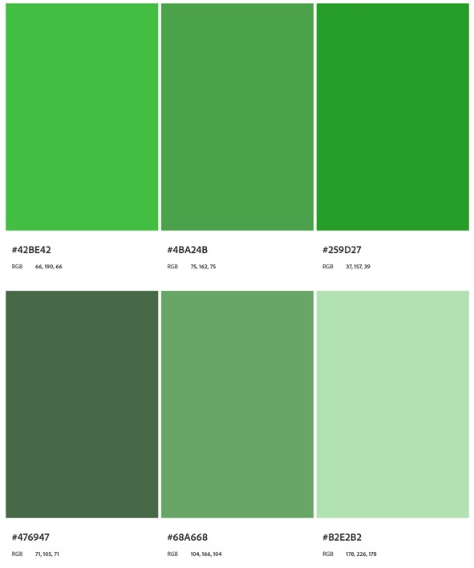

<h2 align="center">
  
</h2>

<h1 align="center">Universidad Peruana de Ciencias Aplicadas</h1>

<h3 align="center">
  Ingeniería de Software
    
  Curso: Desarrollo de Aplicaciones Open Source
    
  Sección: 7380
    
  Profesor: Hugo Allan Mori Paiva
    
  Semestre: 2025-20
    
  Informe del Trabajo Final
    
  Startup: EcoTech
    
  Producto: PlantaE
</h3>

| 
Alumno
       | 
Código
       |
|:-------------------------------------------:|:-------------------------------------------:|
|       Apaza Bocanegra, Elizabeth Noelia     |            u20231c197                       |
|       Contreras Leon, Flor De María         |            u202323243                       |
|       Guillen Galindo, Julio Adolfo         |            u20241a352                       |
|       Miraval Pomalaya, Rodrigo Jesus       |            u202311082                       |
|       Navarro Chinga, Antonio Jhair         |            u202314101                       |

 Setiembre 2025 

# Registro de Versiones del Informe  

| Versión | Fecha       | Autor(es)                            | Descripción de modificación                             |
|---------|-------------|--------------------------------------|---------------------------------------------------------|
|   0.1   | 12/09/2025  | Apaza Bocanegra, Elizabeth Noelia    |  Elaboración de la estructura inicial del reporte.      |

# Project Report Collaboration Insights  

---

# Contenido
- [Registro de Versiones del Informe](#registro-de-versiones-del-informe)
- [Project Report Collaboration Insights](#project-report-collaboration-insights)
- [Contenido](#contenido)
- [Student Outcome](#student-outcome)
- [Capítulo I: Introducción](#capítulo-i-introducción)
  - [1.1. Startup Profile](#11-startup-profile)
    - [1.1.1. Descripción de la Startup](#111-descripción-de-la-startup)
    - [1.1.2. Perfiles de integrantes del equipo](#112-perfiles-de-integrantes-del-equipo)
  - [1.2. Solution Profile](#12-solution-profile)
    - [1.2.1. Antecedentes y problemática](#121-antecedentes-y-problemática)
    - [1.2.2. Lean UX Process](#122-lean-ux-process)
      - [1.2.2.1. Lean UX Problem Statements](#1221-lean-ux-problem-statements)
      - [1.2.2.2. Lean UX Assumptions](#1222-lean-ux-assumptions)
      - [1.2.2.3. Lean UX Hypothesis Statements](#1223-lean-ux-hypothesis-statements)
      - [1.2.2.4. Lean UX Canvas](#1224-lean-ux-canvas)
  - [1.3. Segmentos objetivo](#13-segmentos-objetivo)
- [Capítulo II: Requirements Elicitation \& Analysis](#capítulo-ii-requirements-elicitation--analysis)
  - [2.1. Competidores](#21-competidores)
    - [2.1.1. Análisis competitivo](#211-análisis-competitivo)
    - [2.1.2. Estrategias y tácticas frente a competidores](#212-estrategias-y-tácticas-frente-a-competidores)
  - [2.2. Entrevistas](#22-entrevistas)
    - [2.2.1. Diseño de entrevistas](#221-diseño-de-entrevistas)
    - [2.2.2. Registro de entrevistas](#222-registro-de-entrevistas)
    - [2.2.3. Análisis de entrevistas](#223-análisis-de-entrevistas)
  - [2.3. Needfinding](#23-needfinding)
    - [2.3.1. User Personas](#231-user-personas)
    - [2.3.2. User Task Matrix](#232-user-task-matrix)
    - [2.3.3. User Journey Mapping](#233-user-journey-mapping)
    - [2.3.4. Empathy Mapping](#234-empathy-mapping)
  - [2.4. Big Picture Event Storming](#24-big-picture-event-storming)
  - [2.5. Ubiquitous Language](#25-ubiquitous-language)
- [Capítulo III: Requirements Specification](#capítulo-iii-requirements-specification)
  - [3.1. User Stories](#31-user-stories)
  - [3.2. Impact Mapping](#32-impact-mapping)
  - [3.3. Product Backlog](#33-product-backlog)
- [Capítulo IV: Product Design](#capítulo-iv-product-design)
  - [4.1. Style Guidelines](#41-style-guidelines)
    - [4.1.1. General Style Guidelines](#411-general-style-guidelines)
    - [4.1.2. Web Style Guidelines](#412-web-style-guidelines)
  - [4.2. Information Architecture](#42-information-architecture)
    - [4.2.1. Organization Systems](#421-organization-systems)
    - [4.2.2. Labeling Systems](#422-labeling-systems)
    - [4.2.3. SEO Tags and Meta Tags](#423-seo-tags-and-meta-tags)
    - [4.2.4. Searching Systems](#424-searching-systems)
    - [4.2.5. Navigation Systems](#425-navigation-systems)
  - [4.3. Landing Page UI Design](#43-landing-page-ui-design)
    - [4.3.1. Landing Page Wireframe](#431-landing-page-wireframe)
    - [4.3.2. Landing Page Mock-up](#432-landing-page-mock-up)
  - [4.4. Web Applications UX/UI Design](#44-web-applications-uxui-design)
    - [4.4.1. Web Applications Wireframes](#441-web-applications-wireframes)
    - [4.4.2. Web Applications Wireflow Diagrams](#442-web-applications-wireflow-diagrams)
    - [4.4.2. Web Applications Mock-ups](#442-web-applications-mock-ups)
    - [4.4.3. Web Applications User Flow Diagrams](#443-web-applications-user-flow-diagrams)
  - [4.5. Web Applications Prototyping](#45-web-applications-prototyping)
  - [4.6. Domain-Driven Software Architecture](#46-domain-driven-software-architecture)
    - [4.6.1. Design-Level Event Storming](#461-design-level-event-storming)
    - [4.6.2. Software Architecture Context Diagram](#462-software-architecture-context-diagram)
    - [4.6.3. Software Architecture Container Diagrams](#463-software-architecture-container-diagrams)
    - [4.6.4. Software Architecture Components Diagrams](#464-software-architecture-components-diagrams)
  - [4.7. Software Object-Oriented Design](#47-software-object-oriented-design)
    - [4.7.1. Class Diagrams](#471-class-diagrams)
  - [4.8. Database Design](#48-database-design)
    - [4.8.1. Database Diagrams](#481-database-diagrams)
- [Capítulo V: Product Implementation, Validation \& Deployment](#capítulo-v-product-implementation-validation--deployment)
  - [5.1. Software Configuration Management](#51-software-configuration-management)
    - [5.1.1. Software Development Environment Configuration](#511-software-development-environment-configuration)
    - [5.1.2. Source Code Management](#512-source-code-management)
    - [5.1.3. Source Code Style Guide \& Conventions](#513-source-code-style-guide--conventions)
    - [5.1.4. Software Deployment Configuration](#514-software-deployment-configuration)
  - [5.2. Landing Page, Services \& Applications Implementation](#52-landing-page-services--applications-implementation)
    - [5.2.1. Sprint 1](#521-sprint-1)
      - [5.2.1.1. Sprint Planning 1](#5211-sprint-planning-1)
      - [5.2.1.2. Aspect Leaders and Collaborators](#5212-aspect-leaders-and-collaborators)
      - [5.2.1.3. Sprint Backlog 1](#5213-sprint-backlog-1)
      - [5.2.1.4. Development Evidence for Sprint Review](#5214-development-evidence-for-sprint-review)
      - [5.2.1.5. Execution Evidence for Sprint Review](#5215-execution-evidence-for-sprint-review)
      - [5.2.1.6. Services Documentation Evidence for Sprint Review](#5216-services-documentation-evidence-for-sprint-review)
      - [5.2.1.7. Software Deployment Evidence for Sprint Review](#5217-software-deployment-evidence-for-sprint-review)
      - [5.2.1.8. Team Collaboration Insights during Sprint](#5218-team-collaboration-insights-during-sprint)

- [Conclusiones](#conclusiones)
- [Conclusiones y recomendaciones](#conclusiones-y-recomendaciones)
- [Video About-the-Team](#video-about-the-team)
- [Bibliografía](#bibliografía)
- [Anexos](#anexos)

# Student Outcome  
El curso contribuye al cumplimiento del Student Outcome ABET:
**ABET – EAC - Student Outcome 3**
Capacidad de comunicarse efectivamente con un rango de audiencias.
En el siguiente cuadro se describe las acciones realizadas y enunciados de conclusiones por parte del grupo, que permiten sustentar el haber alcanzado el logro del ABET – EAC - Student Outcome 3.

|             
Criterio específico
             |          
Acciones Realizadas
            |          
Conclusiones
            |
|:---------------------------------------------------------------------:|-------------------------------------------------------------------|------------------------------------------------------------|
| Comunica oralmente con efectividad a diferentes rangos de audiencia.  | <ul><li>**Apaza Bocanegra, Elizabeth Noelia**   **TB1:**   </li><li>**Contreras Leon, Flor De María**   **TB1:**   </li><li>**Guillen Galindo, Julio Adolfo**   **TB1:**   </li><li>**Miraval Pomalaya, Rodrigo Jesus**   **TB1:**   </li><li>**Navarro Chinga, Antonio Jhair**   **TB1:**</ul> | <ul><li>**TB1:** </li></ul> |
| Comunica por escrito con efectividad a diferentes rangos de audiencia | <ul><li>**Apaza Bocanegra, Elizabeth Noelia**   **TB1:**   </li><li>**Contreras Leon, Flor De María**   **TB1:**   </li><li>**Guillen Galindo, Julio Adolfo**   **TB1:**   </li><li>**Miraval Pomalaya, Rodrigo Jesus**   **TB1:**   </li><li>**Navarro Chinga, Antonio Jhair**   **TB1:**</ul> | <ul><li>**TB1:** </li></ul> |

# Capítulo I: Introducción
## 1.1. Startup Profile
### 1.1.1. Descripción de la Startup
Somos EcoTech, una startup universitaria conformada por estudiantes de la Universidad Peruana de Ciencias Aplicadas (UPC), dedicada a desarrollar soluciones tecnológicas que promuevan la sostenibilidad y el cuidado responsable de los recursos naturales. En un contexto donde la agricultura urbana y el mantenimiento de áreas verdes enfrentan retos de eficiencia y gestiones, presentamos PlantaE, una plataforma inteligente basada en IoT que permite a los usuarios monitorear y optimizar el cuidado de sus plantas y cultivos urbanos.

PlantaE surge ante la creciente necesidad de contar con herramientas accesibles y confiables que faciliten el riego eficiente y el cuidado de áreas verdes en hogares y viveros. La aplicación recopila datos en tiempo real sobre humedad, temperatura, luminosidad y calidad del aire mediante sensores instalados en macetas o terrenos de cultivo, brindando a los usuarios notificaciones oportunas y recomendaciones personalizadas para garantizar la salud de sus plantas. Ademas de, contribuir al uso responsable del agua, ofreciendo una plataforma que combina tecnología, sostenibilidad y facilidad de uso. Con PlantaE, buscamos acercar la innovación al bienestar ambiental y a la vida diaria de las personas, fomentando comunidades más conscientes y responsables con su entorno.

   
  

### Misión:
Digitalizar y optimizar el cuidado de cultivos urbanos mediante el uso de tecnologías IoT, ofreciendo a personas y viveros herramientas accesibles para gestionar sus plantas de forma sostenible, eficiente y consciente con el medio ambiente.

### Visión:
Ser una referencia en soluciones tecnológicas para el cuidado de plantas y áreas verdes, promoviendo un estilo de vida más sostenible y acercando la tecnología al servicio del bienestar ambiental y de las comunidades.

### 1.1.2. Perfiles de integrantes del equipo

| **Integrante**            | **Apaza Bocanegra, Elizabeth Noelia**                                               |
|---------------------------|-------------------------------------------------------------------------------------|
| **Código del Estudiante** |                                                                                     |
| **Carrera**               |                                                                                     |
| **Descripción**           |                                                                                     |
| **Foto**                  |  
  
  |

---

| **Integrante**            | **Contreras Leon, Flor De María**                                                   |
|---------------------------|-------------------------------------------------------------------------------------|
| **Código del Estudiante** |  u202323243                                                                         |
| **Carrera**               |  Ingenieria de Software                                                             |
| **Descripción**           |  Mi nombre es Flor de María Contreras León y actualmente estudio la carrera de Ingeniería de Software en la Universidad Peruana de Ciencias Aplicadas (UPC), sede San Miguel. Tengo 20 años y me considero una persona responsable, comprometida y dedicada a mi formación profesional.Me apasiona la programación y la investigación, áreas en las que busco seguir aprendiendo y desarrollando nuevas habilidades. Aunque me considero una persona callada, siempre estoy atenta a los detalles, lo que me permite trabajar de manera cuidadosa y eficiente en mis proyectos. Asimismo, valoro el trabajo en equipo y creo que un entorno colaborativo y respetuoso es clave para alcanzar los mejores resultados. |
| **Foto**                  | 
  
 |

---

| **Integrante**            | **Guillen Galindo, Julio Adolfo**                                                   |
|---------------------------|-------------------------------------------------------------------------------------|
| **Código del Estudiante** | u20241a352                                                                          |
| **Carrera**               | Ingeniería de Software                                                              |
| **Descripción**           | Actualmente curso la carrera de Ingeniería de Software en la UPC. Me considero una persona discreta, pero responsable y enfocada en cumplir los proyectos dentro de los plazos establecidos. Poseo conocimientos en C++ y Python; disfruto trabajar en equipo cuando existe colaboración y apoyo mutuo. Además, me motiva aplicar lo aprendido para afrontar los desafíos que puedan surgir en los próximos ciclos. |
| **Foto**                  | 
  
 |

---

| **Integrante**            | **Miraval Pomalaya, Rodrigo Jesus**                                                 |
|---------------------------|-------------------------------------------------------------------------------------|
| **Código del Estudiante** | u202311082                                                                          |
| **Carrera**               | Ingeniería de Software                                                              |
| **Descripción**           | Mi nombre es Rodrigo Jesús Miraval Pomalaya y estudio Ingeniería de Software en la Universidad Peruana de Ciencias Aplicadas. Me considero una persona adaptable y detallista, siempre en busca de aprender y mejorar en lo que hago. Tengo conocimientos en Python, JavaScript, HTML y CSS, además de un nivel intermedio en SQL Server y MySQL. Me gusta aplicar lo aprendido en proyectos académicos y trabajar en equipo, ya que compartir ideas no solo ayuda a obtener mejores resultados, sino también a ampliar mi visión en la carrera. |
| **Foto**                  |  
  
    |

---

| **Integrante**            | **Navarro Chinga, Antonio Jhair**                                                   |
|---------------------------|-------------------------------------------------------------------------------------|
| **Código del Estudiante** |                                                                                     |
| **Carrera**               |                                                                                     |
| **Descripción**           |                                                                                     |
| **Foto**                  |  
  
    |

## 1.2. Solution Profile
### 1.2.1. Antecedentes y problemática
En el Perú, el cuidado de áreas verdes y la agricultura enfrentan serias dificultades relacionadas con el uso eficiente de recursos, especialmente del agua. Según la Autoridad Nacional del Agua (ANA, 2023), más del 70% del recurso hídrico del país es destinado a la agricultura, pero gran parte se desperdicia debido a sistemas de riego poco eficientes y falta de tecnología de monitoreo.

En las ciudades, la situación no es distinta. Informes de la Municipalidad de Lima (2022) señalan que gran parte de los parques y jardines públicos presentan un riego deficiente, lo que repercute en el deterioro de áreas verdes urbanas. A nivel de hogares, el cuidado de plantas suele hacerse de manera intuitiva, sin datos precisos sobre humedad, temperatura o condiciones ambientales, lo que incrementa el riesgo de pérdida de cultivos o desperdicio de agua.

A esto se suma que la FAO (2021) ha destacado la importancia de impulsar la agricultura urbana y periurbana en países en desarrollo, no solo como fuente de alimentos, sino también como estrategia de sostenibilidad ambiental y de bienestar social. Sin embargo, en el Perú, aún existe un vacío en el acceso a soluciones tecnológicas accesibles que faciliten la gestión eficiente de cultivos urbanos y viveros.

**Análisis 5W2H**

| **Pregunta**                                                         | **Respuesta**                                                                                                                                                                                      |
|:--------------------------------------------------------------------:|:--------------------------------------------------------------------------------------------------------------------------------------------------------------------------------------------------:|
|**What**   ¿Cuál es el problema?                                   |  En el Perú, el cuidado de cultivos urbanos y áreas verdes enfrenta retos significativos por la falta de tecnologías que permitan un monitoreo preciso. Gran parte de los usuarios riegan de manera intuitiva, sin información confiable sobre humedad del suelo, temperatura, luminosidad o calidad del aire. Esto genera pérdidas de plantas, uso ineficiente del agua y deterioro de jardines urbanos y viveros.                                                             |
|**When**   ¿Cuándo sucede el problema?                             |  La problemática ocurre todo el año, pero se intensifica en temporadas de sequía, verano o en situaciones donde el usuario está fuera de casa por mucho tiempo. La falta de monitoreo en tiempo real y de datos confiables hace que la pérdida de cultivos o el mal uso del agua se convierta en un problema recurrente y continuo.                                                                                                                                              |
|**Where**   ¿Dónde se presenta el problema de negocio?             |  Este problema se presenta principalmente en ciudades con creciente interés en agricultura urbana. En las zonas costeras, la necesidad es mayor debido a la escasez de agua y a la poca adopción de tecnologías digitales en el mantenimiento de áreas verdes.                                                                                                                                                                                                                  |
|**Who**   ¿Quiénes están involucrados?                             |  Los principales afectados son las personas en hogares que buscan mantener sus plantas en zonas urbanas, así como viveros y negocios de jardinería que requieren eficiencia para reducir costos y mejorar la calidad de sus productos.                                                                                                                                                                                                                                        |
|**Why**   ¿Por qué se origina el problema?                         |  El uso eficiente del agua y la sostenibilidad ambiental son prioritarios. Según la Autoridad Nacional del Agua (ANA, 2023), más del 70% del recurso hídrico del país se destina a la agricultura, con altos niveles de desperdicio. Una solución tecnológica que permita recopilar datos en tiempo real, enviar alertas y recomendaciones personalizadas no solo optimiza el cuidado de las plantas, sino que también fomenta la conciencia ambiental y contribuye a la gestión responsable de los recursos naturales en un contexto urbano y doméstico.                                                                                                                                                                                                    |
|**How**   ¿Cómo afecta este problema a las personas involucradas?  |  La falta de monitoreo confiable provoca que los usuarios rieguen de manera insuficiente, lo que genera pérdida de plantas, frustración y mayores costos en el mantenimiento de áreas verdes. Y por consiguiente, repercute directamente en la calidad de los productos que ofrecen.                                                                                                                                                                                            |
|**How much**   ¿Cuánto impacto genera el problema en la sociedad?  |  Aunque el impacto económico es considerable, el uso ineficiente del agua contribuye al agotamiento de un recurso escaso en zonas urbanas, mientras que la pérdida de áreas verdes reduce la calidad de vida y el bienestar en las ciudades. En conjunto, esto repercute en la sostenibilidad urbana y en la gestión responsable de los recursos naturales.                                                                                                                      |

### 1.2.2. Lean UX Process
#### 1.2.2.1. Lean UX Problem Statements
- Los usuarios de áreas urbanas y viveros no cuentan con datos precisos y en tiempo real sobre las condiciones de sus cultivos (humedad, temperatura, luminosidad, calidad del aire), lo que ocasiona un riego ineficiente y un mayor riesgo de pérdida de plantas.  
- Las personas suelen regar sus plantas de manera intuitiva, sin información confiable, lo que genera desperdicio de agua y afecta la sostenibilidad del cuidado de áreas verdes.  
- Viveros y responsables de áreas verdes carecen de soluciones tecnológicas accesibles y fáciles de usar que permitan optimizar el manejo de cultivos urbanos.  

#### 1.2.2.2. Lean UX Assumptions
- Los usuarios están dispuestos a utilizar herramientas digitales siempre que estas sean fáciles de usar y les brinden información clara para mejorar el cuidado de sus cultivos.  
- La incorporación de sensores IoT permitirá obtener datos relevantes que ayudarán a optimizar el riego y mejorar la salud de las plantas.  
- Al recibir notificaciones y recomendaciones personalizadas, los usuarios podrán tomar mejores decisiones que contribuirán a la reducción del consumo de agua y al cuidado responsable de áreas verdes.  
- Existe un segmento de mercado (hogares y viveros urbanos) que busca soluciones sostenibles e innovadoras para optimizar sus recursos y mejorar sus resultados.  

#### 1.2.2.3. Lean UX Hypothesis Statements
- Creemos que al ofrecer una plataforma de monitoreo en tiempo real con sensores IoT, los usuarios urbanos y viveros podrán gestionar sus plantas de manera más eficiente.  
- Creemos que al proporcionar recomendaciones personalizadas y notificaciones oportunas, los usuarios reducirán el desperdicio de agua y mejorarán la salud de sus cultivos.  
- Creemos que al diseñar una interfaz sencilla y accesible, lograremos que tanto usuarios individuales como viveros adopten la aplicación sin necesidad de conocimientos técnicos avanzados.  
- Creemos que si demostramos beneficios tangibles (ahorro de agua, reducción de pérdidas de plantas), los usuarios estarán dispuestos a pagar por la solución.  

#### 1.2.2.4. Lean UX Canvas

 
   

## 1.3. Segmentos objetivo
| Segmento Objetivo | Aspectos demográficos | Aspectos geográficos | Aspectos psicográficos |
|-------------------|------------------------|-----------------------|-------------------------|
| **Personas (hogares urbanos que cuidan plantas)** | <ul><li>Sexo: Masculino y femenino.  </li><li>Edades: 25 – 55 años (adultos jóvenes y adultos interesados en la sostenibilidad y el cuidado del hogar).</ul> | <ul><li>Nacionalidad: Peruana.  </li><li>Zona geográfica: Principalmente zonas urbanas y periurbanas con acceso a áreas verdes o pequeños jardines.</ul> | <ul><li>Valoran la sostenibilidad y el cuidado responsable del medio ambiente.  </li><li>Interesados en tecnología accesible que facilite la vida cotidiana.  </li><li>Buscan practicidad y resultados visibles en el cuidado de sus plantas.  </li><li>Dispuestos a probar soluciones innovadoras si estas son fáciles de usar.</ul> |
| **Viveros comerciales** | <ul><li>Sexo: Masculino y femenino (administradores, encargados y trabajadores de viveros).  </li><li>Edades: 20 – 60 años (jóvenes adultos y adultos con experiencia en manejo de cultivos o gestión de negocios de plantas).</ul> | <ul><li>Nacionalidad: Peruana.  </li><li>Zona geográfica: Áreas urbanas, periurbanas y rurales donde se concentran viveros, centros de producción y espacios agrícolas.</ul> | <ul><li>Buscan optimizar recursos (agua, energía, tiempo) para aumentar la rentabilidad.  </li><li>Interesados en soluciones tecnológicas que mejoren la eficiencia operativa.  </li><li>Valoran herramientas que brinden datos confiables y prácticos para la toma de decisiones.  </li><li>Dispuestos a pagar por soluciones que generen beneficios tangibles en productividad y sostenibilidad.</ul> |

# Capítulo II: Requirements Elicitation & Analysis
## 2.1. Competidores

En esta sección, se presenta un análisis de los principales competidores de PlantaE, centrado en aquellos que operan con modelos de negocio digitales similares o que, aunque no sean idénticos, ofrecen productos o servicios que se superponen parcialmente con nuestra propuesta.Evaluamos tanto competidores directos, que ofrecen plataformas basadas en IoT para monitoreo de cultivos y áreas verdes, como competidores indirectos, que brindan soluciones de riego automatizado o aplicaciones de agricultura urbana más generales.

Este análisis nos permitirá comprender mejor el entorno competitivo y cómo podemos diferenciarnos en el ecosistema de soluciones de agricultura urbana sostenible.

1. ### AgroSmart : 
Es una de las startups líderes en soluciones de agricultura digital. Su plataforma combina sensores IoT, imágenes satelitales e inteligencia artificial para optimizar el manejo de grandes cultivos.

- **Fortalezas:** monitoreo IoT en tiempo real, predicciones climáticas y optimización avanzada del riego.

- **Debilidades:** está orientada a la agricultura a gran escala y requiere alta inversión, lo que limita su accesibilidad para viveros urbanos y hogares.

2. ### Netafim:
Es una empresa pionera en riego por goteo inteligente, con sistemas que reducen significativamente el consumo de agua en cultivos.

- **Fortalezas:** experiencia consolidada, sistemas de riego automatizado de alta eficiencia y sostenibilidad hídrica comprobada.

- **Debilidades:** alto costo de implementación y foco en agricultores medianos y grandes, con baja personalización para usuarios urbanos.

3. ### Plantix

Es una aplicación móvil que utiliza inteligencia artificial para diagnosticar plagas y enfermedades en cultivos mediante fotos.

- **Fortalezas:** accesibilidad desde dispositivos móviles, comunidad activa de usuarios y recomendaciones prácticas para el cuidado de plantas.

- **Debilidades:** su alcance está limitado al diagnóstico de problemas y no ofrece un sistema de monitoreo IoT ni gestión hídrica.

### 2.1.1. Análisis competitivo
<table> 
  <tr>
    <th colspan="7"> Competitive Analysis Landscape </th>
  </tr>
  <tr>
    <td colspan="2" rowspan="2">¿Por qué llevar acabo este análisis? </td>
    <td colspan="5"> ¿Que busca comprender el analisis de PlantaE frente a competidores que ofrecen soluciones de agricultura digital e IoT, considerando factores de accesibilidad, mercado objetivo y sostenibilidad? </td>
  </tr>
  <tr>
    <td colspan="5"> Este análisis busca comprender el posicionamiento de PlantaE en comparación con otras soluciones digitales e IoT para la gestión de cultivos y áreas verdes, identificando oportunidades de mejora y diferenciación frente a las necesidades de nuestros segmentos objetivos: hogares urbanos interesados en el cuidado sostenible de plantas y viveros comerciales que buscan optimizar el uso de recursos y mejorar la salud de sus cultivos. </td>
  </tr>
  <tr>
    <td colspan="2"> Productos </td>
    <td> 
 PlantaE    </td>
    <td> 
 AgroSmart   
 </td>
    <td> 
 Netafim   
 </td>
    <td> 
 Plantix   
 </td>
  </tr>
  <tr>
    <td rowspan="2">Perfil</td>
    <td>Overview</td>
    <td> Plataforma accesible de monitoreo IoT en tiempo real para hogares y viveros comerciales. </td>
    <td> Startup de agricultura digital con sensores IoT, IA y datos satelitales. </td>
    <td> Empresa líder en riego inteligente a nivel global. </td>
    <td> App móvil que diagnostica plagas y enfermedades con IA. </td>
  </tr>
  <tr>
    <td>Ventaja competitiva ¿Qué valor ofrece a los clientes?</td>
    <td> Accesible, simple y adaptable a hogares y viveros comerciales. </td>
    <td> Alta tecnología para agricultura a gran escala. </td>
    <td> Experiencia consolidada y eficiencia hídrica. </td>
    <td> Uso de IA accesible desde móvil y comunidad activa. </td>
  </tr>
  <tr>
    <td rowspan="2">Perfil de Marketing</td>
    <td> Mercado Objetivo </td>
    <td> Hogares urbanos y viveros comerciales pequeños/medianos. </td>
    <td> Agricultores industriales y medianos. </td>
    <td> Agricultores medianos y grandes. </td>
    <td> Agricultores y aficionados urbanos </td>
  </tr>
  <tr>
    <td> Estrategias de Marketing </td>
    <td> Educación digital sobre sostenibilidad, alianzas con viveros locales. </td>
    <td> Marketing B2B, posicionamiento tecnológico. </td>
    <td> Branding global, casos de éxito y sostenibilidad hídrica. </td>
    <td> Estrategia digital masiva vía Google Play/App Store. </td>
  </tr> 
  <tr>
    <td rowspan="3">Perfil de Producto</td>
    <td> Productos & Servicios </td>
    <td> Sensores IoT, web, recomendaciones personalizadas. </td>
    <td> Sensores IoT, pronósticos climáticos, gestión avanzada. </td>
    <td> Sistemas de riego por goteo inteligentes, software de gestión. </td>
    <td> Diagnóstico de plagas y comunidad de soporte. </td>
  </tr>
  <tr>
    <td> Precios & Costos </td>
    <td> Accesible, modelo freemium o suscripción baja. </td>
    <td> Alto costo, licencias SaaS premium. </td>
    <td> Alta inversión inicial y mantenimiento. </td>
    <td> Gratis con servicios premium. </td>
  </tr>
  <tr> 
    <td>Canales de distribución (Web y/o Móvil)</td>
    <td> Aplicación Web. </td>
    <td> Aplicación Web y App móvil. </td>
    <td> Equipos físicos más plataforma digital. </td>
    <td> App móvil. </td>
  </tr>  
  <tr>
    <td rowspan="4"> Análisis SWOT </td>
    <td> Fortalezas </td>
    <td> Accesibilidad, simplicidad de uso, enfoque en sostenibilidad urbana. </td>
    <td> Tecnología avanzada, IA y datos satelitales. </td>
    <td> Experiencia consolidada, reducción comprobada de consumo de agua. </td>
    <td> Uso de IA en diagnóstico, comunidad digital activa. </td>
  </tr>
  <tr>
    <td> Debilidades </td>
    <td> Escala inicial limitada, baja madurez tecnológica frente a competidores. </td>
    <td> Costos elevados, poco enfoque en usuarios pequeños. </td>
    <td> Alto costo, poca personalización para usuarios urbanos. </td>
    <td> No ofrece gestión hídrica ni monitoreo IoT. </td>
  </tr>
  <tr>
    <td> Oportunidades </td>
    <td> Creciente demanda de soluciones sostenibles, apoyo a viveros urbanos. </td>
    <td> Expansión en mercados emergentes. </td>
    <td> Creciente necesidad de eficiencia hídrica. </td>
    <td> Integración con soluciones de riego y monitoreo urbano. </td>
  </tr>
  <tr>
    <td> Amenazas </td>
    <td> Entrada de grandes competidores al segmento urbano, barreras de adopción tecnológica. </td>
    <td> Saturación de mercado y alta inversión necesaria para usuarios pequeños. </td>
    <td> Nuevas startups más ágiles y accesibles. </td>
    <td> Dependencia de la precisión de IA y limitación del modelo freemium. </td>
  </tr>
</table>

### 2.1.2. Estrategias y tácticas frente a competidores
Para enfrentar a la competencia y posicionarse de manera sólida en el ecosistema de soluciones sostenibles, **PlantaE implementará estrategias enfocadas en sus principales ventajas competitivas** y en la explotación de oportunidades poco atendidas por otras iniciativas. Entre las principales tácticas preliminares destacan:

**Estrategia de diferenciación sostenible :**
- La plataforma digital de PlantaE facilitará la conexión entre ciudadanos, municipalidades, ONGs y empresas, mediante herramientas enfocadas en la regeneración de áreas verdes y el monitoreo comunitario. Se contempla, por ejemplo, el desarrollo progresivo de funcionalidades como reportes de impacto ambiental en tiempo real y mapas interactivos de proyectos verdes, diferenciándonos de competidores que se centran únicamente en el sector agrícola o de riego.

**Alianzas estratégicas multiactor:**
- PlantaE priorizará la construcción de convenios con municipalidades, viveros urbanos y organizaciones comunitarias. Estas alianzas permitirán fortalecer la confianza en la plataforma, garantizar acceso a insumos sostenibles y generar proyectos colaborativos que refuercen el sentido de pertenencia ciudadana.

**Campañas digitales con enfoque social y ambiental:**
- Las campañas en redes sociales serán clave para sensibilizar sobre la importancia del cuidado de áreas verdes urbanas. Se priorizarán contenidos educativos, testimonios de voluntarios y casos de éxito en la transformación de espacios públicos, reforzando así la conexión emocional entre los usuarios y su entorno.

**Captación y fidelización de comunidades:**
- La plataforma incluirá herramientas que permitan a los ciudadanos participar en proyectos de reforestación, limpieza y mantenimiento, mientras que ONGs y empresas podrán gestionar sus iniciativas desde un panel especializado. Se prevé también la implementación de incentivos no monetarios, como reconocimientos digitales o certificaciones de impacto ambiental.

**Gestión de riesgos y validación de proyectos:**
- Frente a la posible desconfianza en nuevas plataformas digitales o la falta de continuidad en proyectos comunitarios, PlantaE aplicará un modelo de validación y seguimiento transparente. Cada proyecto contará con métricas claras de impacto y espacios de retroalimentación, lo que fortalecerá la confianza y garantizará la sostenibilidad a largo plazo.

## 2.2. Entrevistas

### 2.2.1. Diseño de entrevistas
Hola, mi nombre es [Nombre del entrevistador] y formo parte del equipo que está desarrollando PlantaE, una iniciativa que busca mejorar el cuidado de plantas y áreas verdes con ayuda de la tecnología. Nuestra idea es apoyarnos en el Internet de las Cosas (IoT), es decir, en sensores y dispositivos que recopilan datos en tiempo real sobre tus plantas —por ejemplo, la humedad del suelo o la cantidad de agua utilizada— para que el riego y el mantenimiento sean más fáciles y eficientes.

Con esto queremos crear una aplicación que te brinde alertas, consejos y herramientas prácticas para ahorrar agua, cuidar mejor de las plantas y simplificar el proceso, ya sea en casa o en un vivero.

**Diseño de entrevistas - Segmento 1 :**

**Presentacion del proyecto y inicio de la entrevista:**
- Para empezar, ¿puedes contarnos tu nombre y qué relación tienes con el cuidado de plantas en tu hogar?

- ¿Cómo describirías tu experiencia con las plantas: las consideras un pasatiempo, una responsabilidad o parte de tu estilo de vida?

- ¿Qué lugar ocupan las plantas en tu día a día (ejemplo: decoración, conexión con la naturaleza, bienestar personal)?

- ¿Desde cuándo empezaste a cuidar plantas en casa y qué te motivó a hacerlo?

**Preguntas:**

1. ¿Dedicas un tiempo específico en la semana para cuidar tus plantas o lo haces de manera espontánea?

2. ¿Qué dificultades enfrentas al cuidar tus plantas o áreas verdes?

3. ¿Cómo organizas el riego y mantenimiento de tus plantas?

4. ¿Has tenido problemas relacionados con el riego (por exceso, falta o uso de agua)?

5. ¿Qué tanto influye el consumo de agua en tu decisión de cuidar más o menos plantas?

6. ¿Alguna vez has perdido plantas por no darles el cuidado adecuado? ¿Cómo te sentiste?

7. ¿Ha tenido problemas relacionados con el mantenimiento general de tus plantas (plagas, falta de tiempo, espacio)?

8. ¿Usas actualmente alguna aplicación, sistema o herramienta para ayudarte en el cuidado de tus plantas?

9. ¿Qué tan cómodo te sentirías usando sensores o aplicaciones para recibir alertas y recomendaciones sobre tus plantas?

10. ¿Qué tan útil te resultaría una aplicación que te ayude a optimizar el riego y cuidado de tus plantas?

11. ¿Qué funcionalidades te motivarían más a usar una aplicación como esta? (ejemplo: alertas de riego, consejos personalizados, ahorro de agua).

12. Si tuvieras esta aplicación, ¿cómo crees que cambiaría tu experiencia actual con el cuidado de plantas en casa?

13. ¿Hay algo más que te gustaría agregar sobre tu experiencia con las plantas y áreas verdes?

**Diseño de entrevistas - Segmento 2 :**

**Presentacion del proyecto y inicio de la entrevista:**

- Para comenzar, ¿puedes presentarte y contarnos tu rol dentro del vivero o negocio de plantas?

- ¿Cuál es la historia detrás del vivero? (¿Cómo empezó y qué los motivó a dedicarse a este rubro?)

- ¿Qué tanto valoras la tecnología o la innovación en el manejo de riego y mantenimiento en tu negocio?

**Preguntas:**

1. ¿Qué retos enfrenta en la gestión del riego y mantenimiento a gran escala?

2. ¿Cómo manejan actualmente el control del consumo de agua?

3. ¿Qué estrategias utilizan para garantizar que las plantas se mantengan en buen estado?

4. ¿Han tenido pérdidas significativas de plantas por problemas de riego o mantenimiento?

5. ¿Qué métodos utilizan para planificar y organizar las tareas de su equipo en el vivero?

6. ¿Cómo gestionan el almacenamiento y uso de insumos (fertilizantes, sustratos, pesticidas)?

7. ¿Qué tan importante es para su negocio poder reducir costos relacionados al consumo de agua y mantenimiento?

8. ¿Utilizan actualmente algún software o sistema digital para gestionar el vivero? ¿Cuál?

9. ¿Qué tipo de información o métricas consideran más útiles para tomar decisiones sobre la producción y venta?

10. ¿De qué forma creen que una aplicación como PlantaE podría apoyar la eficiencia y sostenibilidad en su vivero?

11. ¿Qué funcionalidades valoraría más en una herramienta digital pensada para viveros (ejemplo: gestión de riego por sectores, alertas de plagas, informes de consumo)?

### 2.2.2. Registro de entrevistas
### 2.2.3. Análisis de entrevistas

## 2.3. Needfinding
### 2.3.1. User Personas
- User Persona – Usuario Doméstico

| **Attributes**   | **Values** |
|------------------|------------|
| **Name**         | Ana Torres |
| **Age**          | 29 años |
| **Occupation**   | Diseñadora gráfica (trabajo remoto) |
| **Status**       | Soltera |
| **Location**     | Lima, Perú (San Borja) |
| **Tier**         | Cuidadora de plantas domésticas |
| **Archetype**    | Amante de las plantas |
| **Image**        | 
  
 |
| **Quote**        | "Quiero una solución simple y confiable para que mis plantas estén siempre bien." |
| **Motivations**  | Incentive: 80/100 · Fear: 60/100 · Achievement: 70/100 · Growth: 65/100 · Power: 30/100 · Social: 85/100 |
| **Goals**        | Mantener sanas sus plantas de interior y jardín · Recibir alertas simples y claras sobre riego, luz y humedad · Compartir logros en redes sociales |
| **Frustrations** | Falta de tiempo para investigar cuidados · No identificar enfermedades a tiempo · Información técnica confusa en otras apps |
| **Biography**    | Ana vive sola en un departamento y disfruta decorarlo con plantas. Ha perdido varias porque no sabía cómo cuidarlas correctamente. Quiere recordatorios sencillos que eviten descuidos. Comparte sus hobbies en redes sociales y valora soluciones visuales y fáciles de usar. |
| **Personality**  | Extrovert: 65/100 · Thinking: 70/100 · Judging: 60/100 |
| **Technology**   | IT & Internet: 80/100 · Software: 65/100 · Mobile Apps: 90/100 · Social Networks: 95/100 |
| **Brands**       | Instagram · TikTok · Pinterest |

- User Persona – Usuario Institucional

| **Attributes**   | **Values** |
|------------------|------------|
| **Name**         | Carlos Ramírez |
| **Age**          | 45 años |
| **Occupation**   | Administrador de vivero |
| **Status**       | Casado |
| **Location**     | Lima, Perú (Ate) |
| **Tier**         | Gestor de vivero/invernadero |
| **Archetype**    | Administrador pragmático |
| **Image**        | 
  
 |
| **Quote**        | "Necesito datos claros para tomar decisiones rápidas y efectivas." |
| **Motivations**  | Incentive: 85/100 · Fear: 55/100 · Achievement: 90/100 · Growth: 80/100 · Power: 70/100 · Social: 60/100 |
| **Goals**        | Optimizar consumo de agua y fertilizantes · Recibir reportes claros y priorizados para casos críticos · Tomar decisiones estratégicas con base en tendencias históricas |
| **Frustrations** | Instalación de sensores compleja · Resistencia del personal al cambio · Exceso de alertas sin priorización |
| **Biography**    | Carlos administra un vivero de tamaño medio. Usa planillas y reportes en papel, pero sabe que la digitalización es clave. Busca ahorrar costos y tiempo con herramientas que generen reportes claros, exportables y fáciles de compartir con la gerencia. |
| **Personality**  | Extrovert: 55/100 · Thinking: 85/100 · Judging: 75/100 |
| **Technology**   | IT & Internet: 70/100 · Software: 80/100 · Mobile Apps: 60/100 · Social Networks: 50/100 |
| **Brands**       | LinkedIn · Excel · Google Workspace |

### 2.3.2. User Task Matrix

| **Tareas**                              | **Ana (Frecuencia)** | **Ana (Importancia)** | **Carlos (Frecuencia)** | **Carlos (Importancia)** |
|-----------------------------------------|----------------------|-----------------------|-------------------------|--------------------------|
| Buscar solución para cuidado de plantas | Alta                 | Alta                  | Media                   | Media                    |
| Instalar sensores                       | Media                | Alta                  | Alta                    | Alta                     |
| Configurar la app/dashboard             | Alta                 | Alta                  | Alta                    | Alta                     |
| Monitorear condiciones de las plantas   | Alta                 | Alta                  | Alta                    | Alta                     |
| Recibir alertas de cuidado              | Alta                 | Alta                  | Alta                    | Alta                     |
| Analizar reportes históricos            | Baja                 | Media                 | Alta                    | Alta                     |
  | Compartir logros o resultados         | Alta                 | Media                 | Media                   | Media                    |
| Exportar reportes                       | Baja                 | Baja                  | Alta                    | Alta                     |

---

### Conclusiones
- **Ana** (usuaria doméstica) se enfoca en tareas simples y motivacionales como recibir recordatorios, cuidar sus plantas y compartir avances en redes sociales.  
- **Carlos** (usuario institucional) prioriza el análisis de datos, la exportación de reportes y la optimización de recursos en su vivero.  
- Ambos coinciden en la **alta importancia de un dashboard confiable y alertas claras**, lo que convierte estas funciones en elementos centrales del diseño de **PlantaE**.

### 2.3.3. User Journey Mapping
- Segmento objetivo 1:

  

- Segmento objetivo 2:

 

### 2.3.4. Empathy Mapping
- Segmento objetivo 1:

 

- Segmento objetivo 2:

 

## 2.4. Big Picture Event Storming

 
   
   
   
   

## 2.5. Ubiquitous Language
| **Término (Inglés)**         | **Término (Español)**       | **Descripción**                                                                                              |
|------------------------------|-----------------------------|--------------------------------------------------------------------------------------------------------------|
| **Soil Moisture**            | Humedad del suelo           | Cantidad de agua presente en la tierra donde crece la planta; determina la necesidad de riego.               |
| **Air Quality**              | Calidad del aire            | Condiciones del aire que rodea al cultivo, considerando pureza y presencia de contaminantes.                 |
| **Sunlight Exposure**        | Exposición a la luz solar   | Cantidad de luz solar o artificial que recibe la planta, fundamental para la fotosíntesis y el crecimiento.  |
| **Plant Health**             | Salud de la planta          | Estado general de una planta basado en sus condiciones ambientales y cuidados recibidos.                     |
| **Watering Recommendation**  | Recomendación de riego      | Sugerencia personalizada generada para optimizar el uso del agua y mantener el buen estado del cultivo.      |
| **Alert Notification**       | Notificación de alerta      | Mensaje que informa al usuario sobre condiciones críticas que requieren acción inmediata.                    |
| **Dashboard**                | Panel de control            | Interfaz donde el usuario visualiza en tiempo real el estado de sus cultivos y recibe notificaciones.        |
| **Growth Stage**             | Etapa de crecimiento        | Fase de desarrollo en la que se encuentra la planta (germinación, crecimiento, floración, madurez).          |
| **Overwatering**             | Exceso de riego             | Situación en la que la planta recibe más agua de la necesaria, lo que puede causar pudrición de raíces.      |
| **Underwatering**            | Falta de riego              | Situación en la que la planta recibe menos agua de la necesaria, afectando su salud y crecimiento.           |
| **Indoor Plant**             | Planta de interior          | Planta cultivada dentro de un espacio cerrado, adaptada a condiciones de luz artificial o indirecta.         |
| **Outdoor Plant**            | Planta de exterior          | Planta cultivada en terrazas, balcones o jardines, expuesta a condiciones ambientales naturales.             |
| **Fertilizer Use**           | Uso de fertilizantes        | Práctica de añadir nutrientes a la maceta para mejorar el crecimiento y salud de la planta.                  |

# Capítulo III: Requirements Specification
## 3.1. User Stories
<table>
    <tr>
        <td>Epic / Story ID</td>
        <td>Título</td>
        <td>Descripción</td>
        <td>Criterios de Aceptación</td>
        <td>Relacionado con (Epic ID)</td>
    </tr>
      <tr>
      <td>EP-01</td>
      <td>Comunicación de valor y confianza en la página de inicio</td>
      <td>Como usuario, quiero entender de inmediato qué es PlantaE, sus beneficios y testimonios de otros usuarios, para sentirme motivado a registrarme.</td>
      <td></td>
      <td></td>
    </tr>
    <tr>
        <td>EP-02</td>
        <td>Accesibilidad de la plataforma</td>
        <td>Como usuario, quiero que la plataforma sea accesible en móviles, tablets y escritorio, con modo oscuro y soporte de lectores de pantalla, para usarla sin barreras.</td>
        <td></td>
        <td></td>
    </tr>
    <tr>
        <td>EP-03</td>
        <td>Gestión de autenticación y acceso</td>
        <td>Como usuario, quiero registrarme, iniciar sesión y recuperar mi contraseña, para acceder a mis cultivos de manera segura y sin inconvenientes.</td>
        <td></td>
        <td></td>
    </tr>
    <tr>
        <td>EP-04</td>
        <td>Gestión al dashboard</td>
        <td>Como usuario, quiero acceder a un dashboard con métricas y mis plantas registradas, para supervisar mis plantas.</td>
        <td></td>
        <td></td>
    </tr>
    <tr>
        <td>EP-05</td>
        <td>Gestión de perfil</td>
        <td>Como usuario, quiero editar mis datos personales, idioma y preferencias de notificación, para mantener mi perfil actualizado y adaptado a mis necesidades.</td>
        <td></td>
        <td></td>
    </tr>
    <tr>
        <td>EP-06</td>
        <td>Gestión de plantas y sensores</td>
        <td>Como usuario, quiero registrar plantas y vincular sensores IoT (humedad, luz, temperatura), para monitorear el estado de mis cultivos en tiempo real.</td>
        <td></td>
        <td></td>
    </tr>
    <tr>
        <td>EP-07</td>
        <td>Gestión de insumos y recursos de cultivo</td>
        <td>Como usuario, quiero llevar un registro básico de insumos (fertilizantes, semillas, tierra), para planificar mejor el cuidado de mis plantas.</td>
        <td></td>
        <td></td>
    </tr>    
    <tr>
        <td>EP-08</td>
        <td>Panel de métricas y estadísticas</td>
        <td>Como usuario, quiero ver gráficos de humedad, luz, temperatura y fertilización, para analizar la evolución de mis cultivos con datos históricos.</td>
        <td></td>
        <td></td>
    </tr>
    <tr>
        <td>EP-09</td>
        <td>Notificaciones inteligentes y recordatorios</td>
        <td>Como usuario, quiero recibir alertas automáticas sobre humedad baja, falta de luz o fertilización pendiente, para actuar a tiempo y evitar problemas en mis plantas.</td>
        <td></td>
        <td></td>
    </tr>
    <tr>
        <td>EP-10</td>
        <td>Seguimiento del estado de los cultivos</td>
        <td>Como usuario, quiero registrar y visualizar las fases de crecimiento de mis plantas, para planificar cuidados y saber cuándo cosechar.</td>
        <td></td>
        <td></td>
    </tr>
    <tr>
        <td>EP-11</td>
        <td>Feedback y calificaciones comunitarias</td>
        <td>Como usuario, quiero calificar y comentar consejos de la comunidad, para apoyar las mejores prácticas y dar retroalimentación útil.</td>
        <td></td>
        <td></td>
    </tr>
    <tr>
        <td>EP-12</td>
        <td>Gestión de catálogo de plantas</td>
        <td>Como usuario, quiero acceder a una biblioteca de plantas con fichas técnicas y cuidados básicos, para asociarlas a mis registros y aprender más sobre ellas.</td>
        <td></td>
        <td></td>
    </tr>
    <tr>
        <td>EP-13</td>
        <td>Gestión de tareas y acciones programadas</td>
        <td>Como usuario, quiero programar tareas automáticas (regar, fertilizar, trasplantar), para no olvidar el cuidado de mis plantas.</td>
        <td></td>
        <td></td>
    </tr>
    <tr>
        <td>EP-14</td>
        <td>Historial de cuidados y cosechas</td>
        <td>Como usuario, quiero guardar un historial de riegos, fertilizaciones, podas y cosechas, para llevar un control completo de mis cultivos.</td>
        <td></td>
        <td></td>
    </tr>
    <tr>
        <td>EP-15</td>
        <td>Información institucional y autores</td>
        <td>Como visitante, quiero ver una sección sobre los autores de la aplicación y los objetivos del proyecto, para conocer quién está detrás de PlantaE.</td>
        <td></td>
        <td></td>
    </tr>
    <tr>
        <td>US-01</td>
        <td>Acceso a la plataforma</td>
        <td>Como visitante, quiero registrarme o iniciar sesión, para acceder a las funcionalidades de PlantaE.</td>
        <td>
            <ul>
                <li>Escenario 1: Registro exitoso: Dado que el visitante no tiene cuenta, cuando ingresa datos válidos y confirma el registro, entonces el sistema crea la cuenta y lo dirige al dashboard.</li>
                <li>Escenario 2: Inicio de sesión válido: Dado que el usuario ya tiene cuenta, cuando ingresa sus credenciales correctas, entonces accede al sistema sin inconvenientes.</li>
            </ul>
        </td>
        <td>EP-03</td>
    </tr>
    <tr>
        <td>US-02</td>
        <td>Recuperación de contraseña</td>
        <td>Como usuario, quiero recuperar el acceso a mi cuenta mediante correo electrónico, para continuar usando la app aunque olvide mis credenciales.</td>
        <td>
            <ul>
                <li>Escenario 1: Solicitud válida: Dado que el usuario olvidó su contraseña, cuando ingresa su correo válido, entonces el sistema envía un enlace de recuperación.</li>
            </ul>
        </td>
        <td>EP-03</td>
    </tr>
    <tr>
        <td>US-03</td>
        <td>Gestión de plantas</td>
        <td>Como usuario, quiero registrar mis plantas con nombre, tipo y foto, para organizarlas y monitorearlas.</td>
        <td>
            <ul>
                <li>Escenario 1: Registro de planta: Dado que el usuario está en la sección “Mis plantas”, cuando ingresa nombre, tipo y foto, entonces el sistema guarda y muestra la planta en la lista.</li>
                <li>Escenario 2: Eliminación de planta: Dado que el usuario selecciona una planta, cuando confirma su eliminación, entonces el sistema la borra y actualiza la lista.</li>
            </ul>
        </td>
        <td>EP-04</td>
    </tr>
    <tr>
        <td>US-04</td>
        <td>Alertas de cultivo</td>
        <td>Como usuario, quiero recibir notificaciones sobre humedad, luz o temperatura, para cuidar mis plantas a tiempo.</td>
        <td>
            <ul>
                <li>Escenario 1: Alerta de humedad baja: Dado que la humedad cae bajo el umbral, cuando el sistema recibe el dato, entonces envía una alerta de riego al usuario.</li>
                <li>Escenario 2: Historial de alertas: Dado que el usuario ha recibido alertas, cuando accede al historial, entonces ve una lista cronológica de notificaciones.</li>
            </ul>
        </td>
        <td>EP-05</td>
    </tr>
    <tr>
        <td>US-05</td>
        <td>Recomendaciones personalizadas</td>
        <td>Como usuario, quiero recibir consejos basados en mi tipo de planta y datos históricos, para mejorar su salud.</td>
        <td>
            <ul>
                <li>Escenario 1: Generación de consejo: Dado que el usuario tiene plantas registradas, cuando el sistema analiza los datos de sensores, entonces genera recomendaciones de cuidado.</li>
            </ul>
        </td>
        <td>EP-05</td>
    </tr>
    <tr>
        <td>US-06</td>
        <td>Panel de métricas</td>
        <td>Como usuario, quiero ver gráficos de humedad, temperatura y luz, para analizar tendencias de mis plantas.</td>
        <td>
            <ul>
                <li>Escenario 1: Visualización de gráficos: Dado que hay datos históricos de sensores, cuando el usuario selecciona una planta, entonces se muestran gráficas de humedad, luz y temperatura.</li>
            </ul>
        </td>
        <td>EP-07</td>
    </tr>
    <tr>
        <td>US-07</td>
        <td>Gestión de perfil</td>
        <td>Como usuario, quiero actualizar mis datos e idioma preferido, para personalizar mi experiencia en PlantaE.</td>
        <td>
            <ul>
                <li>Escenario 1: Edición de datos: Dado que el usuario está en su perfil, cuando actualiza su nombre o correo válido, entonces el sistema guarda los cambios.</li>
                <li>Escenario 2: Cambio de idioma: Dado que la plataforma soporta español e inglés, cuando el usuario cambia el idioma, entonces todo el contenido se muestra en el idioma seleccionado.</li>
            </ul>
        </td>
        <td>EP-06</td>
    </tr>
    <tr>
        <td>US-08</td>
        <td>Alternar modo oscuro/claro</td>
        <td>Como usuario, quiero poder cambiar entre modo oscuro y claro, para visualizar la página de acuerdo a mis preferencias.</td>
        <td>
            <ul>
                <li>Escenario 1: Cambio manual: Dado que el usuario navega en la plataforma, cuando activa el botón de modo oscuro, entonces la interfaz cambia inmediatamente a ese esquema de colores.</li>
            </ul>
        </td>
        <td>EP-02</td>
    </tr>
    <tr>
        <td>US-09</td>
        <td>Sección de contáctanos</td>
        <td>Como visitante, quiero tener un formulario de contacto, para enviar consultas o sugerencias directamente al equipo de PlantaE.</td>
        <td>
            <ul>
                <li>Escenario 1: Envío válido: Dado que el visitante completa nombre, correo electrónico y mensaje, cuando hace clic en “Enviar”, entonces el sistema almacena la solicitud y notifica al equipo.</li>
                <li>Escenario 2: Validación de campos: Dado que el visitante deja un campo obligatorio vacío o ingresa un correo inválido, cuando intenta enviar el formulario, entonces el sistema muestra un error y no permite el envío.</li>
            </ul>
        </td>
        <td>EP-01</td>
    </tr>
    <tr>
        <td>US-10</td>
        <td>Mostrar autores de la aplicación</td>
        <td>Como visitante, quiero ver una sección con los autores de la app, para conocer quiénes desarrollaron PlantaE.</td>
        <td>
            <ul>
                <li>Escenario 1: Visualización de autores  Dado que el visitante accede a la sección “Sobre nosotros”, cuando carga el contenido, entonces ve una lista con nombres, roles y fotos de los autores.</li>
            </ul>
        </td>
        <td>EP-01</td>
    </tr>
    <tr>
        <td>US-11</td>
        <td>Agregar sensores IoT</td>
        <td>Como usuario, quiero poder vincular un nuevo sensor IoT a una planta, para empezar a recibir datos.</td>
        <td>
            <ul>
                <li>Escenario 1: Vinculación exitosa: Dado que el usuario tiene un sensor nuevo, cuando ingresa su código de registro válido, entonces el sistema lo vincula a la planta seleccionada.</li>
                <li>Escenario 2: Código inválido: Dado que el usuario ingresa un código incorrecto, cuando intenta registrarlo, entonces el sistema muestra un mensaje de error.</li>
            </ul>
        </td>
        <td>EP-04</td>
    </tr>
    <tr>
        <td>US-12</td>
        <td>Visualizar sensores más activos</td>
        <td>Como usuario, quiero ver cuáles sensores registran más actividad, para identificar cultivos con mayor demanda de cuidado.</td>
        <td>
            <ul>
                <li>Escenario 1: Ranking de actividad: Dado que hay sensores vinculados, cuando el usuario abre el panel de métricas, entonces el sistema muestra un ranking con los sensores más activos.</li>
            </ul>
        </td>
        <td>EP-07</td>
    </tr>
    <tr>
        <td>US-13</td>
        <td>Ver alertas recientes</td>
        <td>Como usuario, quiero ver un panel con mis últimas alertas de plantas, para actuar rápido.</td>
        <td>
            <ul>
                <li>Escenario 1: Visualización de alertas: Dado que existen alertas activas, cuando el usuario accede al panel, entonces se muestran clasificadas por tipo (riego, temperatura, luz).</li>
            </ul>
        </td>
        <td>EP-05</td>
    </tr>
    <tr>
        <td>US-14</td>
        <td>Identificar mis plantas más críticas</td>
        <td>Como usuario, quiero ver qué plantas requieren más atención, para priorizar su cuidado.</td>
        <td>
            <ul>
                <li>Escenario 1: Orden de criticidad: Dado que hay varias plantas registradas, cuando el sistema detecta alertas, entonces las ordena por nivel de criticidad en el dashboard.</li>
            </ul>
        </td>
        <td>EP-07</td>
    </tr>
    <tr>
        <td>US-15</td>
        <td>Registro de cosechas</td>
        <td>Como usuario, quiero registrar las veces que cosecho una planta, para llevar un historial de producción.</td>
        <td>
            <ul>
                <li>Escenario 1: Registro exitoso: Dado que el usuario cosecha una planta, cuando ingresa fecha y cantidad, entonces el sistema guarda el registro en el historial.</li>
                <li>Escenario 2: Registro incompleto: Dado que el usuario omite un dato obligatorio, cuando intenta guardar, entonces el sistema muestra un error.</li>
            </ul>
        </td>
        <td>EP-07</td>
    </tr>
    <tr>
        <td>US-16</td>
        <td>Seguimiento de estado de cultivo</td>
        <td>Como usuario, quiero ver las fases de crecimiento de mis plantas, para planificar mejor sus cuidados.</td>
        <td>
            <ul>
                <li>Escenario 1: Cambio automático de fase: Dado que el sistema tiene datos históricos, cuando detecta patrones de crecimiento, entonces actualiza automáticamente la fase de la planta.</li>
            </ul>
        </td>
        <td>EP-04</td>
    </tr>
    <tr>
        <td>US-17</td>
        <td>Visualizar feedback de la comunidad</td>
        <td>Como usuario, quiero ver comentarios y calificaciones de consejos publicados, para identificar las mejores prácticas.</td>
        <td>
            <ul>
                <li>Escenario 1: Visualización de feedback: Dado que existen comentarios en un consejo, cuando el usuario lo abre, entonces puede leerlos con sus calificaciones.</li>
            </ul>
        </td>
        <td>EP-08</td>
    </tr>
    <tr>
        <td>US-18</td>
        <td>Visualizar lista de sensores activos</td>
        <td>Como usuario, quiero ver todos los sensores conectados, para controlar qué plantas están siendo monitoreadas.</td>
        <td>
            <ul>
                <li>Escenario 1: Listado de sensores: Dado que hay sensores vinculados, cuando el usuario accede al panel de sensores, entonces se listan con estado y planta asociada.</li>
                <li>Escenario 2: Eliminación de sensor: Dado que el usuario ya no quiere usar un sensor, cuando lo elimina, entonces desaparece de la lista y se desasocia de la planta.</li>
            </ul>
        </td>
        <td>EP-04</td>
    </tr>
    <tr>
        <td>US-19</td>
        <td>Consultar datos de un sensor</td>
        <td>Como usuario, quiero ver todos los registros de un sensor específico, para entender el comportamiento de una planta.</td>
        <td>
            <ul>
                <li>Escenario 1: Consulta detallada: Dado que un sensor tiene registros, cuando el usuario lo selecciona, entonces el sistema muestra los datos históricos en gráficas.</li>
            </ul>
        </td>
        <td>EP-04</td>
    </tr>
    <tr>
        <td>US-20</td>
        <td>Historial de alertas por planta</td>
        <td>Como usuario, quiero ver todas las alertas recibidas de una planta, para llevar un control de su evolución.</td>
        <td>
            <ul>
                <li>Escenario 1: Listado cronológico: Dado que la planta ha generado alertas, cuando el usuario abre su historial, entonces se muestran en orden de fecha.</li>
            </ul>
        </td>
        <td>EP-05</td>
    </tr>
    <tr>
        <td>US-21</td>
        <td>Descargar reportes</td>
        <td>Como usuario, quiero descargar un reporte de mis cultivos en Excel o PDF, para analizar mis datos fuera de la plataforma.</td>
        <td>
            <ul>
                <li>Escenario 1: Generación exitosa: Dado que el usuario tiene datos registrados, cuando solicita un reporte, entonces el sistema genera el archivo con la información.</li>
            </ul>
        </td>
        <td>EP-07</td>
    </tr>
    <tr>
        <td>US-22</td>
        <td>Cambio de contraseña</td>
        <td>Como usuario autenticado, quiero cambiar mi contraseña, para mantener la seguridad de mi cuenta.</td>
        <td>
            <ul>
                <li>Escenario 1: Cambio exitoso: Dado que el usuario conoce su contraseña actual, cuando ingresa una nueva válida, entonces el sistema actualiza la información y confirma el cambio.</li>
                <li>Escenario 2: Contraseña incorrecta: Dado que el usuario ingresa la contraseña actual incorrecta, cuando intenta cambiarla, entonces el sistema rechaza la solicitud.</li>
            </ul>
        </td>
        <td>EP-03</td>
    </tr>
    <tr>
        <td>US-23</td>
        <td>Eliminar cuenta</td>
        <td>Como usuario, quiero poder eliminar mi cuenta, para dejar de usar PlantaE y borrar mis datos personales.</td>
        <td>
            <ul>
                <li>Escenario 1: Eliminación exitosa: Dado que el usuario confirma la acción, cuando acepta eliminar su cuenta, entonces el sistema borra toda su información.</li>
            </ul>
        </td>
        <td>EP-03</td>
    </tr>
    <tr>
        <td>US-24</td>
        <td>Consultar Preguntas Frecuentes</td>
        <td>Como visitante, quiero ver una sección de FAQ sobre sensores y uso de la app, para resolver dudas rápidas.</td>
        <td>
            <ul>
                <li>Escenario 1: Visualización de FAQ: Dado que el visitante accede a la sección de ayuda, cuando la abre, entonces el sistema muestra al menos tres preguntas frecuentes con respuestas claras.</li>
            </ul>
        </td>
        <td>EP-01</td>
    </tr>
    <tr>
        <td>US-25</td>
        <td>Contacto directo</td>
        <td>Como visitante, quiero enviar mis datos y mensaje al equipo PlantaE, para resolver dudas o sugerir mejoras.</td>
        <td>
            <ul>
                <li>Escenario 1: Envío válido: Dado que el visitante completa nombre, email y mensaje, cuando envía el formulario, entonces el sistema almacena la solicitud.</li>
                <li>Escenario 2: Confirmación de recepción: Dado que el sistema recibió la solicitud, cuando termina el proceso, entonces muestra el mensaje “Gracias por tu mensaje, te responderemos pronto”.</li>
            </ul>
        </td>
        <td>EP-01</td>
    </tr>
    <tr>
        <td>US-26</td>
        <td>Información institucional</td>
        <td>Como visitante, quiero ver redes sociales, contacto y términos legales en todo el sitio, para obtener soporte y conocer condiciones de uso.</td>
        <td>
            <ul>
                <li>Escenario 1: Footer visible: Dado que el visitante navega en el sitio, cuando se desplaza, entonces siempre visualiza la sección de información institucional.</li>
            </ul>
        </td>
        <td>EP-01</td>
    </tr>
    <tr>
        <td>US-27</td>
        <td>Acceso a secciones principales</td>
        <td>Como visitante, quiero navegar fácilmente a Inicio, Beneficios y Contacto, para entender PlantaE.</td>
        <td>
            <ul>
                <li>Escenario 1: Navegación desde menú: Dado que el visitante accede al sitio, cuando abre el menú principal, entonces puede ingresar a las secciones clave.</li>
            </ul>
        </td>
        <td>EP-01</td>
    </tr>
     <tr>
        <td>US-28</td>
        <td>Comprensión inmediata</td>
        <td>Como visitante, quiero entender en segundos qué es PlantaE, para captar rápido su valor.</td>
        <td>
            <ul>
                <li>Escenario 1: Mensaje principal visible  Dado que el visitante accede al sitio, cuando carga la página, entonces visualiza el mensaje de valor en la primera pantalla.</li>
            </ul>
        </td>
        <td>EP-01</td>
    </tr>
    <tr>
        <td>US-29</td>
        <td>Beneficios segmentados</td>
        <td>Como visitante, quiero ver beneficios adaptados a mi perfil (hogar, vivero, comunidad), para entender cómo me ayuda PlantaE.</td>
        <td>
            <ul>
                <li>Escenario 1: Segmentación visible: Dado que el visitante entra a la sección de beneficios, cuando la revisa, entonces encuentra información diferenciada según su perfil.</li>
            </ul>
        </td>
        <td>EP-01</td>
    </tr>
    <tr>
        <td>US-30</td>
        <td>Selección de idioma</td>
        <td>Como usuario, quiero poder cambiar entre inglés y español, para usar la app en mi idioma preferido.</td>
        <td>
            <ul>
                <li>Escenario 1: Cambio exitoso: Dado que el idioma actual es español, cuando el usuario cambia a inglés, entonces el sistema actualiza todo el contenido textual.</li>
                <li>Escenario 2: Persistencia de idioma: Dado que el usuario seleccionó español, cuando vuelve a navegar dentro de la sesión, entonces el sistema mantiene el idioma elegido.</li>
            </ul>
        </td>
        <td>EP-02</td>
    </tr>
    <tr>
        <td>US-31</td>
        <td>Optimización para escritorio</td>
        <td>Como usuario, quiero ver el sitio optimizado en pantallas grandes, para tener toda la información visible sin esfuerzo.</td>
        <td>
            <ul>
                <li>Escenario 1: Visualización completa: Dado que el visitante accede desde una PC, cuando carga la página, entonces el sistema distribuye el contenido de forma clara y amplia.</li>
                <li>Escenario 2: Panel accesible: Dado que el usuario usa desktop, cuando abre el dashboard, entonces ve métricas y datos sin necesidad de scroll excesivo.</li>
            </ul>
        </td>
        <td>EP-02</td>
    </tr>
    <tr>
        <td>US-32</td>
        <td>Navegación fluida</td>
        <td>Como visitante, quiero que cada sección del sitio esté claramente diferenciada, para comprender la estructura.</td>
        <td>
            <ul>
                <li>Escenario 1: Secciones identificables: Dado que el visitante navega, cuando recorre la página, entonces identifica claramente las secciones separadas.</li>
                <li>Escenario 2: Flujo natural: Dado que el visitante se desplaza, cuando pasa de una sección a otra, entonces entiende el orden sin perderse.</li>
            </ul>
        </td>
        <td>EP-02</td>
    </tr>
    <tr>
        <td>US-33</td>
        <td>Testimonios de usuarios</td>
        <td>Como visitante, quiero leer testimonios de otros usuarios de PlantaE, para confiar más en la plataforma.</td>
        <td>
            <ul>
                <li>Escenario 1: Ver testimonios  Dado que el visitante en la página, cuando llega a la sección de testimonios, entonces visualiza al menos tres experiencias reales.</li>
                <li>Escenario 2: Datos del testimonio  Dado que se muestra un testimonio, cuando el visitante lo lee, entonces identifica nombre, tipo de usuario y comentario.</li>
            </ul>
        </td>
        <td>EP-01</td>
    </tr>
</table>

## 3.2. Impact Mapping

  

## 3.3. Product Backlog
  | Orden | User Story Id | Título                           | Descripción                                                                                                                                   | Story Points |
  | ----- | ------------- | -------------------------------- | --------------------------------------------------------------------------------------------------------------------------------------------- | ------------ |
  | 1     | US-01         | Acceso a la plataforma           | Como visitante, quiero registrarme o iniciar sesión, para acceder a las funcionalidades de PlantaE.                                           | 5            |
  | 2     | US-02         | Recuperación de contraseña       | Como usuario, quiero recuperar mi contraseña mediante correo electrónico, para continuar usando la app aunque olvide mis credenciales.        | 3            |
  | 3     | US-03         | Gestión de plantas               | Como usuario, quiero registrar mis plantas con nombre, tipo y foto, para organizarlas y monitorearlas.                                        | 8            |
  | 4     | US-11         | Agregar sensores IoT             | Como usuario, quiero poder vincular un nuevo sensor IoT a una planta, para empezar a recibir datos.                                           | 8            |
  | 5     | US-04         | Alertas de cultivo               | Como usuario, quiero recibir notificaciones sobre humedad, luz o temperatura, para cuidar mis plantas a tiempo.                               | 8            |
  | 6     | US-05         | Recomendaciones personalizadas   | Como usuario, quiero recibir consejos basados en mi tipo de planta y datos históricos, para mejorar su salud.                                 | 5            |
  | 7     | US-06         | Panel de métricas                | Como usuario, quiero ver gráficos de humedad, temperatura y luz, para analizar tendencias de mis plantas.                                     | 8            |
  | 8     | US-13         | Ver alertas recientes            | Como usuario, quiero ver un panel con mis últimas alertas de plantas, para actuar rápido.                                                     | 5            |
  | 9     | US-14         | Identificar plantas críticas     | Como usuario, quiero ver qué plantas requieren más atención, para priorizar su cuidado.                                                       | 5            |
  | 10    | US-15         | Registro de cosechas             | Como usuario, quiero registrar las veces que cosecho una planta, para llevar un historial de producción.                                      | 5            |
  | 11    | US-16         | Seguimiento de estado de cultivo | Como usuario, quiero ver las fases de crecimiento de mis plantas, para planificar mejor sus cuidados.                                         | 8            |
  | 12    | US-21         | Descargar reportes               | Como usuario, quiero descargar un reporte de mis cultivos en Excel o PDF, para analizar mis datos fuera de la plataforma.                     | 5            |
  | 13    | US-07         | Gestión de perfil                | Como usuario, quiero actualizar mis datos e idioma preferido, para personalizar mi experiencia en PlantaE.                                    | 3            |
  | 14    | US-08         | Alternar modo oscuro/claro       | Como usuario, quiero poder cambiar entre modo oscuro y claro, para visualizar la página de acuerdo a mis preferencias.                        | 3            |
  | 15    | US-09         | Sección de contáctanos           | Como visitante, quiero tener un formulario de contacto, para enviar consultas o sugerencias directamente al equipo de PlantaE.                | 5            |

# Capítulo IV: Product Design
## 4.1. Style Guidelines

**Overview:**
El diseño web es un componente esencial de PlantaE. Debe reflejar la esencia de la sostenibilidad urbana, transmitiendo cercanía, confianza y armonía con la naturaleza. La interfaz debe ser clara, ligera y fácil de procesar para todo tipo de usuarios, desde hogares hasta viveros, priorizando siempre la accesibilidad y la experiencia intuitiva.

**Brand Name:**
***PlantaE*** simboliza el vínculo entre las personas y el cuidado de la naturaleza en entornos urbanos. El nombre evoca vida, crecimiento y sostenibilidad, reforzando la idea de que cada acción, por pequeña que sea, contribuye al bienestar colectivo y a la conservación de las áreas verdes. Representa una comunidad comprometida con el equilibrio ecológico, la innovación y la colaboración.

### 4.1.1. General Style Guidelines

**¿Qué debe tener? :**

- Colores naturales y suaves (verde, beige, marrón tierra, toques de verde claro).

- Tipografía moderna, redondeada y amigable.

- Diseño minimalista, intuitivo y con iconografía simple.

- Uso de contrastes suaves que transmitan frescura y confianza.

**¿Qué no debe tener? :**

- Colores demasiado brillantes o estridentes (como rojos fuertes, fucsias o neones).

- Sobrecarga de elementos gráficos que dificulten la navegación.

- Tipografías recargadas o poco legibles.

**Typography:** Open Sans como tipografía principal.

- Títulos (H1 y H2) en estilo Bold para resaltar jerarquía.

- Subtítulos y descripciones en Semi-bold.

- Textos de párrafo en Regular para asegurar legibilidad.

- Notas o captions en Light para diferenciar información secundaria.

  

  

**Buttons:**

  

**Paleta de Colores:**

  

### 4.1.2. Web Style Guidelines
***PlantaE*** se compromete a ofrecer una interfaz digital que no solo sea visualmente atractiva, sino también funcional y adaptable a distintos dispositivos. La prioridad está en la usabilidad, la accesibilidad y la coherencia visual, garantizando que cada usuario pueda interactuar con la aplicación de manera intuitiva y sin barreras. Estos lineamientos buscan asegurar una experiencia unificada, fresca y eficiente, en armonía con los valores de sostenibilidad y conexión con la naturaleza que inspiran al proyecto.

## 4.2. Information Architecture

La arquitectura de información (IA) en **PlantaE **busca reducir la carga cognitiva de los usuarios, facilitando la navegación, el acceso a funcionalidades clave y guiándolos en su journey de cuidado y gestión de plantas y áreas verdes. Se articula en cinco pilares.

### 4.2.1. Organization Systems
La landing page de PlantaE se organiza bajo un sistema jerárquico y progresivo que busca guiar al usuario desde la propuesta de valor hasta la acción final. Las secciones se estructuran en bloques diferenciados y ordenados para asegurar claridad y fluidez en la navegación:

- Header: incluye el logotipo de PlantaE y la barra de navegación principal.

- Hero Section: propuesta de valor clara con un eslogan, llamada a la acción y una imagen representativa de la app.

- Beneficios principales: explica ventajas de usar PlantaE (ahorro de agua, cuidado fácil, alertas personalizadas).

- Cómo funciona: breve descripción en pasos con íconos para mostrar la instalación de sensores, el monitoreo y las recomendaciones.

- Planes o Público objetivo: bloques diferenciados para usuarios domésticos y viveros.

- Testimonios o casos de uso: muestra evidencia social con experiencias de usuarios.

- Contacto y registro: formulario de contacto, enlaces a redes sociales y botón de registro destacado.

Este orden responde a un patrón de lectura en “Z”, guiando la atención desde el encabezado hasta los botones de acción, asegurando que el usuario encuentre rápidamente información clave antes de decidir registrarse.

### 4.2.2. Labeling Systems
El sistema de etiquetado de PlantaE emplea nombres claros, consistentes y orientados a la acción, con el objetivo de transmitir confianza y accesibilidad:

- Menú principal: “Inicio”, “Beneficios”, “Cómo funciona”, “Planes”, “Contacto”.

- Botones de acción: textos directos como “Regístrate gratis”, “Descubre PlantaE” o “Solicitar demo”.

- Encabezados y subtítulos: utilizan un lenguaje cercano y orientado al usuario, por ejemplo: “Cuida tus plantas de manera inteligente” o “Control total de tus cultivos en un solo lugar”.

- Íconos e imágenes: llevan etiquetas alt descriptivas para garantizar accesibilidad a usuarios con lectores de pantalla.

- Secciones técnicas (dashboard, alertas, reportes): etiquetadas con nombres comprensibles como “Panel de control” o “Alertas críticas”.

Con esto se busca que tanto un usuario casual como uno con perfil técnico puedan comprender sin dificultad el contenido.

### 4.2.3. SEO Tags and Meta Tags
- Landing Page:
    - Title: PlantaE, monitoreo inteligente de cultivos urbanos con IoT.
    - Meta Description: Supervisa tus plantas en tiempo real con sensores IoT, brindando recomendaciones de riego y cuidado personalizado para que tus cultivos urbanos crezcan saludables y sostenibles.
    - Meta Keywords: Plantas inteligentes, cultivos urbanos, IoT, agricultura sostenible, cuidado de plantas, huertos urbanos, monitoreo ambiental.
    - Meta Author: PlantaE Team.

- Web Application:
    - Title: PlantaE, estado de tus plantas en tiempo real.
    - Meta Description: Gestiona tus cultivos urbanos desde un solo lugar. Visualiza humedad, temperatura, luz y calidad del aire con gráficos claros y recibe alertas personalizadas.
    - Meta Keywords: dashboard plantas, monitoreo IoT, gestión de cultivos, agricultura urbana, cuidado de plantas en casa, viveros sostenibles.
    - Meta Author: PlantaE Team.

### 4.2.4. Searching Systems
El sistema de búsqueda de PlantaE está diseñado para facilitar a los usuarios la localización rápida y eficiente de información sobre sus cultivos urbanos. El objetivo es evitar que el usuario se sienta perdido ante el volumen de datos provenientes de los sensores y garantizar que pueda acceder de forma intuitiva al estado de cada planta o conjunto de cultivos.

- Usuarios domésticos: 
    - Filtros dinámicos combinables:
        - Tipo de planta.
        - Estado de salud: Saludable, en riesgo, crítico.
        - Variable ambiental: Humedad, temperatura, luminosidad, calidad del aire.
        - Ubicación: Sala, balcón, terraza, huerto urbano.
        - Nivel de cuidado requerido: Bajo, medio, alto.

    - Tarjetas visuales:
        - Imagen de la planta o ícono representativo.
        - Nombre de la planta.
        - Ubicación asignada.
        - Estado actual resumido: Humedad baja, necesita riego.
        - Indicadores visuales de color:
            - Verde, planta saludable.
            - Amarillo, requiere atención.
            - Rojo, estado crítico.
        
- Viveros comerciales:
    - Filtros por estado de cultivo.
    - Filtro por variable crítica: Lotes con humedad baja, exceso de temperatura o deficiencia de luz.
    - Búsqueda en histórico:
        - Consultar registros por fecha.
        - Estado previo o acciones realizadas.
    - Iconos destacados para alertas, recomendaciones o novedades.
  
### 4.2.5. Navigation Systems
La navegación en PlantaE sigue un enfoque simple, intuitivo y responsivo:

- Menú superior fijo: accesible en todo momento, con enlaces internos a cada sección de la landing page (#benefits, #how-it-works, #plans, #contact).

- Smooth scrolling: desplazamiento fluido entre secciones para mejorar la experiencia del usuario.

- Versión móvil: menú hamburguesa desplegable que mantiene los mismos enlaces clave.

- Navegación secundaria (en la web app): incluye pestañas internas para “Mis Plantas”, “Alertas”, “Reportes” y “Configuración”.

- Breadcrumbs (para viveros con múltiples lotes): facilitan ubicar la posición del usuario dentro del sistema.

- Call To Action destacados: botones visibles en secciones clave que redirigen a registro o demo.

Este sistema permite un recorrido ágil y consistente, evitando que el usuario se pierda entre la información y favoreciendo la interacción rápida con las funciones principales.

## 4.3. Landing Page UI Design
### 4.3.1. Landing Page Wireframe
### 4.3.2. Landing Page Mock-up

## 4.4. Web Applications UX/UI Design
### 4.4.1. Web Applications Wireframes
### 4.4.2. Web Applications Wireflow Diagrams
### 4.4.2. Web Applications Mock-ups
### 4.4.3. Web Applications User Flow Diagrams

## 4.5. Web Applications Prototyping

## 4.6. Domain-Driven Software Architecture
### 4.6.1. Design-Level Event Storming
### 4.6.2. Software Architecture Context Diagram
### 4.6.3. Software Architecture Container Diagrams
### 4.6.4. Software Architecture Components Diagrams

## 4.7. Software Object-Oriented Design
### 4.7.1. Class Diagrams

   

## 4.8. Database Design
### 4.8.1. Database Diagrams

    

---

# Capítulo V: Product Implementation, Validation & Deployment
## 5.1. Software Configuration Management
### 5.1.1. Software Development Environment Configuration
### 5.1.2. Source Code Management
### 5.1.3. Source Code Style Guide & Conventions
### 5.1.4. Software Deployment Configuration

## 5.2. Landing Page, Services & Applications Implementation
### 5.2.1. Sprint 1
#### 5.2.1.1. Sprint Planning 1
#### 5.2.1.2. Aspect Leaders and Collaborators
#### 5.2.1.3. Sprint Backlog 1
#### 5.2.1.4. Development Evidence for Sprint Review
#### 5.2.1.5. Execution Evidence for Sprint Review
#### 5.2.1.6. Services Documentation Evidence for Sprint Review
#### 5.2.1.7. Software Deployment Evidence for Sprint Review
#### 5.2.1.8. Team Collaboration Insights during Sprint

## 5.3. Validation Interviews
### 5.3.1. Diseño de Entrevistas
### 5.3.2. Registro de Entrevistas
### 5.3.3. Evaluaciones según heurísticas

## 5.4. Video About-the-Product

---

# Conclusiones
# Conclusiones y recomendaciones
# Video About-the-Team
# Bibliografía
# Anexos

