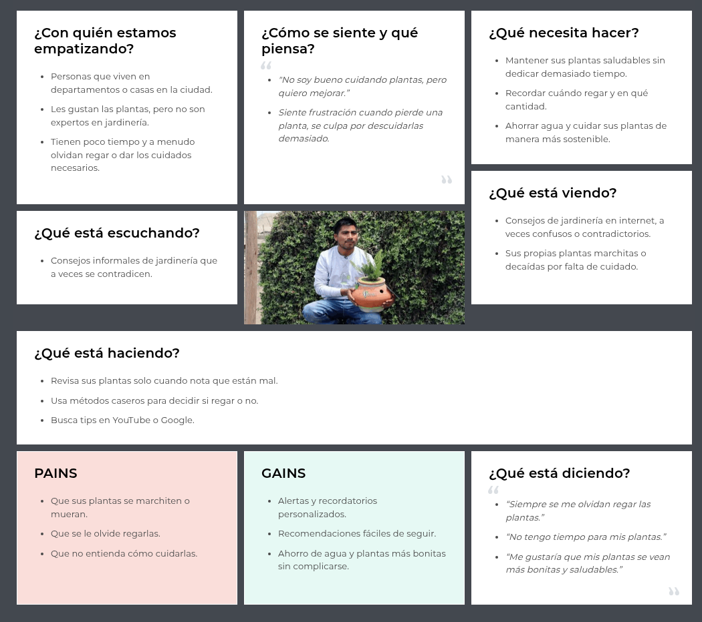

<h2 align="center">
  
</h2>

<h1 align="center">Universidad Peruana de Ciencias Aplicadas</h1>

<h3 align="center">
  Ingeniería de Software
    
  Curso: Desarrollo de Aplicaciones Open Source
    
  Sección: 7380
    
  Profesor: Hugo Allan Mori Paiva
    
  Semestre: 2025-20
    
  Informe del Trabajo Final
    
  Startup: 
    
  Producto: PlantaE
</h3>

| 
Alumno
       | 
Código
       |
|:-------------------------------------------:|:-------------------------------------------:|
|       Apaza Bocanegra, Elizabeth Noelia     |            u20231c197                       |
|       Contreras Leon, Flor De María         |            u202323243                       |
|       Guillen Galindo, Julio Adolfo         |            u20241a352                       |
|       Miraval Pomalaya, Rodrigo Jesus       |            u2023110821                      |
|       Navarro Chinga, Antonio Jhair         |            u202314101                       |

 Setiembre 2025 

# Registro de Versiones del Informe  

| Versión | Fecha       | Autor(es)                            | Descripción de modificación                             |
|---------|-------------|--------------------------------------|---------------------------------------------------------|
|   0.1   | 12/09/2025  | Apaza Bocanegra, Elizabeth Noelia    |  Elaboración de la estructura inicial del reporte.      |

# Project Report Collaboration Insights  

---

# Contenido
- [Registro de Versiones del Informe](#registro-de-versiones-del-informe)
- [Project Report Collaboration Insights](#project-report-collaboration-insights)
- [Contenido](#contenido)
- [Student Outcome](#student-outcome)
- [Capítulo I: Introducción](#capítulo-i-introducción)
  - [1.1. Startup Profile](#11-startup-profile)
    - [1.1.1. Descripción de la Startup](#111-descripción-de-la-startup)
    - [1.1.2. Perfiles de integrantes del equipo](#112-perfiles-de-integrantes-del-equipo)
  - [1.2. Solution Profile](#12-solution-profile)
    - [1.2.1. Antecedentes y problemática](#121-antecedentes-y-problemática)
    - [1.2.2. Lean UX Process](#122-lean-ux-process)
      - [1.2.2.1. Lean UX Problem Statements](#1221-lean-ux-problem-statements)
      - [1.2.2.2. Lean UX Assumptions](#1222-lean-ux-assumptions)
      - [1.2.2.3. Lean UX Hypothesis Statements](#1223-lean-ux-hypothesis-statements)
      - [1.2.2.4. Lean UX Canvas](#1224-lean-ux-canvas)
  - [1.3. Segmentos objetivo](#13-segmentos-objetivo)
- [Capítulo II: Requirements Elicitation \& Analysis](#capítulo-ii-requirements-elicitation--analysis)
  - [2.1. Competidores](#21-competidores)
    - [2.1.1. Análisis competitivo](#211-análisis-competitivo)
    - [2.1.2. Estrategias y tácticas frente a competidores](#212-estrategias-y-tácticas-frente-a-competidores)
  - [2.2. Entrevistas](#22-entrevistas)
    - [2.2.1. Diseño de entrevistas](#221-diseño-de-entrevistas)
    - [2.2.2. Registro de entrevistas](#222-registro-de-entrevistas)
    - [2.2.3. Análisis de entrevistas](#223-análisis-de-entrevistas)
  - [2.3. Needfinding](#23-needfinding)
    - [2.3.1. User Personas](#231-user-personas)
    - [2.3.2. User Task Matrix](#232-user-task-matrix)
    - [2.3.3. User Journey Mapping](#233-user-journey-mapping)
    - [2.3.4. Empathy Mapping](#234-empathy-mapping)
  - [2.4. Big Picture Event Storming](#24-big-picture-event-storming)
  - [2.5. Ubiquitous Language](#25-ubiquitous-language)
- [Capítulo III: Requirements Specification](#capítulo-iii-requirements-specification)
  - [3.1. User Stories](#31-user-stories)
  - [3.2. Impact Mapping](#32-impact-mapping)
  - [3.3. Product Backlog](#33-product-backlog)
- [Capítulo IV: Product Design](#capítulo-iv-product-design)
  - [4.1. Style Guidelines](#41-style-guidelines)
    - [4.1.1. General Style Guidelines](#411-general-style-guidelines)
    - [4.1.2. Web Style Guidelines](#412-web-style-guidelines)
  - [4.2. Information Architecture](#42-information-architecture)
    - [4.2.1. Organization Systems](#421-organization-systems)
    - [4.2.2. Labeling Systems](#422-labeling-systems)
    - [4.2.3. SEO Tags and Meta Tags](#423-seo-tags-and-meta-tags)
    - [4.2.4. Searching Systems](#424-searching-systems)
    - [4.2.5. Navigation Systems](#425-navigation-systems)
  - [4.3. Landing Page UI Design](#43-landing-page-ui-design)
    - [4.3.1. Landing Page Wireframe](#431-landing-page-wireframe)
    - [4.3.2. Landing Page Mock-up](#432-landing-page-mock-up)
  - [4.4. Web Applications UX/UI Design](#44-web-applications-uxui-design)
    - [4.4.1. Web Applications Wireframes](#441-web-applications-wireframes)
    - [4.4.2. Web Applications Wireflow Diagrams](#442-web-applications-wireflow-diagrams)
    - [4.4.2. Web Applications Mock-ups](#442-web-applications-mock-ups)
    - [4.4.3. Web Applications User Flow Diagrams](#443-web-applications-user-flow-diagrams)
  - [4.5. Web Applications Prototyping](#45-web-applications-prototyping)
  - [4.6. Domain-Driven Software Architecture](#46-domain-driven-software-architecture)
    - [4.6.1. Design-Level Event Storming](#461-design-level-event-storming)
    - [4.6.2. Software Architecture Context Diagram](#462-software-architecture-context-diagram)
    - [4.6.3. Software Architecture Container Diagrams](#463-software-architecture-container-diagrams)
    - [4.6.4. Software Architecture Components Diagrams](#464-software-architecture-components-diagrams)
  - [4.7. Software Object-Oriented Design](#47-software-object-oriented-design)
    - [4.7.1. Class Diagrams](#471-class-diagrams)
  - [4.8. Database Design](#48-database-design)
    - [4.8.1. Database Diagrams](#481-database-diagrams)
- [Capítulo V: Product Implementation, Validation \& Deployment](#capítulo-v-product-implementation-validation--deployment)
  - [5.1. Software Configuration Management](#51-software-configuration-management)
    - [5.1.1. Software Development Environment Configuration](#511-software-development-environment-configuration)
    - [5.1.2. Source Code Management](#512-source-code-management)
    - [5.1.3. Source Code Style Guide \& Conventions](#513-source-code-style-guide--conventions)
    - [5.1.4. Software Deployment Configuration](#514-software-deployment-configuration)
  - [5.2. Landing Page, Services \& Applications Implementation](#52-landing-page-services--applications-implementation)
    - [5.2.1. Sprint 1](#521-sprint-1)
      - [5.2.1.1. Sprint Planning 1](#5211-sprint-planning-1)
      - [5.2.1.2. Aspect Leaders and Collaborators](#5212-aspect-leaders-and-collaborators)
      - [5.2.1.3. Sprint Backlog 1](#5213-sprint-backlog-1)
      - [5.2.1.4. Development Evidence for Sprint Review](#5214-development-evidence-for-sprint-review)
      - [5.2.1.5. Execution Evidence for Sprint Review](#5215-execution-evidence-for-sprint-review)
      - [5.2.1.6. Services Documentation Evidence for Sprint Review](#5216-services-documentation-evidence-for-sprint-review)
      - [5.2.1.7. Software Deployment Evidence for Sprint Review](#5217-software-deployment-evidence-for-sprint-review)
      - [5.2.1.8. Team Collaboration Insights during Sprint](#5218-team-collaboration-insights-during-sprint)

- [Conclusiones](#conclusiones)
- [Conclusiones y recomendaciones](#conclusiones-y-recomendaciones)
- [Video About-the-Team](#video-about-the-team)
- [Bibliografía](#bibliografía)
- [Anexos](#anexos)

# Student Outcome  

---
# Capítulo I: Introducción
## 1.1. Startup Profile
PlantaE es una aplicación web enfocada en el cuidado y gestión de cultivos urbanos mediante un sistema de monitoreo inteligente basado en IoT. La plataforma recopila y procesa datos en tiempo real desde sensores instalados en macetas o áreas de cultivo, midiendo humedad del suelo, temperatura, luminosidad y calidad del aire.

De esta manera, los usuarios pueden supervisar sus plantas desde cualquier lugar, recibir notificaciones oportunas y acceder a recomendaciones personalizadas para optimizar el riego y cuidado de sus cultivos.

El modelo de negocio se dirige tanto a personas individuales como a viveros comerciales que buscan soluciones sostenibles y eficientes para mantener áreas verdes saludables.

### Misión:
Digitalizar y optimizar el cuidado de cultivos urbanos mediante el uso de tecnologías IoT, ofreciendo a personas y viveros herramientas accesibles para gestionar sus plantas de forma sostenible, eficiente y consciente con el medio ambiente.

### Visión:
Ser una referencia en soluciones tecnológicas para el cuidado de plantas y áreas verdes, promoviendo un estilo de vida más sostenible y acercando la tecnología al servicio del bienestar ambiental y de las comunidades.

### 1.1.1. Descripción de la Startup
Somos EcoTech, una startup universitaria conformada por estudiantes de la Universidad Peruana de Ciencias Aplicadas (UPC), dedicada a desarrollar soluciones tecnológicas que promuevan la sostenibilidad y el cuidado responsable de los recursos naturales. En un contexto donde la agricultura urbana y el mantenimiento de áreas verdes enfrentan retos de eficiencia y gestiones, presentamos PlantaE, una plataforma inteligente basada en IoT que permite a los usuarios monitorear y optimizar el cuidado de sus plantas y cultivos urbanos.

PlantaE surge ante la creciente necesidad de contar con herramientas accesibles y confiables que faciliten el riego eficiente y el cuidado de áreas verdes en hogares y viveros. La aplicación recopila datos en tiempo real sobre humedad, temperatura, luminosidad y calidad del aire mediante sensores instalados en macetas o terrenos de cultivo, brindando a los usuarios notificaciones oportunas y recomendaciones personalizadas para garantizar la salud de sus plantas. Ademas de, contribuir al uso responsable del agua, ofreciendo una plataforma que combina tecnología, sostenibilidad y facilidad de uso. Con PlantaE, buscamos acercar la innovación al bienestar ambiental y a la vida diaria de las personas, fomentando comunidades más conscientes y responsables con su entorno.

### 1.1.2. Perfiles de integrantes del equipo

| **Integrante**            | **Apaza Bocanegra, Elizabeth Noelia**                                               |
|---------------------------|-------------------------------------------------------------------------------------|
| **Código del Estudiante** |                                                                                     |
| **Carrera**               |                                                                                     |
| **Descripción**           |                                                                                     |
| **Foto**                  |                                         |

---

| **Integrante**            | **Contreras Leon, Flor De María**                                                   |
|---------------------------|-------------------------------------------------------------------------------------|
| **Código del Estudiante** |  u202323243                                                                       |
| **Carrera**               |  Ingenieria de Software                                                                                   |
| **Descripción**           |  Mi nombre es Flor de María Contreras León y actualmente estudio la carrera de Ingeniería de Software en la Universidad Peruana de Ciencias Aplicadas (UPC), sede San Miguel. Tengo 20 años y me considero una persona responsable, comprometida y dedicada a mi formación profesional.Me apasiona la programación y la investigación, áreas en las que busco seguir aprendiendo y desarrollando nuevas habilidades. Aunque me considero una persona callada, siempre estoy atenta a los detalles, lo que me permite trabajar de manera cuidadosa y eficiente en mis proyectos. Asimismo, valoro el trabajo en equipo y creo que un entorno colaborativo y respetuoso es clave para alcanzar los mejores resultados.                                                                                   |
| **Foto**                  |                                        |

---

| **Integrante**            | **Guillen Galindo, Julio Adolfo**                                                   |
|---------------------------|-------------------------------------------------------------------------------------|
| **Código del Estudiante** | u20241a352                                                                          |
| **Carrera**               | Ingeniería de Software                                                              |
| **Descripción**           | Actualmente curso la carrera de Ingeniería de Software en la UPC. Me considero una persona discreta, pero responsable y enfocada en cumplir los proyectos dentro de los plazos establecidos. Poseo conocimientos en C++ y Python; disfruto trabajar en equipo cuando existe colaboración y apoyo mutuo. Además, me motiva aplicar lo aprendido para afrontar los desafíos que puedan surgir en los próximos ciclos. |
| **Foto**                  |     |

---

| **Integrante**            | **Miraval Pomalaya, Rodrigo Jesus**                                                 |
|---------------------------|-------------------------------------------------------------------------------------|
| **Código del Estudiante** |                                                                                     |
| **Carrera**               |                                                                                     |
| **Descripción**           |                                                                                     |
| **Foto**                  |                                         |

---

| **Integrante**            | **Navarro Chinga, Antonio Jhair**                                                   |
|---------------------------|-------------------------------------------------------------------------------------|
| **Código del Estudiante** |                                                                                     |
| **Carrera**               |                                                                                     |
| **Descripción**           |                                                                                     |
| **Foto**                  |                                         |

## 1.2. Solution Profile
### 1.2.1. Antecedentes y problemática
En el Perú, el cuidado de áreas verdes y la agricultura enfrentan serias dificultades relacionadas con el uso eficiente de recursos, especialmente del agua. Según la Autoridad Nacional del Agua (ANA, 2023), más del 70% del recurso hídrico del país es destinado a la agricultura, pero gran parte se desperdicia debido a sistemas de riego poco eficientes y falta de tecnología de monitoreo.

En las ciudades, la situación no es distinta. Informes de la Municipalidad de Lima (2022) señalan que gran parte de los parques y jardines públicos presentan un riego deficiente, lo que repercute en el deterioro de áreas verdes urbanas. A nivel de hogares, el cuidado de plantas suele hacerse de manera intuitiva, sin datos precisos sobre humedad, temperatura o condiciones ambientales, lo que incrementa el riesgo de pérdida de cultivos o desperdicio de agua.

A esto se suma que la FAO (2021) ha destacado la importancia de impulsar la agricultura urbana y periurbana en países en desarrollo, no solo como fuente de alimentos, sino también como estrategia de sostenibilidad ambiental y de bienestar social. Sin embargo, en el Perú, aún existe un vacío en el acceso a soluciones tecnológicas accesibles que faciliten la gestión eficiente de cultivos urbanos y viveros.

**Análisis 5W2H**

| **Pregunta**                                                         | **Respuesta**                                                                                                                                                                                      |
|:--------------------------------------------------------------------:|:--------------------------------------------------------------------------------------------------------------------------------------------------------------------------------------------------:|
|**What**   ¿Cuál es el problema?                                   |  En el Perú, el cuidado de cultivos urbanos y áreas verdes enfrenta retos significativos por la falta de tecnologías que permitan un monitoreo preciso. Gran parte de los usuarios riegan de manera intuitiva, sin información confiable sobre humedad del suelo, temperatura, luminosidad o calidad del aire. Esto genera pérdidas de plantas, uso ineficiente del agua y deterioro de jardines urbanos y viveros.                                                             |
|**When**   ¿Cuándo sucede el problema?                             |  La problemática ocurre todo el año, pero se intensifica en temporadas de sequía, verano o en situaciones donde el usuario está fuera de casa por mucho tiempo. La falta de monitoreo en tiempo real y de datos confiables hace que la pérdida de cultivos o el mal uso del agua se convierta en un problema recurrente y continuo.                                                                                                                                              |
|**Where**   ¿Dónde se presenta el problema de negocio?             |  Este problema se presenta principalmente en ciudades con creciente interés en agricultura urbana. En las zonas costeras, la necesidad es mayor debido a la escasez de agua y a la poca adopción de tecnologías digitales en el mantenimiento de áreas verdes.                                                                                                                                                                                                                  |
|**Who**   ¿Quiénes están involucrados?                             |  Los principales afectados son las personas en hogares que buscan mantener sus plantas en zonas urbanas, así como viveros y negocios de jardinería que requieren eficiencia para reducir costos y mejorar la calidad de sus productos.                                                                                                                                                                                                                                        |
|**Why**   ¿Por qué se origina el problema?                         |  El uso eficiente del agua y la sostenibilidad ambiental son prioritarios. Según la Autoridad Nacional del Agua (ANA, 2023), más del 70% del recurso hídrico del país se destina a la agricultura, con altos niveles de desperdicio. Una solución tecnológica que permita recopilar datos en tiempo real, enviar alertas y recomendaciones personalizadas no solo optimiza el cuidado de las plantas, sino que también fomenta la conciencia ambiental y contribuye a la gestión responsable de los recursos naturales en un contexto urbano y doméstico.                                                                                                                                                                                                    |
|**How**   ¿Cómo afecta este problema a las personas involucradas?  |  La falta de monitoreo confiable provoca que los usuarios rieguen de manera insuficiente, lo que genera pérdida de plantas, frustración y mayores costos en el mantenimiento de áreas verdes. Y por consiguiente, repercute directamente en la calidad de los productos que ofrecen.                                                                                                                                                                                            |
|**How much**   ¿Cuánto impacto genera el problema en la sociedad?  |  Aunque el impacto económico es considerable, el uso ineficiente del agua contribuye al agotamiento de un recurso escaso en zonas urbanas, mientras que la pérdida de áreas verdes reduce la calidad de vida y el bienestar en las ciudades. En conjunto, esto repercute en la sostenibilidad urbana y en la gestión responsable de los recursos naturales.                                                                                                                      |

### 1.2.2. Lean UX Process
#### 1.2.2.1. Lean UX Problem Statements
- Los usuarios de áreas urbanas y viveros no cuentan con datos precisos y en tiempo real sobre las condiciones de sus cultivos (humedad, temperatura, luminosidad, calidad del aire), lo que ocasiona un riego ineficiente y un mayor riesgo de pérdida de plantas.  
- Las personas suelen regar sus plantas de manera intuitiva, sin información confiable, lo que genera desperdicio de agua y afecta la sostenibilidad del cuidado de áreas verdes.  
- Viveros y responsables de áreas verdes carecen de soluciones tecnológicas accesibles y fáciles de usar que permitan optimizar el manejo de cultivos urbanos.  

#### 1.2.2.2. Lean UX Assumptions
- Los usuarios están dispuestos a utilizar herramientas digitales siempre que estas sean fáciles de usar y les brinden información clara para mejorar el cuidado de sus cultivos.  
- La incorporación de sensores IoT permitirá obtener datos relevantes que ayudarán a optimizar el riego y mejorar la salud de las plantas.  
- Al recibir notificaciones y recomendaciones personalizadas, los usuarios podrán tomar mejores decisiones que contribuirán a la reducción del consumo de agua y al cuidado responsable de áreas verdes.  
- Existe un segmento de mercado (hogares y viveros urbanos) que busca soluciones sostenibles e innovadoras para optimizar sus recursos y mejorar sus resultados.  

#### 1.2.2.3. Lean UX Hypothesis Statements
- Creemos que al ofrecer una plataforma de monitoreo en tiempo real con sensores IoT, los usuarios urbanos y viveros podrán gestionar sus plantas de manera más eficiente.  
- Creemos que al proporcionar recomendaciones personalizadas y notificaciones oportunas, los usuarios reducirán el desperdicio de agua y mejorarán la salud de sus cultivos.  
- Creemos que al diseñar una interfaz sencilla y accesible, lograremos que tanto usuarios individuales como viveros adopten la aplicación sin necesidad de conocimientos técnicos avanzados.  
- Creemos que si demostramos beneficios tangibles (ahorro de agua, reducción de pérdidas de plantas), los usuarios estarán dispuestos a pagar por la solución.  

#### 1.2.2.4. Lean UX Canvas

| **Sección** | **Contenido** |
|-------------|---------------|
| **Business Problem** | Los usuarios de áreas urbanas y viveros no cuentan con datos precisos y en tiempo real sobre las condiciones de sus cultivos (humedad, temperatura, luminosidad, calidad del aire), lo que ocasiona un riego ineficiente y un mayor riesgo de pérdida de plantas. Las personas suelen regar sus plantas de manera intuitiva, lo que genera desperdicio de agua. Los viveros y responsables de áreas verdes carecen de soluciones tecnológicas accesibles y fáciles de usar que permitan optimizar el manejo de cultivos urbanos. |
| **Business Outcomes** | - Aumentar el número de usuarios (hogares y viveros) que gestionan sus plantas basados en datos de sensores IoT. - Incrementar la adopción de recomendaciones y notificaciones personalizadas dentro de la plataforma. - Lograr que la mayoría de usuarios puedan utilizar la plataforma sin requerir conocimientos técnicos avanzados. - Validar la disposición de pago de los usuarios al percibir beneficios tangibles en el cuidado de sus cultivos. |
| **Users and Customers** | **Primarios:** - Personas que cuidan plantas en sus hogares. - Viveros comerciales que buscan optimizar el cuidado de cultivos urbanos. |
| **User Benefits** | **Personas (hogares):** - Outcomes: Regar sus plantas con base en datos y recibir alertas útiles. - Benefits: Menor esfuerzo en el cuidado de sus plantas, reducción de desperdicio de agua, plantas más saludables.  **Viveros comerciales:** - Outcomes: Monitorear condiciones de cultivo en tiempo real y aplicar decisiones basadas en datos. - Benefits: Mayor control de sus recursos, optimización de tiempo y costos, mejora en la productividad de cultivos. |
| **Solution Ideas** | - Plataforma conectada a sensores IoT para medir condiciones de cultivo. - Sistema de notificaciones y recomendaciones personalizadas para riego eficiente. - Interfaz sencilla y accesible para todo tipo de usuario. - Reportes de estado y mejoras de los cultivos. |
| **Hypotheses** | - Creemos que al ofrecer una plataforma de monitoreo en tiempo real con sensores IoT, los usuarios urbanos y viveros podrán gestionar sus plantas de manera más eficiente. - Creemos que al proporcionar recomendaciones personalizadas y notificaciones oportunas, los usuarios reducirán el desperdicio de agua y mejorarán la salud de sus cultivos. - Creemos que al diseñar una interfaz sencilla y accesible, lograremos que tanto usuarios individuales como viveros adopten la aplicación sin necesidad de conocimientos técnicos avanzados. - Creemos que si demostramos beneficios tangibles (ahorro de agua, reducción de pérdidas de plantas), los usuarios estarán dispuestos a pagar por la solución. |
| **What's the most important thing we need to learn first?** | ¿Los usuarios (hogares y viveros) están dispuestos a utilizar una plataforma tecnológica basada en sensores IoT para gestionar sus cultivos de manera más eficiente? |
| **What's the least amount of work we need to do to learn the next most important thing?** | **MVP:** Prototipo funcional con sensores IoT básicos conectados a una aplicación que muestre datos de humedad y temperatura, notificaciones iniciales y recomendaciones simples. Validar si los usuarios utilizan el sistema y siguen las recomendaciones. |

## 1.3. Segmentos objetivo
---
| Segmento Objetivo | Aspectos demográficos | Aspectos geográficos | Aspectos psicográficos |
|-------------------|------------------------|-----------------------|-------------------------|
| **Personas (hogares urbanos que cuidan plantas)** | - Sexo: Masculino y femenino. - Edades: 25 – 55 años (adultos jóvenes y adultos interesados en la sostenibilidad y el cuidado del hogar). | - Nacionalidad: Peruana. - Zona geográfica: Principalmente zonas urbanas y periurbanas con acceso a áreas verdes o pequeños jardines (ej. Lima Metropolitana y principales ciudades del Perú). | - Valoran la sostenibilidad y el cuidado responsable del medio ambiente. - Interesados en tecnología accesible que facilite la vida cotidiana. - Buscan practicidad y resultados visibles en el cuidado de sus plantas. - Dispuestos a probar soluciones innovadoras si estas son fáciles de usar. |
| **Viveros comerciales** | - Sexo: Masculino y femenino (administradores, encargados y trabajadores de viveros). - Edades: 20 – 60 años (jóvenes adultos y adultos con experiencia en manejo de cultivos o gestión de negocios de plantas). | - Nacionalidad: Peruana. - Zona geográfica: Áreas urbanas, periurbanas y rurales donde se concentran viveros, centros de producción y espacios agrícolas. | - Buscan optimizar recursos (agua, energía, tiempo) para aumentar la rentabilidad. - Interesados en soluciones tecnológicas que mejoren la eficiencia operativa. - Valoran herramientas que brinden datos confiables y prácticos para la toma de decisiones. - Dispuestos a pagar por soluciones que generen beneficios tangibles en productividad y sostenibilidad. |

# Capítulo II: Requirements Elicitation & Analysis
## 2.1. Competidores
### 2.1.1. Análisis competitivo
### 2.1.2. Estrategias y tácticas frente a competidores

## 2.2. Entrevistas
### 2.2.1. Diseño de entrevistas
### 2.2.2. Registro de entrevistas
### 2.2.3. Análisis de entrevistas

## 2.3. Needfinding
### 2.3.1. User Personas

- User Persona – Usuario Doméstico

| **Attributes**   | **Values** |
|------------------|------------|
| **Name**         | Ana Torres |
| **Age**          | 29 años |
| **Occupation**   | Diseñadora gráfica (trabajo remoto) |
| **Status**       | Soltera |
| **Location**     | Lima, Perú (San Borja) |
| **Tier**         | Cuidadora de plantas domésticas |
| **Archetype**    | Amante de las plantas |
| **Image**        |  |
| **Quote**        | "Quiero una solución simple y confiable para que mis plantas estén siempre bien." |
| **Motivations**  | Incentive: 80/100 · Fear: 60/100 · Achievement: 70/100 · Growth: 65/100 · Power: 30/100 · Social: 85/100 |
| **Goals**        | Mantener sanas sus plantas de interior y jardín · Recibir alertas simples y claras sobre riego, luz y humedad · Compartir logros en redes sociales |
| **Frustrations** | Falta de tiempo para investigar cuidados · No identificar enfermedades a tiempo · Información técnica confusa en otras apps |
| **Biography**    | Ana vive sola en un departamento y disfruta decorarlo con plantas. Ha perdido varias porque no sabía cómo cuidarlas correctamente. Quiere recordatorios sencillos que eviten descuidos. Comparte sus hobbies en redes sociales y valora soluciones visuales y fáciles de usar. |
| **Personality**  | Extrovert: 65/100 · Thinking: 70/100 · Judging: 60/100 |
| **Technology**   | IT & Internet: 80/100 · Software: 65/100 · Mobile Apps: 90/100 · Social Networks: 95/100 |
| **Brands**       | Instagram · TikTok · Pinterest |

- User Persona – Usuario Institucional

| **Attributes**   | **Values** |
|------------------|------------|
| **Name**         | Carlos Ramírez |
| **Age**          | 45 años |
| **Occupation**   | Administrador de vivero |
| **Status**       | Casado |
| **Location**     | Lima, Perú (Ate) |
| **Tier**         | Gestor de vivero/invernadero |
| **Archetype**    | Administrador pragmático |
| **Image**        |  |
| **Quote**        | "Necesito datos claros para tomar decisiones rápidas y efectivas." |
| **Motivations**  | Incentive: 85/100 · Fear: 55/100 · Achievement: 90/100 · Growth: 80/100 · Power: 70/100 · Social: 60/100 |
| **Goals**        | Optimizar consumo de agua y fertilizantes · Recibir reportes claros y priorizados para casos críticos · Tomar decisiones estratégicas con base en tendencias históricas |
| **Frustrations** | Instalación de sensores compleja · Resistencia del personal al cambio · Exceso de alertas sin priorización |
| **Biography**    | Carlos administra un vivero de tamaño medio. Usa planillas y reportes en papel, pero sabe que la digitalización es clave. Busca ahorrar costos y tiempo con herramientas que generen reportes claros, exportables y fáciles de compartir con la gerencia. |
| **Personality**  | Extrovert: 55/100 · Thinking: 85/100 · Judging: 75/100 |
| **Technology**   | IT & Internet: 70/100 · Software: 80/100 · Mobile Apps: 60/100 · Social Networks: 50/100 |
| **Brands**       | LinkedIn · Excel · Google Workspace |

### 2.3.2. User Task Matrix

| **Tareas**                           | **Ana (Frecuencia)** | **Ana (Importancia)** | **Carlos (Frecuencia)** | **Carlos (Importancia)** |
|--------------------------------------|-----------------------|------------------------|--------------------------|---------------------------|
| Buscar solución para cuidado de plantas | Alta                  | Alta                   | Media                    | Media                     |
| Instalar sensores                    | Media                 | Alta                   | Alta                     | Alta                      |
| Configurar la app/dashboard          | Alta                  | Alta                   | Alta                     | Alta                      |
| Monitorear condiciones de las plantas| Alta                  | Alta                   | Alta                     | Alta                      |
| Recibir alertas de cuidado           | Alta                  | Alta                   | Alta                     | Alta                      |
| Analizar reportes históricos         | Baja                  | Media                  | Alta                     | Alta                      |
| Compartir logros o resultados        | Alta                  | Media                  | Media                    | Media                     |
| Exportar reportes                    | Baja                  | Baja                   | Alta                     | Alta                      |

---

### Conclusiones
- **Ana** (usuaria doméstica) se enfoca en tareas simples y motivacionales como recibir recordatorios, cuidar sus plantas y compartir avances en redes sociales.  
- **Carlos** (usuario institucional) prioriza el análisis de datos, la exportación de reportes y la optimización de recursos en su vivero.  
- Ambos coinciden en la **alta importancia de un dashboard confiable y alertas claras**, lo que convierte estas funciones en elementos centrales del diseño de **PlantaE**.

### 2.3.3. User Journey Mapping
- Segmento objetivo 1:

  

- Segmento objetivo 2:

 

### 2.3.4. Empathy Mapping
- Segmento objetivo 1:

 

- Segmento objetivo 2:

 

## 2.4. Big Picture Event Storming

## 2.5. Ubiquitous Language
| **Término (Inglés)**         | **Término (Español)**       | **Descripción**                                                                                              |
|------------------------------|-----------------------------|--------------------------------------------------------------------------------------------------------------|
| **Soil Moisture**            | Humedad del suelo           | Cantidad de agua presente en la tierra donde crece la planta; determina la necesidad de riego.               |
| **Air Quality**              | Calidad del aire            | Condiciones del aire que rodea al cultivo, considerando pureza y presencia de contaminantes.                 |
| **Sunlight Exposure**        | Exposición a la luz solar   | Cantidad de luz solar o artificial que recibe la planta, fundamental para la fotosíntesis y el crecimiento.  |
| **Plant Health**             | Salud de la planta          | Estado general de una planta basado en sus condiciones ambientales y cuidados recibidos.                     |
| **Watering Recommendation**  | Recomendación de riego      | Sugerencia personalizada generada para optimizar el uso del agua y mantener el buen estado del cultivo.      |
| **Alert Notification**       | Notificación de alerta      | Mensaje que informa al usuario sobre condiciones críticas que requieren acción inmediata.                    |
| **Dashboard**                | Panel de control            | Interfaz donde el usuario visualiza en tiempo real el estado de sus cultivos y recibe notificaciones.        |
| **Growth Stage**             | Etapa de crecimiento        | Fase de desarrollo en la que se encuentra la planta (germinación, crecimiento, floración, madurez).          |
| **Overwatering**             | Exceso de riego             | Situación en la que la planta recibe más agua de la necesaria, lo que puede causar pudrición de raíces.      |
| **Underwatering**            | Falta de riego              | Situación en la que la planta recibe menos agua de la necesaria, afectando su salud y crecimiento.           |
| **Indoor Plant**             | Planta de interior          | Planta cultivada dentro de un espacio cerrado, adaptada a condiciones de luz artificial o indirecta.         |
| **Outdoor Plant**            | Planta de exterior          | Planta cultivada en terrazas, balcones o jardines, expuesta a condiciones ambientales naturales.             |
| **Fertilizer Use**           | Uso de fertilizantes        | Práctica de añadir nutrientes a la maceta para mejorar el crecimiento y salud de la planta.                  |

# Capítulo III: Requirements Specification
## 3.1. User Stories
## 3.2. Impact Mapping
## 3.3. Product Backlog

# Capítulo IV: Product Design
## 4.1. Style Guidelines
### 4.1.1. General Style Guidelines
### 4.1.2. Web Style Guidelines

## 4.2. Information Architecture
### 4.2.1. Organization Systems
### 4.2.2. Labeling Systems

### 4.2.3. SEO Tags and Meta Tags
- Landing Page:
    - Title: PlantaE, monitoreo inteligente de cultivos urbanos con IoT.
    - Meta Description: Supervisa tus plantas en tiempo real con sensores IoT, brindando recomendaciones de riego y cuidado personalizado para que tus cultivos urbanos crezcan saludables y sostenibles.
    - Meta Keywords: Plantas inteligentes, cultivos urbanos, IoT, agricultura sostenible, cuidado de plantas, huertos urbanos, monitoreo ambiental.
    - Meta Author: PlantaE Team.

- Web Application:
    - Title: PlantaE, estado de tus plantas en tiempo real.
    - Meta Description: Gestiona tus cultivos urbanos desde un solo lugar. Visualiza humedad, temperatura, luz y calidad del aire con gráficos claros y recibe alertas personalizadas.
    - Meta Keywords: dashboard plantas, monitoreo IoT, gestión de cultivos, agricultura urbana, cuidado de plantas en casa, viveros sostenibles.
    - Meta Author: PlantaE Team.

### 4.2.4. Searching Systems
El sistema de búsqueda de PlantaE está diseñado para facilitar a los usuarios la localización rápida y eficiente de información sobre sus cultivos urbanos. El objetivo es evitar que el usuario se sienta perdido ante el volumen de datos provenientes de los sensores y garantizar que pueda acceder de forma intuitiva al estado de cada planta o conjunto de cultivos.

- Usuarios domésticos: 
    - Filtros dinámicos combinables:
        - Tipo de planta.
        - Estado de salud: Saludable, en riesgo, crítico.
        - Variable ambiental: Humedad, temperatura, luminosidad, calidad del aire.
        - Ubicación: Sala, balcón, terraza, huerto urbano.
        - Nivel de cuidado requerido: Bajo, medio, alto.

    - Tarjetas visuales:
        - Imagen de la planta o ícono representativo.
        - Nombre de la planta.
        - Ubicación asignada.
        - Estado actual resumido: Humedad baja, necesita riego.
        - Indicadores visuales de color:
            - Verde, planta saludable.
            - Amarillo, requiere atención.
            - Rojo, estado crítico.
        
- Viveros comerciales:
    - Filtros por estado de cultivo.
    - Filtro por variable crítica: Lotes con humedad baja, exceso de temperatura o deficiencia de luz.
    - Búsqueda en histórico:
        - Consultar registros por fecha.
        - Estado previo o acciones realizadas.
    - Iconos destacados para alertas, recomendaciones o novedades.
  
### 4.2.5. Navigation Systems
## 4.3. Landing Page UI Design
### 4.3.1. Landing Page Wireframe
### 4.3.2. Landing Page Mock-up

## 4.4. Web Applications UX/UI Design
### 4.4.1. Web Applications Wireframes
### 4.4.2. Web Applications Wireflow Diagrams
### 4.4.2. Web Applications Mock-ups
### 4.4.3. Web Applications User Flow Diagrams

## 4.5. Web Applications Prototyping

## 4.6. Domain-Driven Software Architecture
### 4.6.1. Design-Level Event Storming
### 4.6.2. Software Architecture Context Diagram
### 4.6.3. Software Architecture Container Diagrams
### 4.6.4. Software Architecture Components Diagrams

## 4.7. Software Object-Oriented Design
### 4.7.1. Class Diagrams

## 4.8. Database Design
### 4.8.1. Database Diagrams

---

# Capítulo V: Product Implementation, Validation & Deployment
## 5.1. Software Configuration Management
### 5.1.1. Software Development Environment Configuration
### 5.1.2. Source Code Management
### 5.1.3. Source Code Style Guide & Conventions
### 5.1.4. Software Deployment Configuration

## 5.2. Landing Page, Services & Applications Implementation
### 5.2.1. Sprint 1
#### 5.2.1.1. Sprint Planning 1
#### 5.2.1.2. Aspect Leaders and Collaborators
#### 5.2.1.3. Sprint Backlog 1
#### 5.2.1.4. Development Evidence for Sprint Review
#### 5.2.1.5. Execution Evidence for Sprint Review
#### 5.2.1.6. Services Documentation Evidence for Sprint Review
#### 5.2.1.7. Software Deployment Evidence for Sprint Review
#### 5.2.1.8. Team Collaboration Insights during Sprint

## 5.3. Validation Interviews
### 5.3.1. Diseño de Entrevistas
### 5.3.2. Registro de Entrevistas
### 5.3.3. Evaluaciones según heurísticas

## 5.4. Video About-the-Product

---

# Conclusiones
# Conclusiones y recomendaciones
# Video About-the-Team
# Bibliografía
# Anexos

